+++
author = "Seorim"
title = 'Blog 제작기 발표'
url = '/Blog/blog'
date = 2023-11-22
categories = [
    "Blog", 
]
tags = [
    "Blog", "hugo", "Github Pages",
]
+++

<style>
g1 { color: #79AC78 }
g2 { color: #B0D9B1 }
g3 { color: #D0E7D2 }
g4 { color: #618264 }
o1 { color: #F9B572 }
w1 { color: #FAF8ED }
</style>

[블로그](https://srlee056.github.io/)

[GitHub repo](https://github.com/srlee056/srlee056.github.io)

# GitHub Pages

[GitHub Pages 공식 페이지](https://pages.github.com/)

> “GitHub Pages is a <o1>static site hosting service</o1> that takes HTML, CSS, and JavaScript files straight <o1>from a repository on GitHub.</o1>”

## 사용 이유

1. 편리한 사이트 제작 및 관리
    - 도메인 및 호스팅 서비스를 직접 관리할 필요 없음
2. 버전 관리 이점
    - 변경 이력을 기록할 수 있고 삭제 및 변경이 자유로움
3. 다양한 예쁜 테마와 커스터마이징
    - [https://themes.gohugo.io/](https://themes.gohugo.io/)
4. 자유로운 **Markdown 표현**

    - Tistory, Velog 등 플랫폼에서 Markdown 문법이 원하는 형태로 표현되지 않아 생기는 불편함 극복
    - html 문법 사용 가능

        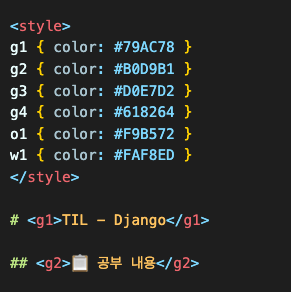
        

## 정적 사이트 생성기

지킬과 휴고는 둘 다 정적 사이트 생성기지만, 다른 언어로 개발되었고 각자의 특징을 가지고 있습니다.

### **지킬 (Jekyll)**

-   **장점**
    -   GitHub에서 기본적으로 지원되는 정적 사이트 생성기로, Ruby로 개발됐습니다.
    -   GitHub Pages에 호스팅할 때 추가적인 설정 없이 지킬을 사용할 수 있습니다.
    -   플러그인이 다양하게 제공되어 확장성이 높습니다.
-   **단점**
    -   Ruby 기반이기 때문에, Ruby 개발 환경이 필요하고 초기 설정이 복잡할 수 있습니다.
    -   빌드 시간이 상대적으로 더 오래 걸릴 수 있습니다.

### **휴고 (Hugo)**

-   **장점**
    -   Go 언어로 개발되어 빠른 빌드 속도를 자랑합니다.
    -   단순하고 직관적인 구조로 빠르게 사이트를 생성할 수 있습니다.
    -   다양한 테마와 플러그인을 제공하며, 커스터마이징이 자유롭습니다.
-   **단점**
    -   Go 언어로 개발되어 있어 Go 환경이 필요하며, Ruby나 다른 언어에 비해 커스터마이징이 조금 더 쉽지 않을 수 있습니다.

# 블로그 제작기

## Hugo 셋업

[Hugo Guidline - Quick start](https://gohugo.io/getting-started/quick-start/)

1. **선행 패키지 및 언어 설치**

    1. 각자의 OS에 맞게 설치 : [https://gohugo.io/installation/](https://gohugo.io/installation/)
    2. Go
    3. Hugo

2. **사이트 생성**

    - Hugo 명령어를 사용하여 새로운 사이트를 생성합니다.
    - **`hugo new site <사이트 이름>`**
        ```bash
        hugo new site testsite
        ```
        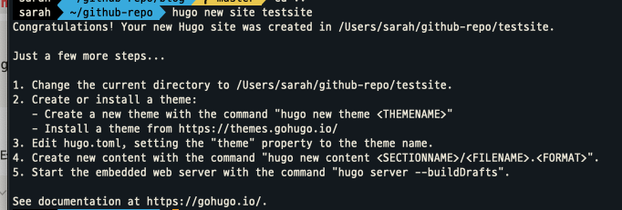
        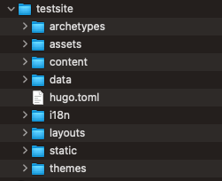

3. **테마 연결**
    - 선택한 테마를 다운로드하거나 Git submodule로 연결하여 사이트에 적용합니다.
        ```bash
        cd testsite
        git init
        git submodule add https://github.com/CaiJimmy/hugo-theme-stack.git themes/hugo-theme-stack
        ```
    - `config.toml` 파일에 테마 설정을 추가합니다.
        ```toml
        theme = "hugo-theme-stack"
        ```
4. **config**
    - **`config.toml`** 파일에서 설정을 변경할 수 있습니다.
    - base URL 설정 : `https://<username>.github.io` or `custom domain`
        ```toml
        baseURL = "https://srlee056.github.io"
        ```
    - 한국어 설정
        ```toml
        languageCode = "ko-KR"
        DefaultContentLanguage = "ko"
        ...
        [languages.ko]
        languageName = "Korean"
        title = "서림록"
        weight = 1
        [languages.ko.params]
        description = ""
        ```
    - **기타 설정**
        - math : 수학 수식 표시 여부
        - toc : 목차
        - readingTime : 해당 글의 글자수를 기준으로 읽는 데 몇 분 정도 걸리는지 표시함
        ```toml
        [params.article]
        math = false
        toc = true
        readingTime = false
        ```
5. **서버 구동**

-   `hugo server`
    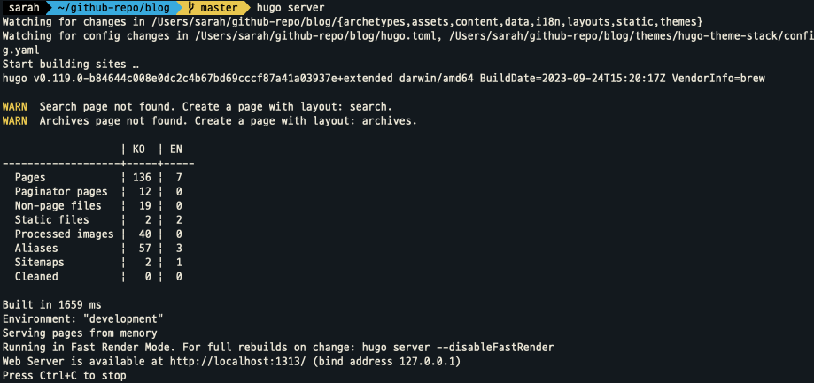
-   `http://localhost:1313/`
    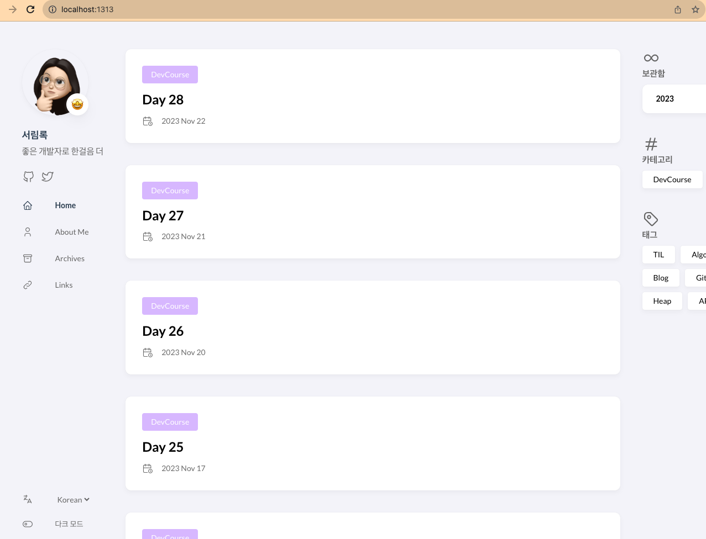

6. 글 템플릿 설정

-   `archetypes` 폴더 내에 `.md` 템플릿을 추가하여, 새 글을 발행할 때 템플릿으로 활용할 수 있습니다.
-   ‘til’ 템플릿과 그 내용

    
    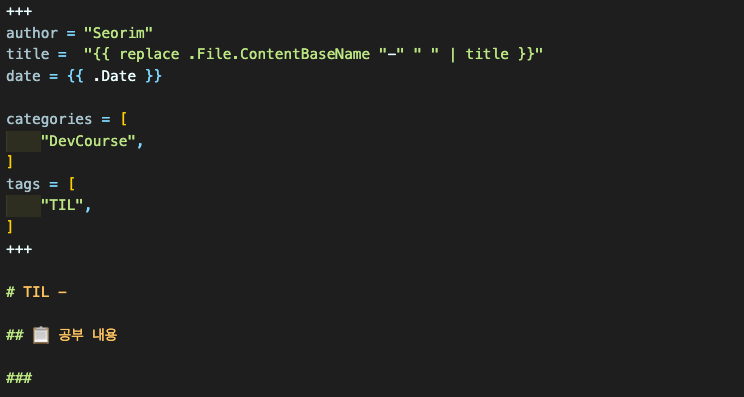

-   새 글 발행 : `--kind` 커맨드로 template 적용

    ```bash
    hugo new content content/post/newpost.md --kind til
    ```

    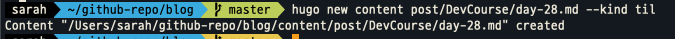
    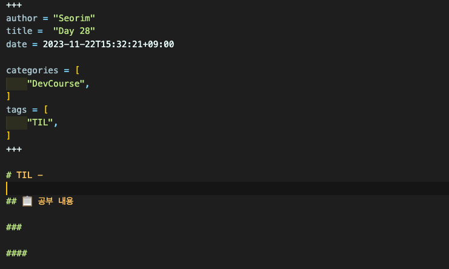

7. 아바타, 파비콘 등 resource 위치

-   Avatar : `assets/img/avatar.png`

    -   `hogo.toml`

    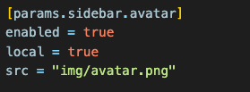

-   Favicon: `static/img/favicon.ico`

    -   `hugo.toml`

    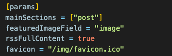

8. 글 속성 및 구조

-   `url`

    -   별도로 설정하지 않으면 title = url

    ```markdown
    title = 'Blog 제작기 #2'
    url = '/Blog/blog-2'
    ```

-   `draft`
    -   빌드 포함 여부 (true : 미포함)
    -   `default.md`(기본 template)
    ```markdown
    author = "Seorim"
    title = '{{ replace .File.ContentBaseName "-" " " | title }}'
    date = {{ .Date }}
    draft = false
    ```
-   `structure`

    -   `post/<title>.md` or `post/<folder-name>/<title>.md` or `post/<title>/index.md`

    ```markdown
    content
    ├─ post
    │ ├─ Blog
    │ │ └─ blog-2.md
    │ ├─ day-10
    │ │ ├─ image.png
    │ │ └─ index.md
    │ └─ DevCourse
    └─ \_index.md
    ```

-   이미지를 포함하는 글 구조

    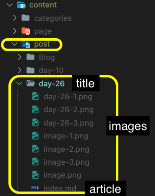

-   글 본문에 이미지 삽입

    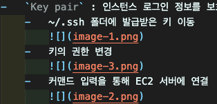

## Hosting

[Hugo Guidline - Host on GitHub Pages](https://gohugo.io/hosting-and-deployment/hosting-on-github/)

1. [repo](https://github.com/srlee056/srlee056.github.io) 생성 및 연결

-   GitHub에서 <username>.github.io 이름으로 새로운 레포지토리 생성
-   local Hugo site repository를 연결
    -   command
        ```bash
        git remote add origin <원격 저장소 URL>
        ```

2. GitHub Actions 세팅

-   Settings > Pages.
-   Build and Deployment 소스를 branch → GitHub Actions 변경
    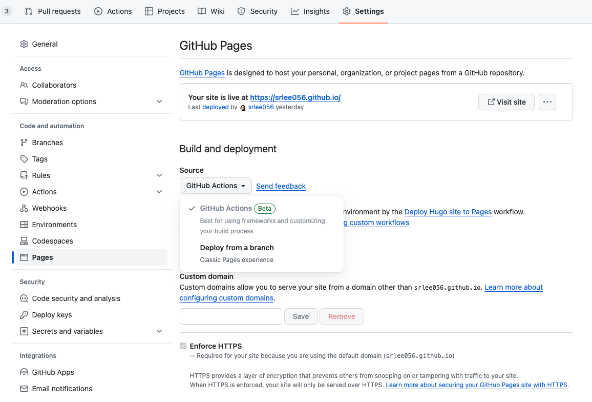
    b. **GitHub Actions - workflow 파일 생성**

    -   [.github/workflows/hugo.yaml](https://github.com/srlee056/srlee056.github.io/blob/master/.github/workflows/hugo.yaml)

    -   Actions > New workflow > `hugo` 검색
        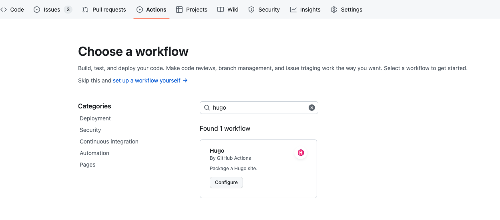
        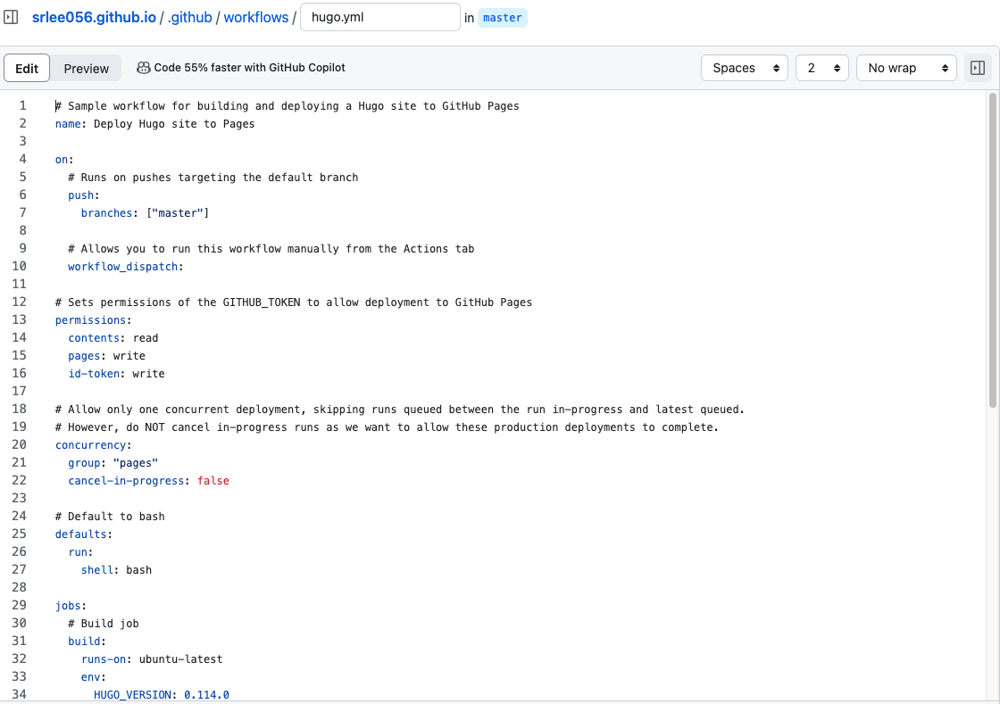

    3. 설정한대로 build&deploy 자동 실행

        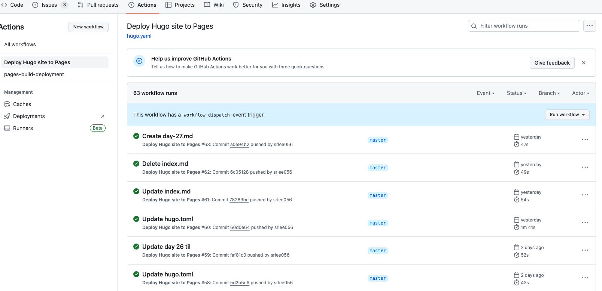

# 느낀점 및 회고

1. **블로그 제작**
    1. 걱정한 것 보다 쉬웠고(3일 정도 소요) 블로그의 기능에 만족하며, 세부적으로 꾸미는 과정에 재미를 느끼고 있습니다.
    2. 버전 관리와 고민과 Markdown 표현에 대한 고민을 한번에 해결하게 되어 후련함을 느꼈습니다.
2. **자동 배포 이해**: GitHub Actions를 활용한 자동 배포를 경험하며 이해할 수 있었고, 프로젝트에 활용하게 되는 계기가 되었습니다.
3. **Hugo 설정 과정의 고난과 성취**
    1. Hugo의 config 설정 관련 변경사항이 많았고, 한국어로 된 자료도 많이 부족합니다.
    2. 블로그 제작 기간 중 대부분의 시간을 config 파일 관련된 부분을 찾고 이해하는데 소요했습니다.
    3. 그만큼 원하는 결과를 얻게 되어 만족스럽습니다.
4. **Git Submodule :** Git Submodule 개념을 처음 접하고 활용하면서, 이에 대한 필요성과 활용 가능성을 체감하게 되었습니다.
