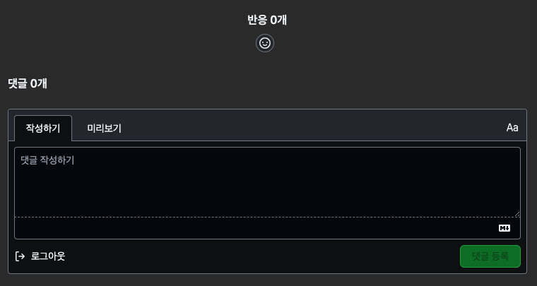
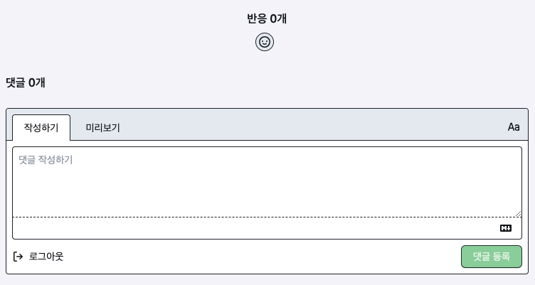

+++
author = "Seorim"
title = 'Blog 제작기 #3'
url = '/Blog/blog-3'
date = 2023-12-19T15:22:00+09:00
draft = false
categories = [
    "Blog", 
]
tags = [
    "Blog", "hugo", "Github Pages","Giscus"
]
+++

# hugo theme stack에서 giscus 댓글창 사용하기

## 댓글창 활성화하기


댓글창 활성화해야지, 해야지 생각만 하다가 거의 두달이 지났으니 이젠 진짜 해야만 한다

[Giscus 댓글창 추가](https://kzeoh.github.io/posts/make-blog3/) 블로그 글을 참고하였다.

### github repo 생성 및 giscus 설치


### theme과 연결

내가 사용하는 hugo stack theme은 giscus comment systems를 지원하고 있었다. 그래서 가이드를 따라서 설정을 진행했다.

[hugo stack theme doc](https://stack.jimmycai.com/config/comments)

설정은 `hugo.toml`을 수정하면 되는데, 이 때 필요한 repo id나 기타 등등은 <https://giscus.app/ko>를 통해 알 수 있다.

`lightTheme`, `darkTheme`에 각각 라이트, 다크모드의 giscus theme을 적어주면 된다.

나는 위에 언급한 페이지에서 테마를 몇개 구경하고, `light_high_contrast`와 `dark_high_contrast`로 정해서 세팅파일에 적어주었다.

```toml
[params.comments]
enabled = true
provider = "giscus"

[params.comments.giscus]
reactionsEnabled = 1
emitMetadata = 0
repo = "srlee056/giscus"
repoID = "R_kgDOK7YF9g"
category = "Blog"
categoryID = "DIC_kwDOK7YF9s4Cb2te"
mapping = "pathname"
lang = "ko"
lightTheme = "light_high_contrast"
darkTheme = "dark_high_contrast"
```

### 결과 화면

[ 다크모드 ON ]



[ 다크모드 OFF ]


