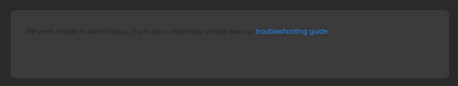
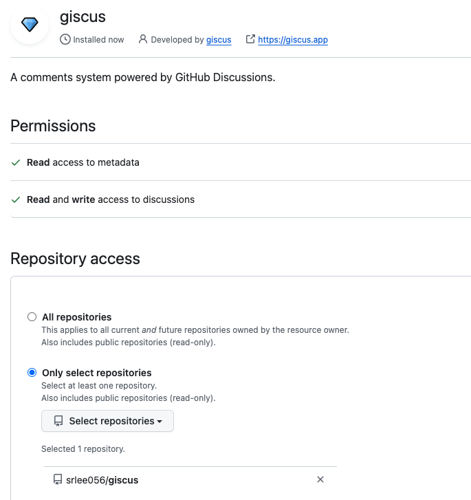

+++
author = "Seorim"
title = 'Blog 제작기 #3'
url = '/Blog/blog-3'
date = 2023-10-16
draft = false
categories = [
    "Blog", 
]
tags = [
    "Blog", "hugo", "Github Pages",
]
+++

## 댓글창 활성화하기



댓글창 활성화해야지, 해야지 생각만 하다가 거의 두달이 지났으니 이젠 진짜 해야만 한다

[Giscus 댓글창 추가](https://kzeoh.github.io/posts/make-blog3/) 블로그 글을 참고하였다.

### github repo 생성 및 giscus 설치



### theme과 연결

내가 사용하는 hugo stack theme은 giscus comment systems를 지원하고 있었다. 그래서 가이드를 따라서 설정을 진행했다.

[hugo stack theme doc](https://stack.jimmycai.com/config/comments)

설정은 `hugo.toml`을 수정하면 되는데, 이 때 필요한 repo id나 기타 등등은 <https://giscus.app/ko>를 통해 알 수 있다.

```script
<script src="https://giscus.app/client.js"
        data-repo="srlee056/giscus"
        data-repo-id="R_kgDOK7YF9g"
        data-category="Blog"
        data-category-id="DIC_kwDOK7YF9s4Cb2te"
        data-mapping="pathname"
        data-strict="0"
        data-reactions-enabled="1"
        data-emit-metadata="0"
        data-input-position="bottom"
        data-theme="preferred_color_scheme"
        data-lang="ko"
        crossorigin="anonymous"
        async>
</script>
```
