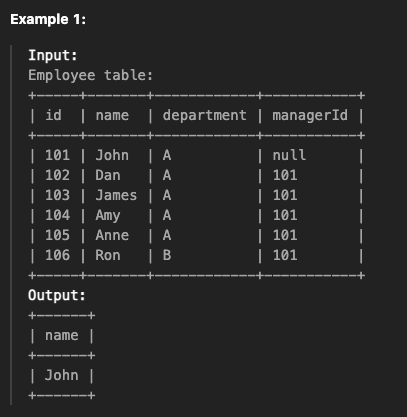
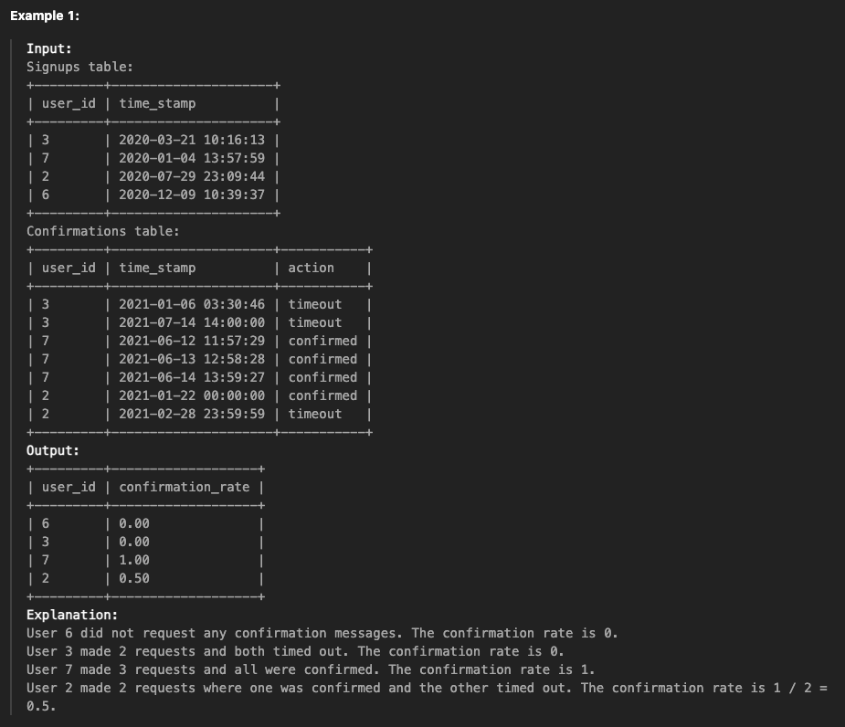
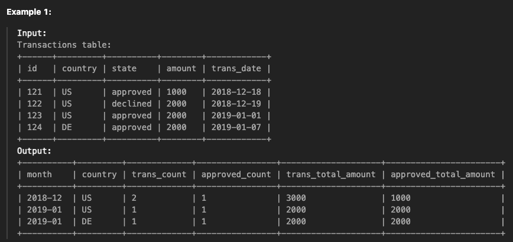
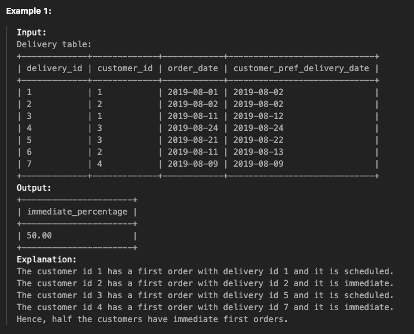

+++
author = "Seorim"
title =  "LeetCode : SQL medium problems"
slug = "240122-sql.md"
date = 2024-01-22T11:36:52+09:00

categories = [
    "CodingTest",
]
tags = [
    "SQL","LeetCode", 
]
+++

LeetCode에서 SQL 문제 풀어보는 중이고, Easy난이도는 너무 쉬워서 Medium부터 시작하고 있다.
오늘은 4문제 정도 풀었는데, 별개의 글로 나눠서 업로드하기가 번거로워서 한번에 기록하려고 한다.

# Managers with at Least 5 Direct Reports

[문제 Link](https://leetcode.com/problems/managers-with-at-least-5-direct-reports/description/)

## 문제 설명

> Table: Employee

| Column Name | Type    |
| ----------- | ------- |
| id          | int     |
| name        | varchar |
| department  | varchar |
| managerId   | int     |

id is the primary key (column with unique values) for this table.
Each row of this table indicates the name of an employee, their department, and the id of their manager.
If managerId is null, then the employee does not have a manager.
No employee will be the manager of themself.

Write a solution to find managers with at least five direct reports.

Return the result table in any order.

The result format is in the following example.



## 풀이 코드

```sql
select I.name
from(
select managerId, count(managerId) as counts
    from Employee
    where managerId is not null
    group by managerId
) as M
    join Employee as I on M.managerId = I.id
    where M.counts>=5;
```

## CHECK!

- `self join`을 사용하여 managerId에 해당하는 이름을 가져왔다.

# Confirmation Rate

[문제 Link](https://leetcode.com/problems/confirmation-rate/description/)

## 문제 설명

> Table: Signups

| Column Name | Type     |
| ----------- | -------- |
| user_id     | int      |
| time_stamp  | datetime |

user_id is the column of unique values for this table.
Each row contains information about the signup time for the user with ID user_id.

> Table: Confirmations

| Column Name | Type     |
| ----------- | -------- |
| user_id     | int      |
| time_stamp  | datetime |
| action      | ENUM     |

- (user_id, time_stamp) is the primary key (combination of columns with unique values) for this table.
- user_id is a foreign key (reference column) to the Signups table.
- action is an ENUM (category) of the type ('confirmed', 'timeout')
- Each row of this table indicates that the user with ID user_id requested a confirmation message at time_stamp and that confirmation message was either confirmed ('confirmed') or expired without confirming ('timeout').

The confirmation rate of a user is the number of 'confirmed' messages divided by the total number of requested confirmation messages. The confirmation rate of a user that did not request any confirmation messages is 0. Round the confirmation rate to two decimal places.

Write a solution to find the confirmation rate of each user.

Return the result table in any order.

The result format is in the following example.



## 풀이 코드

```sql
# Write your MySQL query statement below
select S.user_id, IFNull(C.confirmation_rate, 0) as confirmation_rate
from(
select user_id,
    round(count(if(action='confirmed', action, null)) / count(*), 2) as confirmation_rate
    from Confirmations
    group by user_id
) as C
right join Signups as S on C.user_id = S.user_id
```

## CHECK!

- `right join`을 하면서 빈 컬럼이 생기고, 문제 의도에 따라 이 값을 0으로 지정해줘야 하므로 `IFNULL()`을 사용했다.
- IFNULL(column 이름, null일 경우 값)

# Monthly Transactions I

[문제 Link](https://leetcode.com/problems/monthly-transactions-i/description/)

## 문제 설명

> Table: Transactions

| Column Name | Type    |
| ----------- | ------- |
| id          | int     |
| country     | varchar |
| state       | enum    |
| amount      | int     |
| trans_date  | date    |

- id is the primary key of this table.
  The table has information about incoming transactions.
- The state column is an enum of type ["approved", "declined"].

Write an SQL query to find for each month and country, the number of transactions and their total amount, the number of approved transactions and their total amount.

Return the result table in any order.

The query result format is in the following example.



## 풀이 코드

```sql
select
    date_format(trans_date, '%Y-%m') as month,
    country,
    count(*) as trans_count,
    count(if(state = 'approved', 1, null)) as approved_count,
    sum(amount) as trans_total_amount,
    sum(if(state = 'approved', amount, 0)) as approved_total_amount
from Transactions
group by country, month
```

## CHECK!

- `COUNT(IF()), SUM(IF())` 의 사용법에 대해 확인하고 실행해볼 수 있었다.
- COUNT(IF(조건문, true인 경우의 값, false인 경우의 값))
  - false일 때 null 외에 0 등을 넣게 되면 count하게 되므로 주의
- SUM(IF())도 parameter는 같다.

# Immediate Food Delivery II

[문제 Link](https://leetcode.com/problems/immediate-food-delivery-ii/description/)

## 문제 설명

> Table: Delivery

| Column Name                 | Type |
| --------------------------- | ---- |
| delivery_id                 | int  |
| customer_id                 | int  |
| order_date                  | date |
| customer_pref_delivery_date | date |

- delivery_id is the column of unique values of this table.
- The table holds information about food delivery to customers that make orders at some date and specify a preferred delivery date (on the same order date or after it).

If the customer's preferred delivery date is the same as the order date, then the order is called immediate; otherwise, it is called scheduled.

The first order of a customer is the order with the earliest order date that the customer made. It is guaranteed that a customer has precisely one first order.

Write a solution to find the percentage of immediate orders in the first orders of all customers, rounded to 2 decimal places.

The result format is in the following example.



## 풀이 코드

```sql
select
    round(100 * count(if(order_date=customer_pref_delivery_date, 1, null)) / count(*), 2) as immediate_percentage
from Delivery
where (customer_id, order_date) in (
    select customer_id, min(order_date)
    from Delivery
    group by customer_id
)
```

## CHECK!

```sql
where (a, b) in (
    select a, b
...
)
```

- 단순하게 MIN(order_date)만 조건을 걸어줄 경우, 여러 customer가 같은 날짜에 주문을 시킨 경우에 첫 주문이 아닌데도 고려하게 된다. 따라서 `customer_id, order_date pair`를 체크해야 한다.
- `IN()`을 사용할 때, multiple value를 묶어서 한번에 `여러 column에 조건을 적용`할 수 있다.
