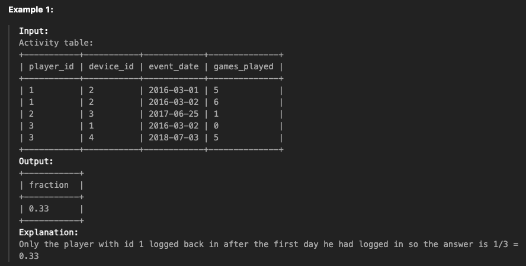
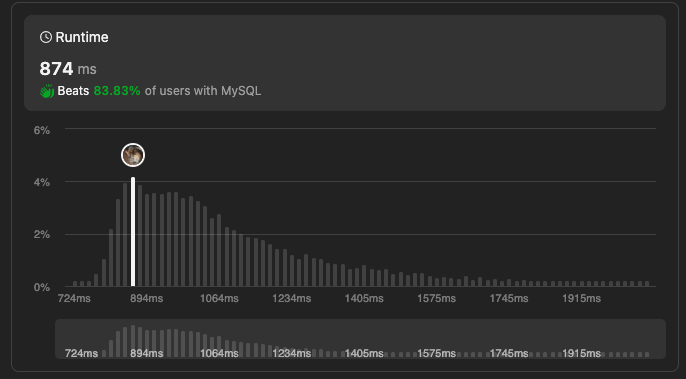
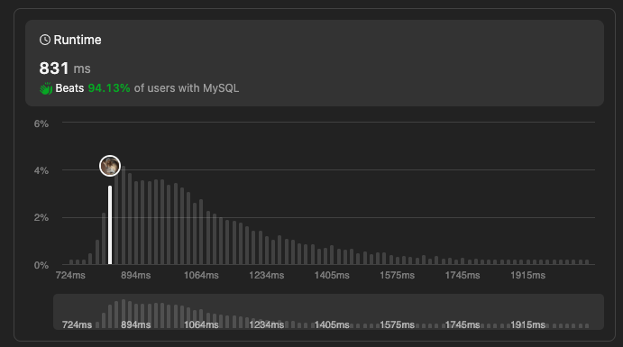

+++
author = "Seorim"
title =  "LeetCode : SQL medium problems"
slug = "240123-sql"
date = 2024-01-23T11:51:00+09:00

categories = [
    "CodingTest",
]
tags = [
    "SQL","LeetCode",
]
+++

오늘은 medium 난이도 1문제를 풀고, Chatgpt에게 리팩토링 및 문법의 효율성에 대해 물어봤다.

# Game Play Analysis IV

[문제 Link](https://leetcode.com/problems/game-play-analysis-iv/description)

## 문제 설명

> Table: Activity

| Column Name  | Type |
| ------------ | ---- |
| player_id    | int  |
| device_id    | int  |
| event_date   | date |
| games_played | int  |

- (player_id, event_date) is the primary key (combination of columns with unique values) of this table.
- This table shows the activity of players of some games.
- Each row is a record of a player who logged in and played a number of games (possibly 0) before logging out on someday using some device.

Write a solution to report the fraction of players that logged in again on the day after the day they first logged in, rounded to 2 decimal places. In other words, you need to count the number of players that logged in for at least two consecutive days starting from their first login date, then divide that number by the total number of players.

The result format is in the following example.



## 풀이 코드

- before refactoring

```sql
select round(count(distinct r.player_id) / count(distinct a.player_id),2) as fraction
from Activity a
left join(
select *
from Activity a1
where (player_id, event_date) in (
    select player_id, (min(event_date) + interval 1 day) as event_date
    from Activity
    group by player_id
)
) r on a.player_id = r.player_id;
```



- after refactoring

```sql
SELECT ROUND(COUNT(DISTINCT r.player_id) / COUNT(DISTINCT a.player_id), 2) AS fraction
FROM Activity a
LEFT JOIN (
    SELECT player_id, MIN(event_date) + INTERVAL 1 DAY AS next_day
    FROM Activity
    GROUP BY player_id
) r ON a.player_id = r.player_id AND a.event_date = r.next_day;
```



## CHECK!

- 처음 플레이 날짜와 그 다음날에 플레이 한 날 모두 존재함을 확인하기 위해, `min()+1`값을 가진 evnet_date가 존재하는지를 확인하였다.
- where in() 구문이 join보다 더 나을거라고 생각했지만 실제로는 경우에 따라 다른 결과가 나온다고 한다.

## JOIN, WHERE IN, WHERE EXISTS (Chatgpt 답변)

SQL에서 서브쿼리를 사용하는 방식인 `JOIN`, `WHERE IN`, `WHERE EXISTS` 각각은 특정 상황에서 사용되며, 각각의 성능과 사용상의 차이점이 있습니다.

1. **JOIN (특히 INNER JOIN)**

   - `JOIN`은 두 테이블에서 관련된 행을 결합하여 결과를 반환합니다.
   - `JOIN`은 두 데이터 세트 간의 관계를 명확히 하고, 결과 테이블에서 모든 관련 열을 선택할 수 있게 해줍니다.
   - 대규모 데이터셋에서는 메모리 사용량이 높을 수 있으며, 성능에 영향을 줄 수 있습니다.
   - `JOIN`은 관계형 데이터베이스의 정규화된 스키마에 적합합니다.

2. **WHERE IN**

   - `WHERE IN` 서브쿼리는 주 쿼리의 열 값이 서브쿼리 결과 집합에 속하는 행만을 반환합니다.
   - 작은 데이터셋에 적합하며, 가독성이 좋습니다.
   - 대규모 데이터셋에서는 성능이 저하될 수 있습니다. 서브쿼리가 큰 데이터셋을 반환할 때, 주 쿼리는 서브쿼리의 결과와 매번 비교해야 하기 때문입니다.
   - 서브쿼리가 한 번 실행되고, 그 결과가 주 쿼리에 대한 비교를 위해 사용됩니다.

3. **WHERE EXISTS**
   - `WHERE EXISTS` 서브쿼리는 서브쿼리가 최소 하나의 행을 반환하는 경우에만 주 쿼리의 행을 반환합니다.
   - `EXISTS`는 주로 상관 서브쿼리(correlated subquery)와 함께 사용됩니다. 상관 서브쿼리는 주 쿼리의 각 행에 대해 실행됩니다.
   - 대규모 데이터셋에서 `IN`보다 성능이 좋을 수 있습니다. `EXISTS`는 조건을 만족하는 첫 번째 행을 찾으면 즉시 중단합니다.
   - `EXISTS`는 주로 존재 여부를 확인하는 데 사용되며, 특정 값을 반환하는 데는 사용되지 않습니다.

### 성능 관점

- **데이터셋의 크기**: 대규모 데이터셋에서는 `JOIN`이나 `EXISTS`가 `IN`보다 성능이 좋을 수 있습니다.
- **인덱싱**: 적절한 인덱싱은 `JOIN`, `IN`, `EXISTS` 쿼리의 성능에 큰 영향을 미칩니다.
- **데이터베이스 엔진 최적화**: 현대의 데이터베이스 관리 시스템은 쿼리 최적화를 자동으로 수행하기 때문에, 실제 성능 차이는 예상보다 작을 수 있습니다.

### 사용 사례

- `JOIN`: 관계형 데이터의 분석이나 복잡한 데이터 추출에 적합합니다.
- `IN`: 작은 데이터셋을 대상으로 간단한 목록 조회에 적합합니다.
- `EXISTS`: 존재 여부 확인이 필요하거나 상관 서브쿼리를 사용할 때 적합합니다.

각 방식의 선택은 사용 사례, 데이터셋의 크기 및 구조, 그리고 데이터베이스의 성능에 따라 달라질 수 있습니다.
