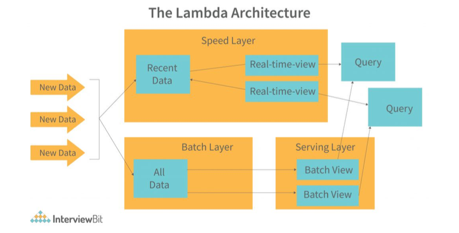

+++
author = "Seorim"
title =  "데이터 처리(1): 실시간 데이터 처리"
slug = "240122-1"
date = 2024-01-22T16:29:58+09:00

categories = [
    "DevCourse",
]
tags = [
    "TIL","Data Processing", "Kafka", "Spark Streaming"
]
+++

# 구글의 기술 공유가 데이터 처리 분야에 미친 영향

## 구글 검색 엔진 - Page Rank

- 기존 검색 엔진은 웹 페이지의 텍스트만 보고 랭킹을 결정
  - 신뢰도 체크 X
  - 많이 사용되는 키워드를 사용해 생성한 spam page가 넘쳐나 검색 엔진의 신뢰도와 효용성 하락

### Page Rank

> 구글의 검색 엔진에 사용된 알고리즘으로, `링크를 기반으로 중요한 페이지를 찾아 랭킹을 결정`

- 중요한 페이지를 결정하는 기준
  1. 중요한 페이지는 다른 페이지로부터 링크를 받는다
  2. 중요한 페이지에 링크를 건 페이지들은 상대적으로 중요한 페이지
  - 일반적으로 신뢰할 수 있고 높은 퀄리티를 가진 사이트(ex: 야후) 등을 기반으로 진행
  - 논문의 Citation과 유사
- 웹상의 모든 페이지에 중요도 점수를 부여할 수 있음
- 계산을 위해 `대용량 컴퓨팅 인프라와 소프트웨어가 필요`해짐

## `빅데이터 시대`의 도래

- Page Rank 기술의 공유를 통해 이를 활용하는 다른 검색 엔진 서비스들이 생겨남
  - 대량의 데이터를 처리하고, 최적의 결과를 찾아내며, 각종 마이닝을 하는 등 처리하는 과정
- 분산 파일 시스템과 관련된 두 개의 논문
  - The Google File System
  - MapReduce: Simplified Data Processing on Large Cluster
  - 하둡 오픈소스 프로젝트의 시작
    - 빅데이터 처리를 가능하게 했으며, 오픈소스 활동이 더욱 활발해지는 원인이 됨
    - 결과적으로 머신러닝, 인공지능 발전을 가속화함

## 구글 애드워즈(Google AdWords)

> 검색 기술과 검색 마케팅의 결합

- 오버추어가 시작한 웹 검색 광고를 발전시킴
  - 검색어 경매 방식에 사람이 필요했던 (자동화X) 비효율적인 기존 방식을 개선
  - 웹 기반 자동화, 사람 개입 없이 검색어 경매와 광고 시스템 구축

## 그 외 구글의 기술 공유

- TensorFlow
- Kubernetes
- ...

# 데이터 처리 단계

1. 데이터 수집 (Data Collection)
2. 데이터 저장 (Data Storage)
3. 데이터 처리 (Data Processing)

## 데이터 저장 (Data Storage)

> Data Warehouse -> Data Lake -> Cloud Data Platform / <o1>Messaging Queue</o1> -> Data Mesh  
> 중앙 시스템 -> 분산 시스템

- 빅데이터가 대두되고 데이터 처리 방법에 대한 기술이 발전함에 따라, 데이터 저장 방식도 변화해왔다.

## 데이터 처리 (Data Processing)

> Batch Processing -> Realtime(& Semi Realtime) Processing

- 서비스가 고도화되며 실시간 데이터 처리 요구가 발생하게 되었다.

### 용어 및 개념 정리

- Throughput : 단위 시간 동안 처리할 수 있는 데이터 양
- Latency : 데이터를 처리하는 데 걸리는 시간
- Bandwidth : Throughput x Latency

 

- SLA(Service Level Agreement) : 서비스 제공업체와 고객간의 계약 또는 합의사항으로, 사내 시스템 사이에서도 정의됨
  - `uptime` 99.9% 보장 : 1년의 0.1%인 8시간 45.6분을 제외하고는 항상 작동함을 보장
  - 99%(or average) of API's `latency` = 0.5s 보장
  - `freshness` of data

### 배치 처리(Batch Processing)

> 주기적으로 데이터를 이동시키거나 처리하는 것

- Throughput 중요
- 주기는 보통 `hourly, daily`이며 짧은 경우엔 5~10분 정도
- 주기가 이보다 짧을 경우 배치 처리를 위한 프레임워크에서 처리하기엔 적절하지 않음

#### 시스템 구조

- Distributed File System : HDFS, S3
- Distributed Processing System : MapReduce, Spark (DataFrame, SQL), ...
- Data Process Scheduling : Airflow

### 실시간 처리(Realtime Processing, Streaming Processing)

> 연속적인 데이터를 처리하는 것

- Latency 중요
- realtime과 semi-realtime(micro batch)로 나뉨

  - realtime : Event가 발생했을 때, 작업이나 계산이 실행됨, 동적 및 반응형
    - `Event` : `초 단위 연속적 데이터`, Immutable | Event Stream
  - semi-realtime : `짧은 주기의 배치 처리` 진행, 주기적인 업데이트 진행
    - 합리적 Latency를 갖고 있으며, 적시성과 효율성 사이에서 균형을 이루고 있음 (때로는 일부 즉각성 희생)

- 모니터링이 필요하며, 데이터 유실 위험이 있어 <o1>시스템 관리 운영의 복잡도가 증가함</o1>

#### 데이터 처리를 위한 서비스들

- Event 저장을 위한 Message Queue : <o1>Kafka</o1>, Kinesis, Pub/Sub, ...
- Event 처리를 위한 시스템 : <o1>Spark Streaming</o1>, ...
- 데이터 분석을 위한 Analytics/Dashboard : Druid

#### 시스템 구조

1. <o1>Producer</o1> : 데이터 생성
2. 데이터를 <o1>Message Queue</o1>에 저장
   - event stream _(topic in Kafka)_ 마다 `데이터 보유 기한 설정`(Retention Policy)
3. <o1>Consumer</o1> : Queue에서 데이터를 읽고 처리
   - offset : Consumer마다 별도로 유지하는 포인터
   - Consumer group : 다수의 Consumer가 데이터 읽기를 공동으로 수행

#### 장단점

**장점**

- 효율적인 운영
  - 사고 등 이벤트에 빠르게 대응 가능
- 실시간 협업 등 소통 가능
- 효율적인 데이터 활용
  - 실시간 insight 발견
  - 개인화된 사용자 경험 개선
  - IoT, 센서 데이터 활용

**단점**

- 시스템 복잡성 증가
  - 실시간 장애에 대응하는것이 중요해짐
- 이에 따른 운영 비용의 증가

### Lambda Architecture

> 배치 레이어와 실시간 레이어 두 가지를 별도로 운영하는 것으로, 다양한 아키텍쳐 구조가 존재한다.

#### 검색 엔진의 데이터 처리

- 실시간 데이터 처리 이전
  - 구글 댄스 : 주기적으로 배치 처리를 하여 검색 인덱스를 업데이트(3개월에 한번)
  - 검색 키워드의 랭킹이 크게 변동되어 마케팅 분야에서 큰 이슈 중 하나였음
- 실시간 데이터 처리 이후
  - 실시간 업데이트 진행
  - 구글 페이지랭크 계산 등은 증분 계산 => `Lambda Architecture`

#### 예시

- Batch Update가 진행되는 동안의 데이터를 realtime layer가 읽어오는 방식

  

- streaming data가 Kafka 등 message queue에 저장되고,  
  realtime(HOT)과 Batch(Cold)로 나뉘어 사용 및 저장되는 방식

  

# 실시간 데이터 종류와 사용 사례

- Online Service
- Retail Business
- IoT

## Event data 처리

- Realtime Reporting
- Realtime Alerting
- Realtime Prediction(ML Model)

# 실시간 데이터 처리 과정의 challenge

## 실시간 데이터 처리 단계

1. 이벤트 데이터 모델 결정
   - `Primary Key`, `Timestamp` 필요
   - 이벤트와 관련된 세부 정보 필요
2. 이벤트 데이터 전송/저장

   - <o1>**Point to Point**</o1>

     - Many to Many 연결
     - Low Throughput Low Latency
     - `backpressure`
       - 다운스트림 단계 (Consumer)가 데이터 속도를 따라잡지 못해 발생
       - 시스템에 데이터가 쌓여 지연되거나 데이터가 유실됨(Buffer Overflow)
       - 메모리 사용량 증가 등으로 잠재적 시스템 장애 초래 가능
       - `Message Queue 도입`으로 해결 가능하지만 완전한 해결은 불가능

   - <o1>**Messaging Queue**</o1>
     - 비교적 안정적인 시스템, 운영 용이
     - 중간에 데이터 저장소(Message Queue)를 두고 Producer, Consumer 서로 독립되어(decoupled) 작업
     - 다수의 Consumer를 쉽게 생성 가능

3. 이벤트 데이터 처리
4. 이벤트 데이터 관리, 모니터링과 해결
