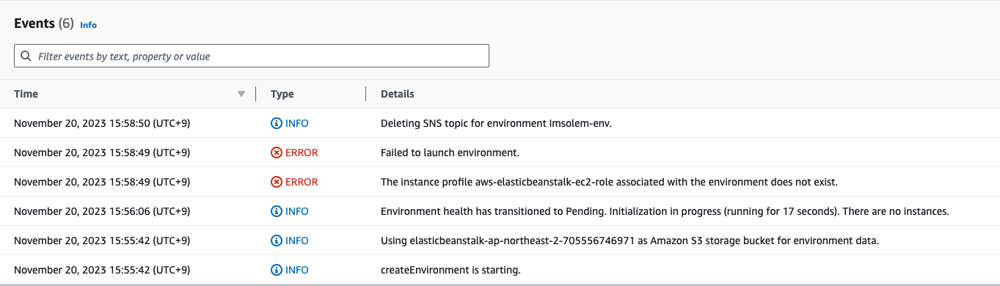
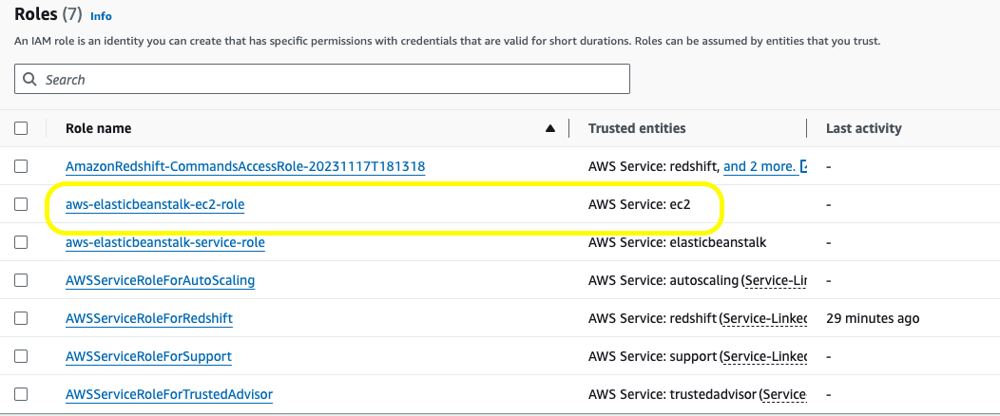
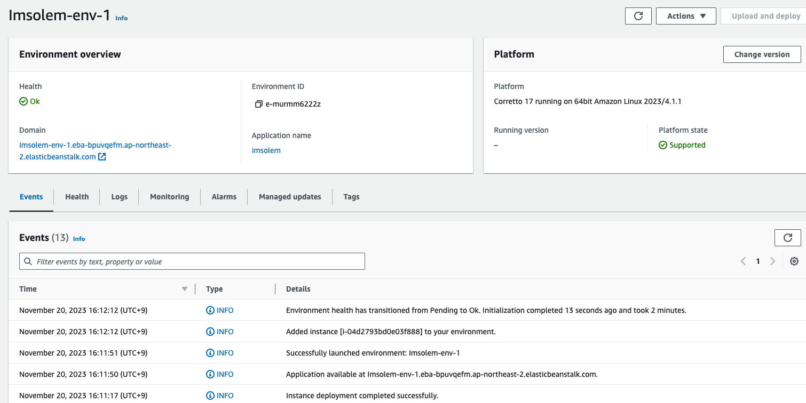

+++
author = "Seorim"
title =  "Day 26"
date = 2023-11-20T10:50:47+09:00

categories = [
    "DevCourse",
]
tags = [
    "TIL",
]
+++

# TIL -

## 📋 공부 내용

###

####

## 👀 CHECK

_(어렵거나 새롭게 알게 된 것 등 다시 확인할 것들)_

-   elsticbeanstalk 오류 관련 해결법

    [stackoverflow 링크](https://stackoverflow.com/questions/30790666/error-with-not-existing-instance-profile-while-trying-to-get-a-django-project-ru)

    -   envirionment 생성 시 오류 발생
        
    -   IAM Role 생성해서 오류 해결
        
    -   environment 생성 성공
        

## ❗ 느낀 점
