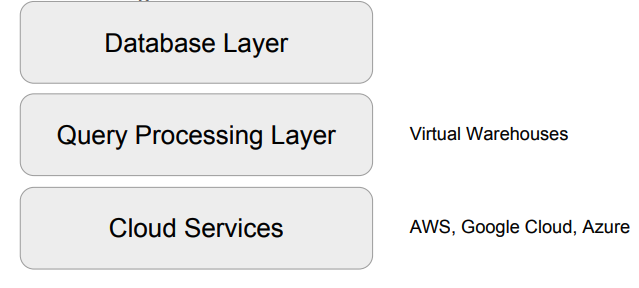
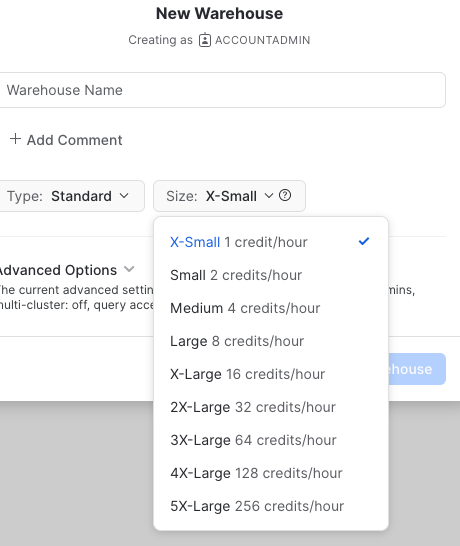
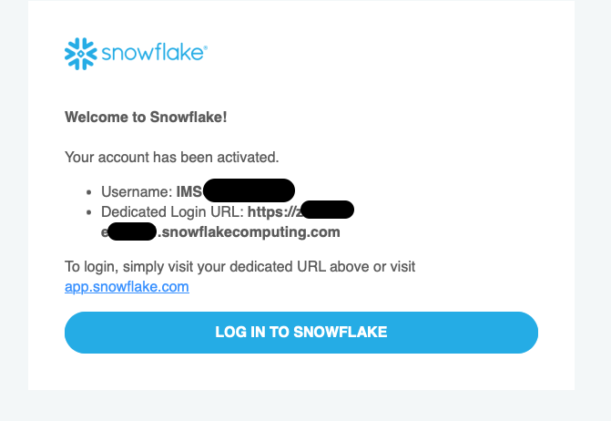
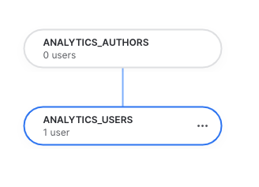

+++
author = "Seorim"
title =  "Day 34 Snowflake"
slug = 'day-34'
date = 2023-11-30T12:06:30+09:00

categories = [
    "DevCourse",
]
tags = [
    "TIL", "Snowflake", "DataWarehouse",
]
+++

# 📋 공부 내용

## Snowflake

### 소개

-   클라우드 기반 데이터웨어하우스
-   ["데이터 클라우드"](https://slownews.kr/81312)

### 특징

-   가변비용 모델

    -   storage, computing infra `별도 설정 가능`
    -   노드 수 조정, distkey(데이터 skew 문제) 등 조절 불필요

-   데이터 처리
    -   SQL 기반 빅데이터 처리 가능
    -   비구조화 데이터 처리, ML 기능 제공
-   멀티클라우드

    -   AWS, GCP, Azure 과 같은 글로벌 클라우드 위에서 모두 동작(멀티클라우드)
    -   다양한 포맷, 다양한 플랫폼의 클라우드 스토리지(S3, GC Cloud Storage 등) 지원
        

-   다른 지역 데이터 공유 (Cross-Region Replication) 기능 지원

-   Time travel
    -   정의된 기간 내의 모든 시점에서 과거 데이터에 액세스할 수 있는 기능
    -   오브젝트 복원, 과거 시점 데이터 복제 혹은 백업, 지정된 기간 동안 데이터 사용/조작 분석 등으로 활용 가능
-   Python API 제공

-   Snowflake 계정 구성
    -   Organizations
        -   하나 혹은 그 이상의 Account로 구성됨
    -   Accounts
        -   하나 혹은 그 이상의 DB로 구성됨
    -   Databases
        -   Account에 소속된 데이터를 다루는 컨테이너
        -   `Warehouse`(컴퓨팅리소스)와 일대일 관계가 아님 (1 Warehouse - 4 Databases)
-   Data Marketplace
-   Data Sharing
    > "Share, Don't Move"  
    >  Dataset을 `Storage level`에서 공유하는 방식
-   Activity
    -   Query/Copy/Task History

### 비용

#### 컴퓨팅 비용 : Credit

-   Credit : 쿼리 실행, 데이터 로드 등 작업 수행에 소비되는 리소스 단위
-   1 Credit = $2~$4
-   Snowflake Warehouse : 사용시간 당 크레딧 청구
    

#### 스토리지 비용

-   TB 당 비용 청구

#### 네트워크 비용

-   지역간, 또는 (다른)클라우드간 데이터 전송 시 TB 당 비용 청구

### Data Governance

> 필요한 데이터가 적재적소에 올바르게 사용됨을 보장하기 위한 데이터 관리 프로세스

#### Object Tagging

> `Snowflake object`에 `태그를 지정`할 수 있는 기능  
> _Object : Organization, Account, Schema, View, ..._

-   생성 : `CREATE TAG`
-   Snowflake에서 기본적으로 제공하는 시스템 태그 존재
-   지정된 tag는 구조를 따라 계승됨

#### Data Classification

> Snowflake가 `데이터를 자동으로 분류하여 태그를 지정`해주는 기능  
> '매뉴얼하게 관리하기가 어려운' Object Tagging의 단점을 보완해주기 위해 등장

1. Analyze : 테이블에서 개인정보나 민감정보가 있는 컬럼들을 분류
2. Review : 분류한 결과를 사람(데이터 엔지니어등)이 수정 등 리뷰
3. Apply : 최종 결과를 System Tag로 적용
    - SNOWFLAKE.CORE.PRIVACY_CATEGORY (상위레벨)
        - IDENTIFIER, QUASI_IDENTIFIER, SENSITIVE
    - SNOWFLAKE.CORE.SEMANTIC_CATEGORY (하위레벨 - 더 세부정보)

-   식별자와 준식별자
    -   식별자(Identifier) : 개인을 바로 지칭할 수 있는 정보
    -   준식별자(Quasi Identifier) : 조합을 통해 개인을 지칭할 수 있는 정보
        | PRIVACY_CATEGORY | SEMANTIC_CATEGORY |
        | ---------------- | ------------------------------ |
        | IDENTIFIER | EMAIL, NAME, PHONE_NUMBER, ... |
        | QUASI_IDENTIFIER | AGE, GENDER, ... |

#### Tag based Masking Policies

> `태그를 기반`으로 유저와 그 `권한을 지정`하는 기능

-   Tag에 액세스 권한을 지정
-   Tag가 지정된 Snowflake Object의 액세스 권한을 그에 맞춰 제한하는 방식
-   개인정보와 같은 Tag에 액세스 권한을 부여하는 방식으로 많이 사용됨

#### Access History

> 데이터 액세스에 대한 기록을 제공하여 감사 추적을 가능하게 함으로써 **보안과 규정 준수**  
> 모든 클라우드 데이터 웨어하우스에서 제공되고 있는 기능

-   `'Access History'`
    -   데이터베이스 로그인, 실행된 쿼리, 테이블 및 뷰 액세스, 데이터 조작 작업
-   잠재적인 보안 위반이나 무단 액세스 시도의 조사를 가능하게 해줌
-   캡처된 정보 : 사용자 신원, IP 주소, 타임스탬프 및 기타 관련 세부 정보 포함

#### Object Dependencies

> 테이블이나 뷰 등 `Object를 수정`할 때 이로 인한 `영향을 자동으로 식별`하는 기능  
> 데이터 거버넌스와 시스템 무결성 유지를 목적으로 함

-   ex: 테이블 이름이나 컬럼 이름을 변경하거나 삭제하는 경우
-   계승 관계 분석을 통한 더 세밀한 보안 및 액세스 제어
    -   어떤 테이블의 개인정보 컬럼이 새로운 테이블을 만들때 사용된다면?
        -   원본 테이블에서의 권한 설정이 그대로 전파됨 (Tag 포함)

## Snowflake 활용 실습

### 계정 생성

-   무료 시험판 계정 생성

    

-   무료계정은 별도의 로그인 링크를 통해 접속해야 함

    

### 실습 코드

#### Schema

```
SNOWFLAKE DB & Schema
dev
├─ raw_data
├─ analytics
└─ adhoc
```

#### db & schema 생성

```sql
-- create db and schema
CREATE DATABASE dev;

CREATE SCHEMA dev.raw_data;
CREATE SCHEMA dev.analytics;
CREATE SCHEMA dev.adhoc;
```

#### table 생성

-   session_transaction, user_session_channel, session_timestamp 세 개의 테이블 생성

```sql
-- create tables
CREATE OR REPLACE TABLE dev.raw_data.session_transaction (
 sessionid varchar(32) primary key,
 refunded boolean,
 amount int
);
```

#### s3 data 연결

-   S3 read 권한을 가진 IAM User 생성 & ACCESS KEY를 발급
    
-   COPY command로 데이터 파일에서 추출하여 저장

```sql
COPY INTO dev.raw_data.session_transaction
FROM 's3://{s3-bucket-path}/session_transaction.csv'
credentials=(AWS_KEY_ID='' AWS_SECRET_KEY='')
FILE_FORMAT = (type='CSV' skip_header=1 FIELD_OPTIONALLY_ENCLOSED_BY='"');
```

-   analytics schema에 테이블을 생성하고 데이터가 잘 불러와졌는지 확인

```sql
-- create a table using CTAS
CREATE TABLE dev.analytics.mau_summary AS
SELECT
 TO_CHAR(A.ts, 'YYYY-MM') AS month,
 COUNT(DISTINCT B.userid) AS mau
FROM raw_data.session_timestamp A
JOIN raw_data.user_session_channel B ON A.sessionid = B.sessionid
GROUP BY 1
ORDER BY 1 DESC;

SELECT * FROM dev.analytics.mau_summary LIMIT 10;
```

#### Role & User 생성

```sql
-- create 3 roles
CREATE ROLE analytics_users;
CREATE ROLE analytics_authors;
CREATE ROLE pii_users;

-- create a user
CREATE USER seorim PASSWORD='xx';

-- grant role to user
GRANT ROLE analytics_users to USER seorim;
```

#### 각 ROLE의 권한 설정

```sql
-- set up analytics_users
GRANT USAGE on schema dev.raw_data to ROLE analytics_users;
GRANT SELECT on all tables in schema dev.raw_data to ROLE analytics_users;
GRANT USAGE on schema dev.analytics to ROLE analytics_users;
GRANT SELECT on all tables in schema dev.analytics to ROLE analytics_users;
GRANT ALL on schema dev.adhoc to ROLE analytics_users;
GRANT ALL on all tables in schema dev.adhoc to ROLE analytics_users;

-- set up analytics_authors
-- authors role이 users role의 권한 설정도 상속받게 됨
GRANT ROLE analytics_users TO ROLE analytics_authors;
GRANT ALL on schema dev.analytics to ROLE analytics_authors;
GRANT ALL on all tables in schema dev.analytics to ROLE analytics_authors;
```



# 👀 CHECK

_<span style = "font-size:15px">(어렵거나 새롭게 알게 된 것 등 다시 확인할 것들)</span>_

### Snowflake SQL

-   <https://docs.snowflake.com/en/guides-overview-queries>

> "Snowflake supports standard SQL", including a subset of ANSI SQL:1999 and the SQL:2003 analytic extensions. Snowflake also supports common variations for a number of commands where those variations do not conflict with each other.

### Snowflake Object Hierachy

-   <https://docs.snowflake.com/en/user-guide/security-access-control-overview>


# ❗ 느낀 점

강의는 Snowflake에 대해 배우고, 간단하게 활용해보는 내용이었다. 전반적으로 어려운 건 없었다. notebook을 따로 써야하는(Colab or Jupyter) Redshift와는 다르게, 자체적으로 notebook 역할을 하는 worksheet를 제공한다. worksheet를 포함한 UI가 redshift를 사용할 때와 비교하면 더 편하고 깔끔해서 좋았다.

오늘은 게더에서 모각코(모각공)을 해봤다. 화면 공유를 하면서 강의를 들으니까 원래보다 집중은 잘 됐는데, 아쉬운점은 같이 공부하는 느낌이 잘 안들더라.
어떻게 진행해야할지 고민이 좀 된다. 시간을 정해서 말을 걸거나 잘 안되는 걸 물어보면 어떨까? 모각코 참여하시는 분들하고 친해지고 싶은데 말 걸기가 쉽지 않아서 어떤 주제로 어떻게 얘기하면 좋을지 고민을 좀 해봐야겠다.... ㅠㅜ
