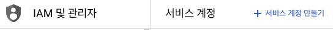

+++
author = "Seorim"
title =  "Day 36"
slug = "day-36"
date = 2023-12-04T18:20:22+09:00

categories = [
    "DevCourse",
]
tags = [
    "TIL",
]
+++

# 📋 공부 내용

## GCS (Google Cloud Storage)

### 버킷 생성


### Scraping using requests

-   [1년간의 데이터를 받아오는 함수 코드]()

1. Setting Session

    ```python
    import requests

    s = requests.Session()
    headers = {
    ...
    "User-Agent": "Mozilla/5.0 (Macintosh; Intel Mac OS X 10_15_7) AppleWebKit/537.36 (KHTML, like Gecko) Chrome/119.0.0.0 Safari/537.36",
    "X-Requested-With": "XMLHttpRequest",
    ...
    }

    payload = {
        "account": {myaccount},
        "password": {mypassword},
    }


    ```

2. Login with Session

    ```python
    # session에 post로 login
    res = s.post("https://kdx.kr/auth/autoLogin", headers=headers, data=payload)
    ```

3. Download file with login authentication
    ```python
    # session에 get으로 파일 url 포함해서 request 보내고 데이터 받아옴
    response = s.get(file_url, stream=True)
    ```
4. Set download path to GCS bucket# Directly Download file to GCS

    ```python
    # import google cloud library
    from google.cloud import storage

    # setting with bucket name
    storage_client = storage.Client()
    bucket_name = {mybucket}  # 여기에 실제 버킷 이름을 입력하세요
    bucket = storage_client.bucket(bucket_name)

    blob = bucket.blob(f"{filename}.csv")
    blob.upload_from_string(response.content)
    ```

### Google Cloud 인증 정보

-   IAM 및 관리자 > 서비스 계정 > 서비스 계정 만들기

    

    

    -   액세스 권한 설정 (GCS에 객체를 생성할 수 있는 권한으로 설정)

    

-   키 생성 및 로컬에 저장

    

    

-   `~/.zshrc`
    ```
    export GOOGLE_APPLICATION_CREDENTIALS="/path/to/your/service-account-file.json"
    ```

## Snowflake

### Connect with GCS

### Bulk Update with `COPY` Command

### 남아있는 무료 요금 확인하는 법


## Superset ( preset.io )

### Connect with Snowflake

# 👀 CHECK

_<span style = "font-size:15px">(어렵거나 새롭게 알게 된 것 등 다시 확인할 것들)</span>_

# ❗ 느낀 점
