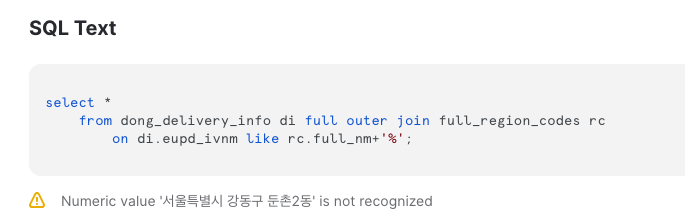
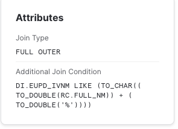

+++
author = "Seorim"
title =  "Day 39"
slug = "day-39"
date = 2023-12-07T11:39:01+09:00

categories = [
    "DevCourse",
]
tags = [
    "TIL",
]
+++

# 📋 공부 내용

##

###

# 👀 CHECK

_(어렵거나 새롭게 알게 된 것 등 다시 확인할 것들)_

## Snowflake

### 오류 해결기

-   JOIN ON A like B + '%'

    

    -   A, B 칼럼 모두 문자열을 가지는 컬럼
    -   `+` operator은 numeric value에 적용되기 때문에 이 과정에서 숫자로 변환하는 과정을 거치게 됨
        -> 오류 발생
        
        -> JOIN ON CONTAINS(A, B) 로 해결

# ❗ 느낀 점
