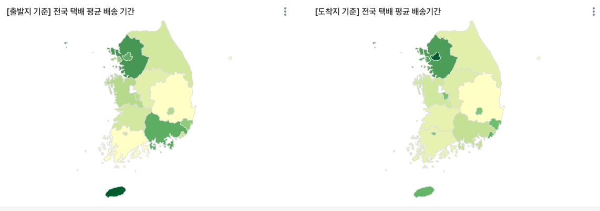

+++
author = "Seorim"
title =  "Day 39"
slug = "day-39"
date = 2023-12-07T11:39:01+09:00

categories = [
    "DevCourse",
]
tags = [
    "TIL",
]
+++

# 📋 공부 내용

##

###

# 👀 CHECK

_(어렵거나 새롭게 알게 된 것 등 다시 확인할 것들)_

## Snowflake

### 오류 해결기

-   JOIN ON A like B + '%'

    

    -   A, B 칼럼 모두 문자열을 가지는 컬럼
    -   `+` operator은 numeric value에 적용되기 때문에 이 과정에서 숫자로 변환하는 과정을 거치게 됨
        -> 오류 발생
        
        -> JOIN ON CONTAINS(A, B) 로 해결

# ❗ 느낀 점 (한 일 정리)

저는 오늘 배송기간, 배송거리 두가지 키워드로 데이터를 분석하고 차트를 만들어봤습니다.

평균 배송 기간은 수도권과 제주도 높게 나왔고, 배송 거리와 뚜렷한 상관관계는 없었습니다. 그래서 긴 배송기간을 갖는 루트의 특징에 생각해 봤고, 배송 물량이 많은 곳(수도권), 산간지역(제주도 등), 같은 지역으로의 배송 등 이라는 걸 파악할 수 있었습니다. 카테고리별로 나누어 bubble chart로 표시해봤습니다.

배송기간별 배송건수 분포를 보면, 배송기간 1일이 제일 많은 다른 지역들과 다르게 제주도는 배송기간 2일에 제일 많은 배송이 이루어지는 것을 볼 수 있습니다.

내일 구 단위까지 분석해보고, 기존과 같은 분석 외에도

-   택배를 받기까지 가장 오래 걸리는 지역구
-   택배가 가장 많이 오가는 지역구
    등을 분석해서 차트로 만들어 볼 생각입니다.

