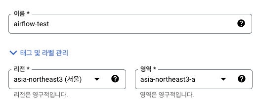
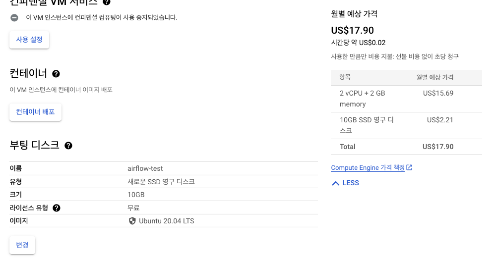
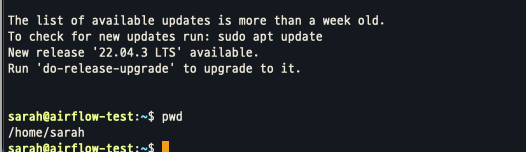
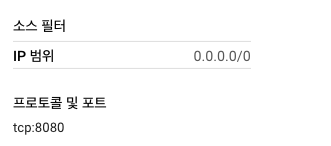
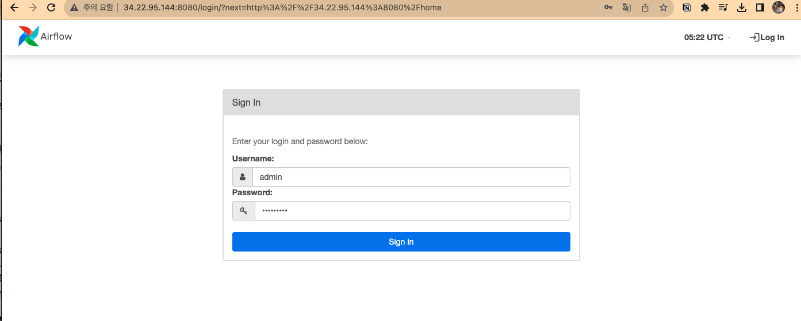

+++
author = "Seorim"
title =  "Day 42 Airflow"
slug = "day-42"
date = 2023-12-12T12:47:43+09:00

categories = [
    "DevCourse",
]
tags = [
    "TIL", "Airflow", 
]
+++

# 📋 공부 내용

## Airflow 실습

-   Google Compute Engine - VM instance 만들어서 사용
    
    

    -   연결을 위한 google cloud sdk 설치
        <https://cloud.google.com/sdk/docs/downloads-interactive?hl=ko>

    ```bash
    # Google Cloud SDK 설치
    curl https://sdk.cloud.google.com | bash
    exec -l $SHELL
    gcloud init

    # 구글 로그인 자동 진행됨 (구글 클라우드 계정으로 로그인 하면 됨)

    # VM 인스턴스에 SSH로 연결
    gcloud compute ssh --project your-project-id --zone your-zone your-instance-name
    ```

    -   우분투 vm instance 접속에 성공한 화면
        
    -   airflow 2.5.1 설치
        <https://github.com/keeyong/airflow-setup/blob/main/docs/Airflow%202%20Installation.md>
    -   웹 브라우저에서 접속 확인

    1. vm instance -> 방화벽 -> http 접근 허용
    2. vpc - 방화벽 규칙 생성 -> 8080포트 접근 허용
       

    

###

# 👀 CHECK

_<span style = "font-size:15px">(어렵거나 새롭게 알게 된 것 등 다시 확인할 것들)</span>_

# ❗ 느낀 점
