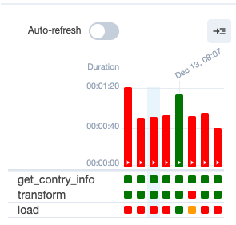
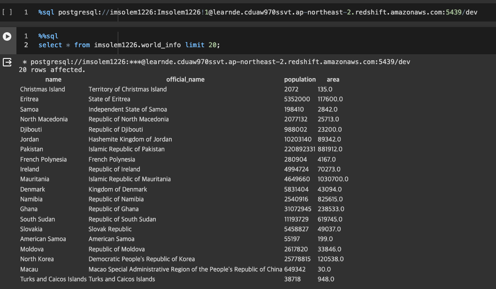

+++
author = "Seorim"
title =  "Day 43 Airflow(2)"
slug = "day-43"
date = 2023-12-13T17:15:12+09:00

categories = [
    "DevCourse",
]
tags = [
    "TIL", "Airflow", "DAG"
]
+++

# 📋 공부 내용

## Airflow 실습

### context & xcom_pull

### Connections & Variables

### @task decorator

### DAG schedule

## Airflow 과제

-   [과제 github](https://github.com/srlee056/devcourse-week10-day3-hw)

-   airflow 실행 및 성공한 결과 화면
    _(코드 테스트 하느라 많이도 실패함)_
    
-   Data warehouse에 연결하여 생성된 table 내용을 불러온 결과
    

###

# 👀 CHECK

_<span style = "font-size:15px">(어렵거나 새롭게 알게 된 것 등 다시 확인할 것들)</span>_

## SSH 연결

### in vscode

-   remote ssh 설치
-   f1 > connect to host
    ```
    ssh -i {path_to_ssh_secret_key}/{key_name} user@ip
    ```
-   /Users/{user_name}/.ssh/config
    -   root 유저로 접속하는 경우 config 파일 내용은 다음과 같다.
    ```
    Host {ip}
        HostName {ip}
        IdentityFile {path_to_ssh_secret_key}/{key_name}
        User root
    ```

### ssh key 생성법

-   `root` user로 생성한 키

```bash
ssh-keygen -t rsa -f {key_name} -C root -b 2048
```

### root user 로그인 방법 (feat. Google Cloud platform)

-

## SQL

### single quote in string

-   insert into table_name values ('Seorim's name')
    -> 에러 발생

-   replace ' to ''

    ```python
    text = "Seorim's name"
    text = text.replace("'", "''")
    # Seorim's -> Seorim''s
    ```

-   insert into table_name values ('Seorim''s name')
    -> 잘 실행되는걸 볼 수 있음 :>

# ❗ 느낀 점
