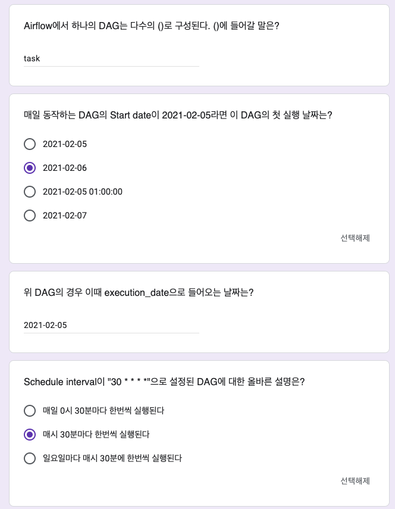
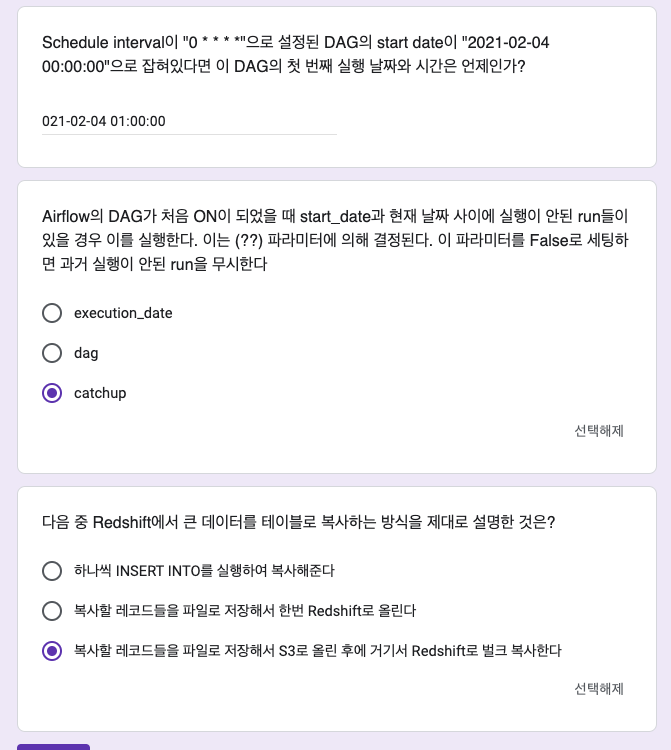
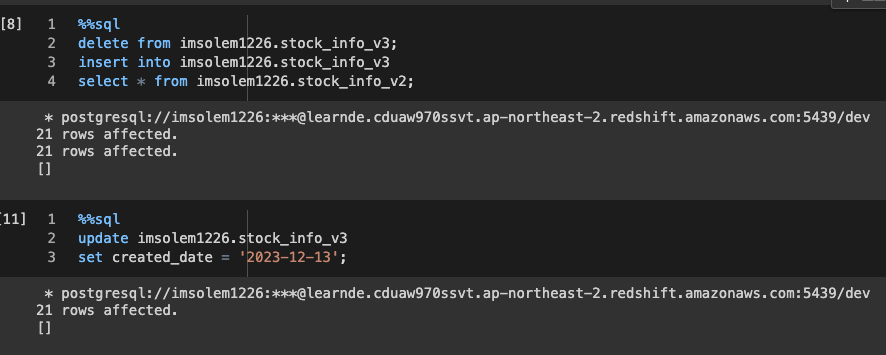
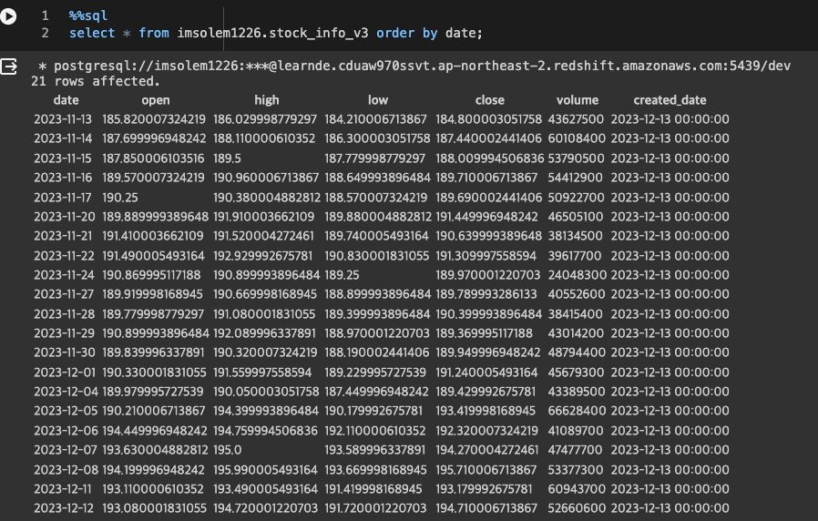
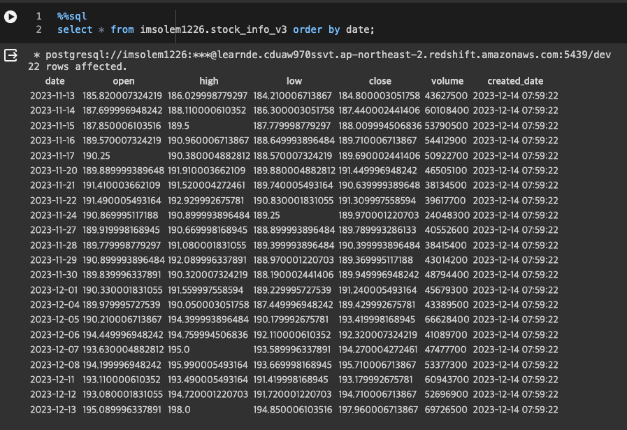

+++
author = "Seorim"
title =  "Day 44 Airflow(3)"
slug = "day-44"
date = 2023-12-14T12:07:41+09:00

categories = [
    "DevCourse",
]
tags = [
    "TIL", "Airflow", "Backfill"
]
+++

<style>
g1 { color: #79AC78 }
g2 { color: #B0D9B1 }
g3 { color: #D0E7D2 }
g4 { color: #618264 }
o1 { color: #F9B572 }
w1 { color: #FAF8ED }
</style>

# 📋 공부 내용

## Airflow 실습 : DAG 구현하기

## Primary Key Uniqueness 보장하기

### 퀴즈

```python
# Weather_to_Redshift_v2.py

INSERT INTO {schema}.{table}
SELECT date, temp, min_temp, max_temp FROM (
SELECT *, ROW_NUMBER() OVER (PARTITION BY date ORDER BY created_date DESC) seq
FROM t
)
WHERE seq = 1;
```

> 여기서 transaction으로 처리되어야 하는 최소 범위의 SQL들은?

### Upsert

> Insert & Update

-   primary key를 기준으로
    -   존재하는 레코드라면, 새 정보로 수정
    -   존재하지 않는 레코드라면 새 레코드 적재
-   DW마다 UPSERT를 효율적으로 실행해주는 문법을 지원해줌

## Backfill

> 데이터를 읽어오는 데 실패하거나, 읽어온 데이터의 문제 때문에 데이터 파이프라인을 재실행하여 다시 읽어와야 하는 과정

### Incremental Update 실패

-   하루에 한 번 동작하는 incremental update
-   중간에 며칠동안 이 과정이 실패한 경우, 그 이후의 실행에도 영향을 주게 되어있음
-   실패한 부분을 재실행 -> 얼마나 중요한가?

### Backfill의 용이성

> <o1>실패한 데이터 파이프라인의 재실행</o1>이 얼마나 용이한 구조인가?

-   full refresh

    -   문제가 생기면 다시 실행하면 됨
    -   backfill 불필요

-   Incremental Update
    -   데이터를 다시 읽어와야 하면 처음부터 모두 다 재실행해야 함 ( 효율성은 더 좋을 수 있지만, 운영&유지보수가 어려워짐)
    -   backfill 필요

> Airflow : backfill을 쉽게 할 수 있도록 디자인됨

### Backfill of Daily DAG

#### Daily DAG

-   지금 시간을 기준으로 어제 날짜를 계산, 어제 데이터를 읽어옴
-   매일 문제 없이 동작하면 OK, BUT 데이터 읽어오기에 실패하는 경우 ? -> 특정 날짜의 데이터가 빠져있음 -> 실패한 날 기준으로 전날의 데이터를 업데이트 하는 코드를 새로 작성해야 함 (원하는 날짜를 하드코딩하는 방식)

    ```python
    from datetime import datetime, timedelta
    # y = datetime.now() - timedelta(1)
    # yesterday = datetime.strftime(y, '%Y-%m-%d')
    yesterday = '2023-01-01'
    ```

-   실수하기 쉽고 수정하는 데 시간이 많이 걸림

**`DAG를 생성할 때 부터 backfill을 쉽게 만들어야 함`**

### Backfill을 용이하게 하는 구조

-   날짜별로 backfill 결과를 기록
-   날짜는 시스템에서 ETL 인자로 제공
-   날짜를 따로 계산하지 않고, 시스템이 정해준 날짜를 사용

#### Airflow의 구조

-   ETL별로 실행날짜, 결과를 메타데이터 DB에 기록
-   모든 DAG 실행에 `execution_date` 지정
-   `execution_date`를 바탕으로 데이터를 갱신하도록 코드 작성

## DAG Parameter

> date 관련 parameter 정리

### Airflow 스케쥴링

schedule_interval이 지난 이후에, execution_date 기준으로 실행이 된다.

`start_date : 2023-12-01 00:00:00`

| Interval   | execution_date      | 실행 날짜           |
| ---------- | ------------------- | ------------------- |
| 1 day      | 2023-12-01          | 2023-12-02          |
|            | 2023-12-02          | 2023-12-03          |
| 1 hour     | 2023-12-01 01:00:00 | 2023-12-01 02:00:00 |
| 10 minutes | 2023-12-01 00:20:00 | 2023-12-01 00:30:00 |

참고 : <https://it-sunny-333.tistory.com/157>

### start_date

> `처음` 읽어와야 하는 데이터의 날짜

-   2020-11-07의 데이터를 읽어옴
-   2020-11-08 부터 ETL 동작

    -> start_date : 2020-11-07

### execution_date

> 읽어와야 하는 데이터의 날짜

-   2020-11-08 ETL 동작

    -> execution_date : 2020-11-07

-   2023-12-14 ETL 동작
    -> execution_date : 2023-12-13
    (start_date : 2020-11-07)

### catchup

> DAG 활성화 시점 > start_date  
> 그 사이 기간동안 실행되지 않은 job을 어떻게 할 지 정하는 파라미터

-   `True`: 디폴트값, 실행되지 않은 job을 모두 실행하여 따라잡으려고 함
-   `False`: 실행되지 않은 job을 무시함
-   잘 모르면 항상 False로 세팅!

# 👀 CHECK

_<span style = "font-size:15px">(어렵거나 새롭게 알게 된 것 등 다시 확인할 것들)</span>_

## openweathermap api

-   https://openweathermap.org/api/one-call-3
-   구독한 이후에 바로 허가가 안되는 문제가 있음..
-   기존 코드를 2.5 -> 3.0 으로 바꿔야 함

## 퀴즈

-   
-   

## DAG 작성 과제

[Code : GitHub Link](https://github.com/srlee056/devcourse-week10-day3-hw/blob/main/UpdateSymbol_v3.py)

### UpdateSymbol_v2의 Incremental Update 방식 수정해보기

-   앞서 배운 ROW_NUMBER 방식을 사용해서 Primary key가 동일한 레코드들을 처리하기

    ```sql
    alter_sql = f"""DELETE FROM {schema}.{table};
        INSERT INTO {schema}.{table}
        SELECT date, "open", high, low, close, volume FROM (
            SELECT *, ROW_NUMBER() OVER (PARTITION BY date ORDER BY created_date DESC) seq
            FROM t
        )
        WHERE seq = 1;"""
    ```

-   Incremental Update가 진행됐는지 확인하기 위해, 어제 데이터를 저장한 `stock_info_v2`의 레코드를 복사해왔고, created_date를 어제로 지정했다.

    

-   Update 이전

    

-   Update 이후

    새로 레코드가 하나 추가됐으며, created_date가 DAG 실행 시간으로 변경된것을 볼 수 있다.

    

## gcp sdk 활용해서 서버<->로컬 파일 통신

```zsh
gcloud compute scp {option} {from_path} {to_path}
```

#### 다운로드 (서버 -> 로컬)

-   서버쪽 폴더 안의 모든 파일을 전부 다운로드

```zsh
gcloud compute scp --recurse "airflow-test":/var/lib/airflow/dags ~/github-repo/dags
```

#### 업로드 (로컬 -> 서버)

-   권한이 있어야 업로드 가능 -> `root@`
-   로컬 특정 파일을 서버쪽 폴더 안으로 업로드

```zsh
gcloud compute scp ~/github-repo/dags/{filename} root@"airflow-test":/var/lib/airflow/dags
```

-   airflow 유저에 업로드한 파일에 대한 권한이 없어서, `chmor 664 {filename}` 으로 수정 권한 부여함

## vscode remote ssh 관련 문제

-   GCP Vm instance의 RAM은 2GB인데, 이 중 airflow 프로세스가 1.3GB정도를 차지함
-   vscode를 위한 ssh server도 1GB정도 필요함
-   그래서 vscode remote ssh로 연결하고 있으면 자꾸 멈추고 airflow 웹 서버가 잘 안돌아가는 등 문제가 있었던 것
-   RAM 증설하기로 결정 (어차피 오래 사용할 것 아니고 무료 크레딧이라 괜찮)

# ❗ 느낀 점

-   알고리즘 문제 풀 때 함수별로 나누는 습관, 주석 적는 습관 만들어보기
-   다음 질문에 대해 생각/찾아보기
    -   DAG에서 같은 함수, task를 여러번 호출 할 수 있는가
    -   @task 외에 다른 decorator 있는지 찾아보기
    -   과제에서 기존 created_date를 가져오지 않고 새로 레코드를 만들 때 생성하는 이유는 뭘까?
