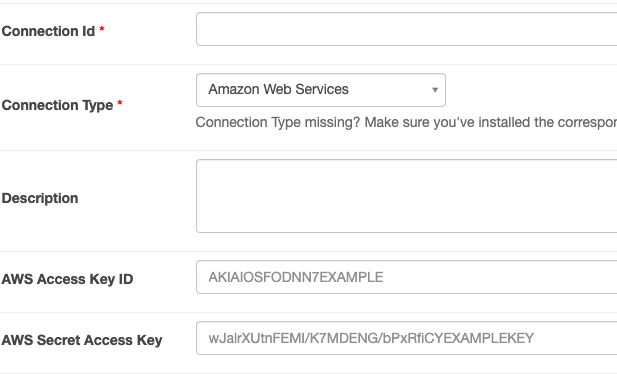
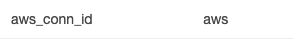
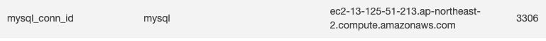
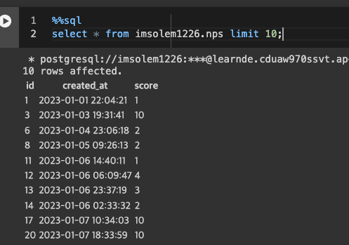

+++
author = "Seorim"
title =  "Day 45 Airflow(4)"
slug = "day-45"
date = 2023-12-15T12:53:19+09:00

categories = [
    "DevCourse",
]
tags = [
    "TIL", "Airflow", "MySQL", "Redshift" 
]
+++

<style>
g1 { color: #79AC78 }
g2 { color: #B0D9B1 }
g3 { color: #D0E7D2 }
g4 { color: #618264 }
o1 { color: #F9B572 }
w1 { color: #FAF8ED }
</style>

# 📋 공부 내용

## OLTP 테이블 복사하기

-   Production MySQL Tables (OLTP) -> AWS Redshift (OLAP)

<br>

-   MySQL Tables(Source) -> Airflow Server
    1. `COPY Command` : -> S3(Cloud Storage) -> Data Warehouse
    2. `INSERT Command` : -> Data Warehouse

## 실습 관련 설정

### 권한 설정

> 버킷과 DB 서버를 가진 계정에서 설정

**1. Airflow DAG에서 S3 접근 (Write 권한)**

-   IAM User를 생성
-   User에게 S3버킷에 대한 Read/Write 권한을 설정
-   User의 access key, secret key 사용

<br>

-   <o1>Custom Policy</o1>

```json
{
    "Version": "2012-10-17",
    "Statement": [
        {
            "Effect": "Allow",
            "Action": ["s3:GetBucketLocation", "s3:ListAllMyBuckets"],
            "Resource": "arn:aws:s3:::*"
        },
        {
            "Effect": "Allow",
            "Action": "s3:*",
            "Resource": [
                "arn:aws:s3:::grepp-data-engineering",
                "arn:aws:s3:::grepp-data-engineering/*"
            ]
        }
    ]
}
```

**2. Redshift에서 S3 접근 (Read 권한)**

-   Redshift에서 S3 접근할 수 있는 Role 생성 후 Redshift에 지정

### Airflow Connection 설정

-   S3 : AWS type 선택 후 access key id, secret access key 입력 (Extra에 지역 입력)

    

    

-   MySQL : 호스트, schema, id/pw, port 입력

    

## DB Tables

### MySQL(OLTP) Table

```sql
CREATE TABLE prod.nps (
    id INT NOT NULL AUTO_INCREMENT primary key,
    created_at timestamp,
    score smallint
);
```

### Redshift(OLAP) Table

-   DAG 실행 이전에 해당 테이블을 미리 생성해야 함

```sql
CREATE TABLE {schema}.nps (
    id INT NOT NULL primary key,
    created_at timestamp,
    score smallint
);
```

## Full Refresh

### tasks in DAG

> 이미 작성되어있는 operator의 파라미터값만 작성하여 task를 생성  
> Incremental Update도 같은 방식 사용

```python
from airflow.providers.amazon.aws.transfers.sql_to_s3 import SqlToS3Operator
from airflow.providers.amazon.aws.transfers.s3_to_redshift import S3ToRedshiftOperator
```

<br>

`SqlToS3Operator`

-   MySQL SQL 결과 -> S3
-   저장 위치 : s3://s3_bucket/s3_key (s3://grepp-data-engineering/{user_id}-nps)
-   _Task code_

    ```python
    mysql_to_s3_nps = SqlToS3Operator(
        task_id = 'mysql_to_s3_nps',
        query = "SELECT * FROM prod.nps",
        s3_bucket = s3_bucket,
        s3_key = s3_key, #{schema} - {table}
        sql_conn_id = "mysql_conn_id",
        aws_conn_id = "aws_conn_id",
        verify = False,
        replace = True, #파일이 이미 존재하면 덮어씀
        pd_kwargs={"index": False, "header": False}, #index, header를 제외하고 copy
        dag = dag
        )
    ```

`S3ToRedshiftOperator`

-   S3 -> Redshift 테이블 ( Redshift : {schema}.nps )
-   COPY command is used
-   _Task code_

    ```python
    s3_to_redshift_nps = S3ToRedshiftOperator(
        task_id = 's3_to_redshift_nps',
        s3_bucket = s3_bucket,
        s3_key = s3_key,
        schema = schema,
        table = table,
        copy_options=['csv'],   # file type : csv
        method = 'REPLACE',     # REPLACE : 테이블이 이미 존재하면 덮어씀 (full refresh)
        redshift_conn_id = "redshift_dev_db",
        aws_conn_id = "aws_conn_id",
        dag = dag
    )
    ```

## Incremental Update

### MySQL/PostgreSQL Table 조건

-   created(timestamp) : Optional
-   `modified(timestamp)`
-   deleted(boolean) : 레코드를 삭제하지 않고 `deleted = True`

### 구현 방식

**1. ROW_NUMBER로 직접 구현**

-   Redshift의 A 테이블을 temp_A 테이블로 복사
-   MySQL의 A 테이블 레코드 중 `modified == execution_date(지난 일)`인 모든 레코드를 temp_A로 복사
    -   MySQL에 다음 쿼리를 보내고 결과를 파일로 저장. S3로 업로드하고 COPY 수행
    ```sql
    SELECT *
        FROM A
        WHERE DATE(modified) = DATE(execution_date)
    ```
-   temp_A의 레코드들을 primary key를 기준으로 파티션한 다음, modified 값을 기준으로 DESC 정렬
-   일련번호가 1인 것들만 다시 A로 복사

<br>

**2. UPSERT 사용 (실습에서 사용)**

**`S3ToRedshiftOperator`로 구현**

-   query 파라미터
    ```sql
    SELECT *
        FROM A
        WHERE DATE(modified) = DATE(execution_date)
    ```
-   method 파라미터 : `“UPSERT”`
-   upsert_keys 파라미터 : Primary key
    -   nps 테이블이라면 “id” 필드를 사용

### tasks in DAG

`SqlToS3Operator`

-   `'{{ execution_date }}'` 를 쿼리 sql에 넣음으로서 airflow가 넘겨주는 execution date 값을 활용할 수 있음
-   여기에서 `modified`가 아니라 `created_at`인 이유는 애초에 테이블에 `modified`컬럼이 존재하지 않기 때문

```python
mysql_to_s3_nps = SqlToS3Operator(
    task_id = 'mysql_to_s3_nps',
    query = "SELECT * FROM prod.nps WHERE DATE(created_at) = DATE('{{ execution_date }}')", # query 파라미터에 새로 생성된 데이터만 가져오도록 sql을 입력
    s3_bucket = s3_bucket,
    s3_key = s3_key,
    sql_conn_id = "mysql_conn_id",
    aws_conn_id = "aws_conn_id",
    verify = False,
    replace = True,
    pd_kwargs={"index": False, "header": False},
    dag = dag
)

```

`S3ToRedshiftOperator`

```python
s3_to_redshift_nps = S3ToRedshiftOperator(
    task_id = 's3_to_redshift_nps',
    s3_bucket = s3_bucket,
    s3_key = s3_key,
    schema = schema,
    table = table,
    copy_options=['csv'],
    redshift_conn_id = "redshift_dev_db",
    aws_conn_id = "aws_conn_id",
    method = "UPSERT",     # UPSERT 방식으로 테이블을 수정
    upsert_keys = ["id"],  # 이 테이블의 primary key를 기준으로 upsert를 진행
    dag = dag
)

```

## 실습 진행

-   Full Refresh 테스트해보기

    ```bash
    airflow dags test MySQL_to_Redshift
    ```

    -   실행되는 sql query
        ```sql
        COPY imsolem1226.nps
        FROM 's3://grepp-data-engineering/imsolem1226-nps'
        credentials
        'aws_access_key_id=xxx;aws_secret_access_key=xxx'
        csv;
        ```
    -   실행 성공 후 Redshift에 저장된 데이터 확인

    

-   Incremental Update (Upsert) 테스트해보기
    ```bash
    airflow dags test MySQL_to_Redshift_v2
    ```
    -   실행되는 sql query
        ```sql
        COPY #
        FROM 's3://grepp-data-engineering/imsolem1226-nps'
        credentials
        'aws_access_key_id=xxx;aws_secret_access_key=xxx'
        csv;
        -- 임시 테이블과 id가 같은 데이터들(중복된 데이터들)을 모두 지우고, 임시 테이블의 데이터만 다시 추가한다
        DELETE FROM imsolem1226.nps USING #nps WHERE nps.id = #nps.id;
        INSERT INTO imsolem1226.nps SELECT * FROM #nps;
        ```

## Backfill 실행

-   데이터를 여러번 다시 읽어와야 하는 경우 한번에 하나씩 vs. 한번에 여러개씩

1. 동시에 여러 요청이 들어가게 되면 데이터 소스 쪽에 문제가 발생

-   데이터 읽기를 전담으로 하는 worker를 만들어 두는 방식으로 분산하여 해결
-   데이터 쓰기는 main(master?)에서 진행

2. 여러 날짜의 데이터를 읽어오는 프로세스가 동시에 실행되는 경우, 데이터 덮어쓰기 등 문제 발생

-   하나씩 실행하는것이 안전 : `max_active_runs`(DAG parameter)를 1로 세팅(?)

### Command Line

```bash
airflow dags backfill dag_id -s 2018-07-01 -e 2018-08-01
```

-   catchUp : True로
-   execution_date을 사용해서 Incremental update가 구현되어 있음
-   start_date부터 시작하지만 end_date은 포함하지 않음
-   실행순서는 랜덤 (날짜, 시간 순 X)
-   날짜순으로 하고 싶다면 DAG default_args의 depends_on_past를 True로 설정
    ```python
    default_args = {
        'depends_on_past': True,
        ...
    ```

### How to Make Your DAG Backfill ready

**모든 DAG가 backfill을 필요로 하지는 않음**

-   Full Refresh를 한다면 backfill은 의미가 없음
-   Incremental Update를 해도, <g1>마지막 업데이트 시간 기준 backfill</g1>을 하는 경우에는 execution_date을 이용한 backfill은 필요하지 않음 (Data Warehouse 테이블에 기록된 시간 기준)

**backfill 구현 상황 및 요건**

-   데이터가 굉장히 커지면 backfill 기능 구현은 필수
-   airflow를 활용하는것이 많이 도움됨
-   `데이터 소스가 backfill 방식을 지원`하는것이 제일 중요

**backfill을 어떻게 구현할 것인가?**

-   `execution_date`을 사용해서 업데이트할 데이터 결정
-   `catchup` 필드를 `True`로 설정
-   start_date/end_date을 backfill하려는 날짜로 설정
-   DAG를 구현할 때 execution_date을 고려해야 하며, `idempotent` 해야함

# 👀 CHECK

_<span style = "font-size:15px">(어렵거나 새롭게 알게 된 것 등 다시 확인할 것들)</span>_

# ❗ 느낀 점
