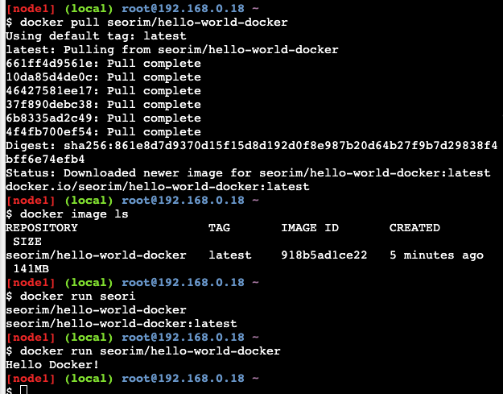
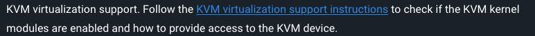
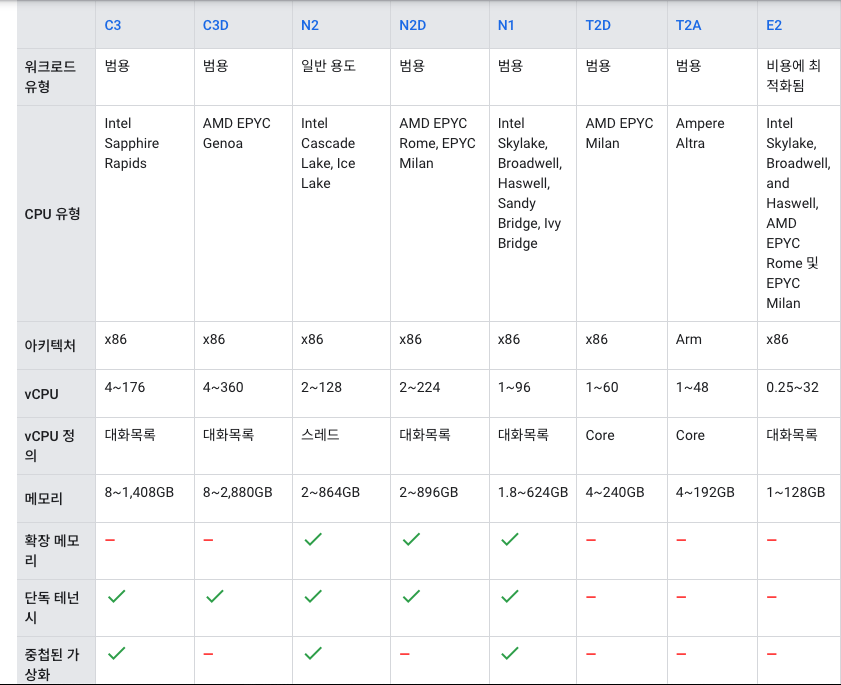

+++
author = "Seorim"
title =  "Day 46 Docker(1)"
slug = "day-46"
date = 2023-12-18T12:21:18+09:00

categories = [
    "DevCourse",
]
tags = [
    "TIL", "Docker"
]
+++

<style>
g1 { color: #79AC78 }
g2 { color: #B0D9B1 }
g3 { color: #D0E7D2 }
g4 { color: #618264 }
o1 { color: #F9B572 }
w1 { color: #FAF8ED }
</style>

# 📋 공부 내용

## 실습

1. 로컬에서 이미지 빌드

2. Docker Hub에 push

3. 다른 서버에서 다운로드 하여 실행

-   docker가 설치되어있는 서버를 4시간동안 제공해주는 사이트
    -   <https://labs.play-with-docker.com>
    -   

# 👀 CHECK

_<span style = "font-size:15px">(어렵거나 새롭게 알게 된 것 등 다시 확인할 것들)</span>_

## Install docker desktop on Ubuntu server

### 서버 사양

-   Google Cloud Compute Engine
-   머신 : n1-standard-4
    -   4 vCPUs, 2 cores, 15GB memory
-   부팅 디스크
    -   Ubuntu 22.04 LTS
    -   SSD 64GB

### 설치 과정

1. root 유저로 로그인
    ```bash
    sudo su
    ```
2. install docker engine
   [링크 참고](https://docs.docker.com/engine/install/ubuntu/#install-using-the-repository)

3. DEB package 다운로드

    ```bash
    curl -O https://desktop.docker.com/linux/main/amd64/docker-desktop-4.26.1-amd64.deb?utm_source=docker&utm_medium=webreferral&utm_campaign=docs-driven-download-linux-amd64
    # 파일 이름에 쿼리가 붙어서 이상해진 경우에 이름 변경 필요함
    mv docker-desktop-4.26.1-amd64.deb\?utm_source\=docker docker-desktop-4.26.1-amd64.deb
    ```

4. 패키지 설치
   [링크 참고](https://docs.docker.com/desktop/install/ubuntu/#install-docker-desktop)

    ```bash
    sudo apt-get install ./docker-desktop-4.26.1-amd64.deb
    ```

5. 일반 유저로 빠져나와서 도커 권한설정 및 서비스 실행

    ```bash
    exit
    sudo usermod -aG docker ${USER}
    systemctl --user start docker-desktop
    ```

6. Headless 환경에서 docker desktop을 실행할 수 있도록 설정

    - Headless server : GUI 환경이 존재하지 않는, User Interaction 기기가 없는? 그런 서버
    - ubuntu desktop을 설치하면 더 편하지만, 그렇게 하지 않고 다른 방법이 있다면 그걸로 진행해보고 싶었음
    - 크롬 원격 데스크탑을 설치하고 설정하여 연결 진행
    - [참고링크](https://devicetests.com/chrome-remote-desktop-ubuntu-server#google_vignette)

7. xfce4 설치

    - 리눅스 및 유닉스 계열 운영 체제를 위한 가벼운 데스크탑 환경

    ```bash
    sudo apt-get install xfce4
    ```

8. 크롬 설치
    ```bash
    wget https://dl.google.com/linux/direct/google-chrome-stable_current_amd64.deb
    sudo apt install ./google-chrome-stable_current_amd64.deb
    ```
9. 크롬 데스크탑 설치 및 설정

    ```bash
    wget https://dl.google.com/linux/direct/chrome-remote-desktop_current_amd64.deb
    sudo apt install ./chrome-remote-desktop_current_amd64.deb
    ```

    - 설정

    ```bash
    vi ~/.chrome-remote-desktop-session
    ```

    - 파일에 다음 추가

    ```
    exec /usr/bin/xfce4-session
    ```

    - 크롬 원격 데스크탑 서비스 실행

    ```
    systemctl restart chrome-remote-desktop@$USER
    ```

    ```

    ```

10. 크롬 원격 데스크탑 호스트 실행 및 연결

-   실행

```bash
DISPLAY= /opt/google/chrome-remote-desktop/start-host --code="4/0AfJohXmJq9WTMUqer6hYc5SHvw2-HH8XJBktdLdjEwjjqfTzxDb-Hnkh7XsTWVWintaZ7A" --redirect-url="https://remotedesktop.google.com/_/oauthredirect" --name=$(hostname)
```

-   오류 발생

    > [1218/052045.042357:ERROR:host_config.cc(83)] Failed to read /home/sarah/.config/chrome-remote-desktop/host#6d661ddc3145c41c372a1cce192c59c2.json

-   권한 주고 재실행

```bash
sudo chown -R sarah:sarah /home/sarah/.config/chrome-remote-desktop
sudo chmod -R 755 /home/sarah/.config/chrome-remote-desktop
systemctl --user restart chrome-remote-desktop

```

11. VM 머신 위에선 docker desktop은 안되는 것 같음

-   
-   포기하고 docker-desktop 삭제함 (ㅠ)
-   ubuntu-desktop은 혹시 몰라서 남겨둠

12. nested vm 설정하면 된다는 말이 있어서 시도해봄
    [참고 링크](https://cloud.google.com/compute/docs/instances/nested-virtualization/enabling?hl=ko)

-   e2머신은 설정이 안돼서 n1, n2 중 비슷한 사양으로 골라서 진행



12. 성공!

-   `killall -3 gnome-shell` 으로 실행했을 때 activities 활성화 된 상태로 갖혀있게되는 문제 해결
-   overview 안뜨게 하는 [extension](https://askubuntu.com/questions/1370068/ubuntu-now-always-starts-in-overview-mode-when-logging-in-how-to-avoid) 설치

# ❗ 느낀 점

도커를 로컬에서 돌리기 어려운 환경이라, 이참에 도커를 설치한 서버를 만들어서 운영하자는 생각을 하고 있었다.

처음에는 서버에 docker만 설치해서 진행 할 예정이었다. 그런데 Ubuntu 22.04 이상부터 docker desktop을 지원한다는 사실을 알게 되었고, GUI환경을 구성해서 docker desktop 프로그램으로 띄워보고싶은 욕망(ㅋㅋ)이 생겼다.

코어타임 6시간 중 5시간 이상을 서버 설정하고 설치하는데 소모했는데, 여러 시행착오를 거쳤지만 결국 성공했다는게 너무 뿌듯하고 기분이 좋았다.

kvm지원여부를 먼저 확인했다면 참 좋았을텐데... 그랬다면 xfce4를 설치했다 지웠다 난리치고 그럴 일도 없었을텐데... 참 아쉽지만 도커 데스크탑이 안되던 이유를 알고, nested visualization을 지원하는 머신으로 교체한 후 거짓말처럼 성공했기 때문에 잊으려고 한다.. (ㅠㅠ)

이 과정 및 airflow 서버 구성 과정도 정리해서 블로그에 글을 올려볼까 한다. 누군가에겐 도움이 되겠지 ^^
