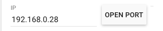
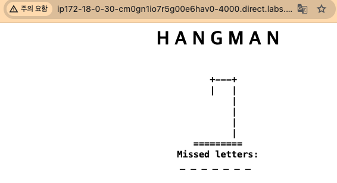
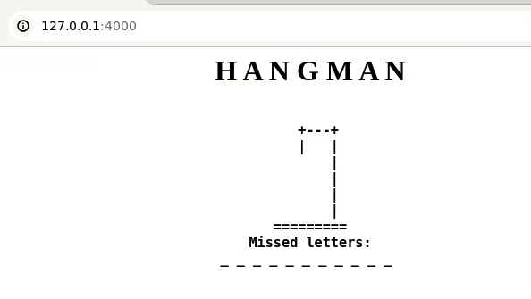
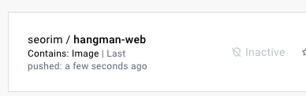
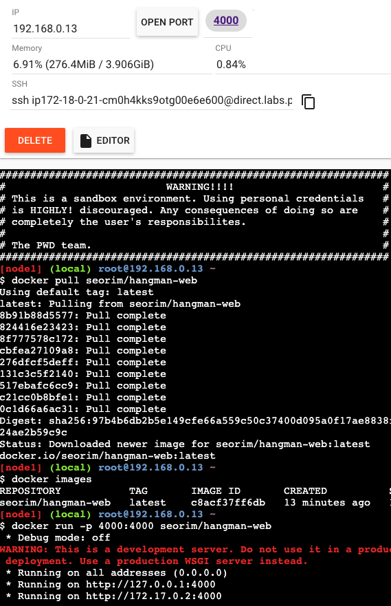
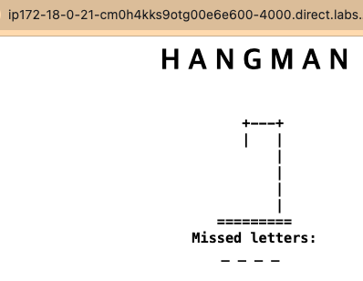
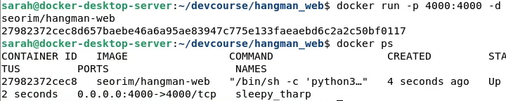

+++
author = "Seorim"
title =  "Day 47 Docker(2)"
slug = "day-47"
date = 2023-12-19T12:54:14+09:00

categories = [
    "DevCourse",
]
tags = [
    "TIL", "Docker", "GitHub Actions", "CI/CD"
]
+++

<style>
g1 { color: #79AC78 }
g2 { color: #B0D9B1 }
g3 { color: #D0E7D2 }
g4 { color: #618264 }
o1 { color: #F9B572 }
w1 { color: #FAF8ED }
</style>

# 📋 공부 내용

## hangman web 실습

### flask web page 실행해보기

-   [play-with-docker](https://labs.play-with-docker.com/) 사이트를 활용해서 테스트

-   git clone으로 fork 해둔 repo를 받아오고, 실행하기

```bash
git clone https://github.com/srlee056/hangman_web.git
cd hangman_web/
pip install -r requirements.txt
python3 -m flask run --host 0.0.0.0 --port=4000
```





## docker 이미지 빌드 실습

1. Dockerfile 작성

```
FROM python:3.8-slim-buster
WORKDIR /app
COPY app.py ./
COPY requirements.txt ./
RUN pip3 install -r requirements.txt
EXPOSE 4000
CMD python3 -m flask run --host 0.0.0.0 --port=4000
# 리스트 형태로 적어도 동작은 같음
CMD ["python3", "-m", "flask", "run", "--host", "0.0.0.0", "--port=4000"]
```

2. docker build & test

-   build

```bash
docker build -t hangman-web .
```

-   run

```bash
docker run -p 4000:4000 hangman-web
```



3. push image to docker Hub

```bash
docker tag hangman-web seorim/hangman-web
docker login --username=seorim
docker push seorim/hangman-web
```



4. test in another host

```bash
docker pull seorim/hangman-web
docker run -p 4000:4000 seorim/hangman-web
```





5. docker run detach 옵션

-   백그라운드에서 실행하게 해주는 옵션

```bash
docker run -p 4000:4000 -d seorim/hangman-test
```



# 👀 CHECK

_<span style = "font-size:15px">(어렵거나 새롭게 알게 된 것 등 다시 확인할 것들)</span>_

# ❗ 느낀 점
