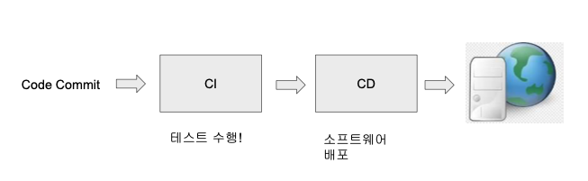
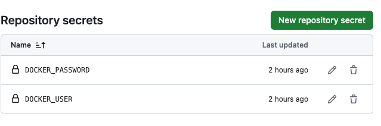

+++
author = "Seorim"
title =  "Day 47 Docker(2)"
slug = "day-47"
date = 2023-12-19T12:54:14+09:00

categories = [
    "DevCourse",
]
tags = [
    "TIL", "Docker", "GitHub Actions", "CI/CD"
]
+++

<style>
g1 { color: #79AC78 }
g2 { color: #B0D9B1 }
g3 { color: #D0E7D2 }
g4 { color: #618264 }
o1 { color: #F9B572 }
w1 { color: #FAF8ED }
</style>

# 📋 공부 내용

## hangman web 실습

### flask web page 실행해보기

-   [play-with-docker](https://labs.play-with-docker.com/) 사이트를 활용해서 테스트

-   git clone으로 fork 해둔 repo를 받아오고, 실행하기

```bash
git clone https://github.com/srlee056/hangman_web.git
cd hangman_web/
pip install -r requirements.txt
python3 -m flask run --host 0.0.0.0 --port=4000
```


## docker 이미지 빌드 실습

### Dockerfile 작성

```
FROM python:3.8-slim-buster
WORKDIR /app
COPY app.py ./
COPY requirements.txt ./
RUN pip3 install -r requirements.txt
EXPOSE 4000
CMD python3 -m flask run --host 0.0.0.0 --port=4000
# 리스트 형태로 적어도 동작은 같음
CMD ["python3", "-m", "flask", "run", "--host", "0.0.0.0", "--port=4000"]
```

### docker build & test

-   build

```bash
docker build -t hangman-web .
```

-   run
    -   `-p` 옵션을 사용해서 포트 포워딩 진행
    -   외부 포트 : 내부 포트 순서로 작성한다

```bash
docker run -p 4000:4000 hangman-web
```


### push image to docker Hub

```bash
docker tag hangman-web seorim/hangman-web
docker login --username=seorim
docker push seorim/hangman-web
```


### test in another host

```bash
docker pull seorim/hangman-web
docker run -p 4000:4000 seorim/hangman-web
```


### docker run detach 옵션

-   백그라운드에서 실행하게 해주는 옵션

```bash
docker run -p 4000:4000 -d seorim/hangman-test
```


## CI/CD

### Continuous Integration

> One of Software Engineering Practice

**기본 원칙**

-   코드 Repository는 하나만 유지 (Main)
-   코드 변경을 자주 반영
-   테스트를 최대한 추가 (Test Coverage)
-   빌드의 자동화 (Commit Build vs. Nightly Build)
-   성공한 빌드를 프로덕션으로 릴리스 자동화: CD



-   CI/CD 자동화 과정에 도커를 활용

## GitHub Actions

> GitHub의 CI/CD service

### workflow

> Push, PR 등 트리거 이벤트가 발생하면 시작되는 일련의 동작을 지칭

-   {workflow_name}.yaml(or .yml)
-   Job으로 나누어지며, 각 Job은 일련의 Step을 수행함

### GitHub Actions 사용 실습

1. 공통적인 부분

workflow 파일의 구조는 보통 다음과 같다.

```yaml
name: app-name

on: # trigger events
    push:
        branches: ["main"]  # name of branches
    pull_request:
        branches: ["main"]

permissions:
    contents: read

jobs:
    build:
        runs-on: ubuntu-latest

        steps:
        ...
```

2. 테스트 자동화

```yaml
steps:
- uses: actions/checkout@v3
- name: Set up Python 3.10
    uses: actions/setup-python@v3
    with:
    python-version: "3.10"
- name: Install dependencies
    run: |
    python -m pip install --upgrade pip
    pip install flake8
    if [ -f requirements.txt ]; then pip install -r requirements.txt; fi
- name: Lint with flake8
    run: |
    # stop the build if there are Python syntax errors or undefined names
    flake8 . --count --select=E9,F63,F7,F82 --show-source --statistics
    # exit-zero treats all errors as warnings. The GitHub editor is 127 chars wide
    flake8 . --count --exit-zero --max-complexity=10 --max-line-length=127 --statistics
- name: Test with unittest
    run: |
    python3 -m unittest discover -p 'test*.py' # python3 test.py
```

3. Docker Build & Push 자동화

-   repository settings -> secrets & variables -> Actions 에서 로그인 정보 (ID/PW) 저장하고 가져와서 사용할 수 있다.
-   ${{secrets.DOCKER_USER}} 형식으로 불러올 수 있으며, 파일에서 사용할 땐 `env`에서 지정하거나, 바로 사용할 수도 있다.



```yaml
- name: Login to the Docker Hub
    env:
        DOCKER_USER: ${{secrets.DOCKER_USER}}
        DOCKER_PASSWORD: ${{secrets.DOCKER_PASSWORD}}
    run: docker login -u $DOCKER_USER -p $DOCKER_PASSWORD
- name: Build the Docker image
    run: docker build --tag ${{secrets.DOCKER_USER}}/hangman-web:latest .
- name : Push the Docker image to the Docker Hub
    run: docker push ${{secrets.DOCKER_USER}}/hangman-web:latest

```

# 👀 CHECK

_<span style = "font-size:15px">(어렵거나 새롭게 알게 된 것 등 다시 확인할 것들)</span>_

# ❗ 느낀 점
