+++
author = "Seorim"
title =  "Day 48 Docker(3)"
slug = "day-48"
date = 2023-12-20T12:07:42+09:00

categories = [
    "DevCourse",
]
tags = [
    "TIL", "Docker", "Docker Compose"
]
+++

<style>
g1 { color: #79AC78 }
g2 { color: #B0D9B1 }
g3 { color: #D0E7D2 }
g4 { color: #618264 }
o1 { color: #F9B572 }
w1 { color: #FAF8ED }
</style>

# 📋 공부 내용

## Docker Volume

> Container와 Host 시스템이 특정 폴더를 공유함으로써, Container가 사라지더라도 데이터를 보존하는 기능

### Container와 데이터

-   Container가 실행되었다가 중단되면 데이터가 유실됨
-   일회성으로 동작하는게 아니라면, 데이터가 영구적으로 보관되어야 함
    -   ex: MySQL 등과 같은 DB가 container에서 동작하는 것
-   데이터 보존을 위해 사용하는 것이 바로 `Docker Volume`

### Docker Volume 정의

-   Host 시스템 폴더 -> Docker Container 시스템 폴더로 `mount` (=mapping)

    -   Host에서 내용을 바꾸면 Docker Container 쪽에도 반영됨 (속성에 따라 반대도 반영됨)

-   Docker Container 상태와 관계 없이 데이터를 영구적으로 보관
    -   Container가 중단되더라도 데이터가남게 됨

### mount in file system

-   mount & unmount
-   disk같은 물리적인 장치를 파일 시스템의 특정 위치와 연결해주는 기능
    -   ex: 외장하드를 연결할 경우 `:E` 처럼 이 장치와 연결된 새로운 폴더가 생김

### Docker Volume Type

**<g1>1. Host Volumes</g1>**

```bash
docker run -v {host_file_system_path}:{container_file_system_path}
```

**<g1>2. Anonymous Volumes</g1>**

-   도커가 알아서 호스트 시스템 폴더를 만들고 연결

```bash
docker run -v {container_file_system_path}
```

**<g1>3. Named Volumes</g1>**

-   가장 많이 사용되고 선호되는 방식
-   하나의 Volume을 다수의 Container에서 공유하는 것도 가능
-   도커가 만들어 마운트하는 호스트 시스템 폴더에 `이름을 지정`할 수 있음

```bash
docker run -v {name}:{container_file_system_path}
# readonly volume 설정 옵션, default는 읽기&쓰기 가능
docker run -v {name}:{container_file_system_path}:ro
```

### Image 생성 시 Docker Volume을 사용하는 방법

**<g1>1. Dockerfile</g1>**

-   VOLUME command를 사용하며, anonymous volume만 지정 가능

**<g1>2. docker-compose</g1>**

-   Host Volume이나 Named Volume을 사용

## Docker Volume 실습

### nginx container without volume

**<g1>1. nginx container를 다운받고 서버를 실행</g1>**

-   command

```bash
# -d 옵션으로 detach하여 서버가 백그라운드에서 실행되게 함
# --p 8081:80 으로 포트포워딩 하여 호스트에서 8081 포트로 연결할 수 있게 함
docker run -d --name=nginx -p 8081:80 nginx
```

-   http://localhost:8081/에 연결한 웹 브라우저 화면

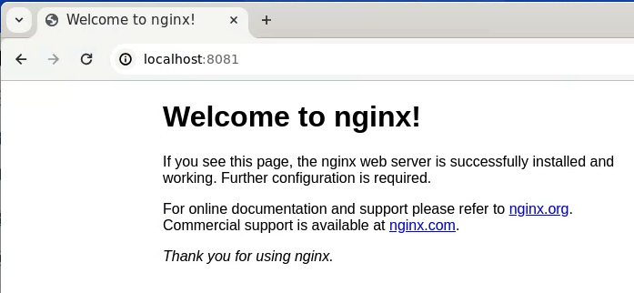

**<g1>2. 서버에 접속해서 html 파일 수정</g1>**

-   command

```bash
# exec으로 실행중인 nginx container에 연결
# --user=root -it 으로 서버에 root유저로 접속
# sh shell script 실행
docker exec --user=root -it nginx sh

# -----------------서버 내부----------------------
apt update
apt install nano
# 내용을 Welcome to Docker Volume으로 수정
nano /usr/share/nginx/html/index.html
exit

# ----------------------------------------------
```

-   웹 브라우저 연결 화면

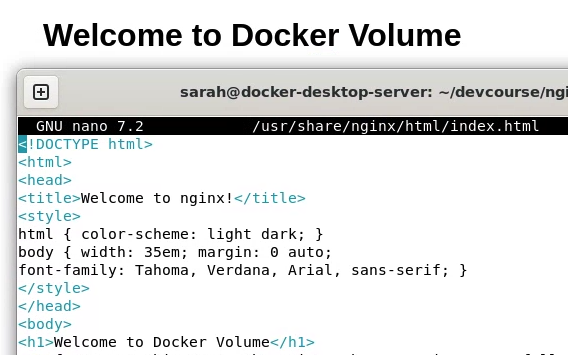

**<g1>3. 재실행 후 파일 확인</g1>**

-   Volume이 지정되지 않은 상태 -> 변경이 적용되지 않고 원래대로 돌아왔음을 알 수 있음

-   command

```bash
# Container 재실행
docker stop nginx
docker run nginx
docker run -d --name=nginx -p 8081:80 nginx

docker exec --user=root -it nginx sh
# -----------------서버 내부----------------------
apt update
apt install nano
# 내용이 수정 전으로 돌아갔음을 확인할 수 있음
nano /usr/share/nginx/html/index.html
exit
# ----------------------------------------------

```

-   웹 브라우저 연결 화면

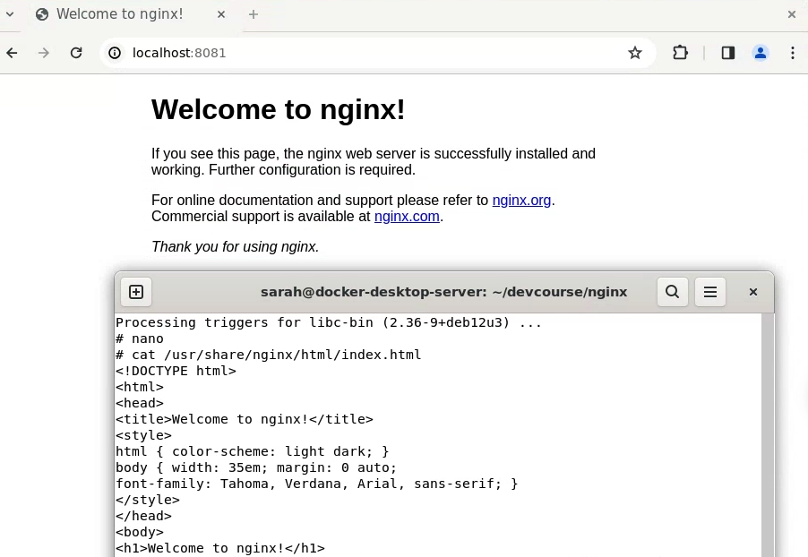

### nginx container with volume

**<g1>1. nginx container를 다운받고 서버를 실행(볼륨 사용 설정)</g1>**

-   command

```bash
# -v 옵션을 사용해서 Host Volumes 방식으로 연결
docker run -d --name nginx_demo -p 8081:80 -v /home/sarah/devcourse/nginx/html:/usr/share/nginx/html nginx
```

-   http://localhost:8081/에 연결한 웹 브라우저 화면


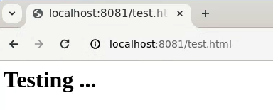

**<g1>2. html 파일 수정 </g1>**

-   host 시스템 상에서 파일을 직접 수정
-   웹 브라우저 연결 화면

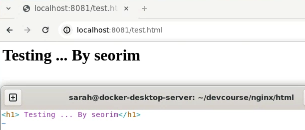

**<g1>3. 재실행 후 파일 확인</g1>**

-   host 시스템 상에서 파일 확인
-   웹 브라우저 연결 화면

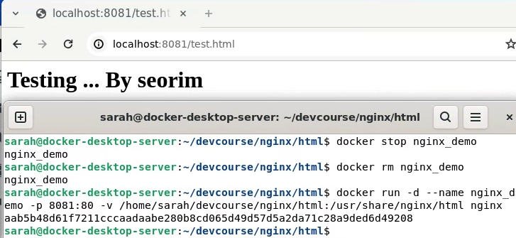

## Docker 환경 클린업

> 컨테이너 중단 후 삭제 -> 이미지 삭제

### CLI

1. 컨테이너 삭제

```bash
# -f : force, 실행중인 컨테이너도 바로 삭제
# ls -a : 실행중이 아닌 컨테이너 목록도 가져옴
# ls -aq : 모든 컨테이너의 container id만 받아옴
docker container rm -f $(docker container ls -aq)
```

2. 이미지 삭제

```bash
docker image rm -f $(docker image ls -q)
```

### Docker Desktop

-   Troubleshoot > Clean/Purge data 를 통해 쉽고 직관적이게 삭제 가능

## Docker Compose 실습

### Docker Compose

> 다수의 Container로 구성된 프로그램을 Build하는 데 사용되는 유틸리티

### 설명 및 구조

여러 Container를 가진 소프트웨어를 Docker에서 빌드한다.

Docker에서 제공해주는 예제 프로그램 : [example-voting-app](https://github.com/dockersamples/example-voting-app)


### 실습 : 일일이 매뉴얼하게 실행

**<g1>1. Build</g1>**

```bash
docker build -t vote ./vote
docker build -t result ./result
docker build -t worker ./worker

docker images
```

**<g1>2. Run</g1>**

```bash
docker run -d --name=redis redis
docker run -d -e POSTGRES_PASSWORD=postgres --name=db postgres
docker run -d --name=vote -p 5001:80 vote
docker run -d --name=result -p 5002:80 result
docker run -d --name=worker worker
```

-   이 경우 각 컴포턴트들 간 네트워크 연결이 되지 않음

**<g1>3. 네트워크 관련 이슈 확인</g1>**

-   vote에 로그인하여 iputils-ping 설치 후 ping

```bash
docker exec --user=root -it vote sh
apt update
apt install iputils-ping
ping redis
```


### 실습 : 네트워크를 만들어 연결하여 실행

**<g1>네트워크 이슈 해결 방법</g1>**

-   docker network 기능 사용

    -   이전에는 docker run - link 옵션을 사용했었음

-   network를 만들고, 모든 컨테이너를 네트워크 안으로 지정
    -   연결에 따라 별개의 네트워크를 만들어 사용하는것도 가능 (back-tier, front-tier)

**<g1>1. Create newtork </g1>**

-   먼저 이전에 생성한 container들은 삭제한다. 빌드한 이미지는 삭제하지 않아도 됨

```bash
docker container rm -f $(docker container ls -aq)
```

-   네트워크를 생성한다.

```bash
docker network create mynetwork
```

**<g1>2. Run in network </g1>**

-   앞서 입력한 커맨드에 `--network mynetwork` 를 추가하여 컨테이너를 네트워크 안에 지정한다.

```bash
docker run -d --name=redis --network mynetwork redis
docker run -d --name=db -e POSTGRES_PASSWORD=postgres --network mynetwork postgres
docker run -d --name=vote -p 5001:80 --network mynetwork vote
docker run -d --name=result -p 5002:80 --network mynetwork result
docker run -d --name=worker --network mynetwork worker

```

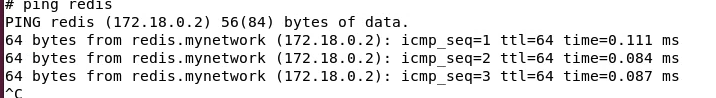

**<g1>3. 결과 화면 </g1>**

-   votes

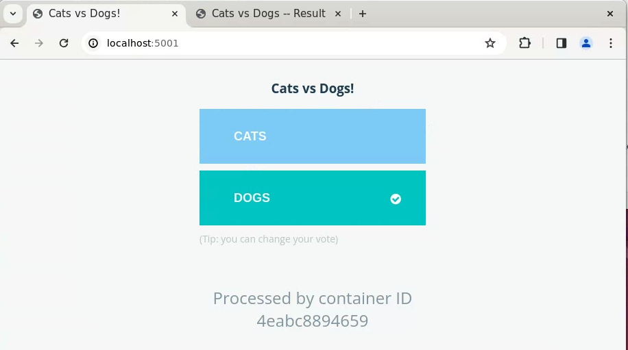

-   result

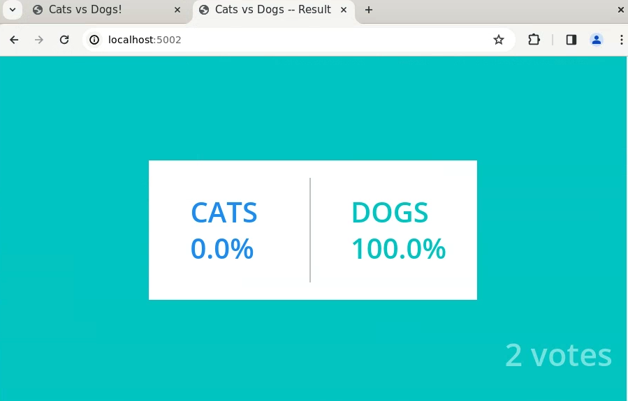
**<g1></g1>**

# 👀 CHECK

_<span style = "font-size:15px">(어렵거나 새롭게 알게 된 것 등 다시 확인할 것들)</span>_

## Docker review quiz

-   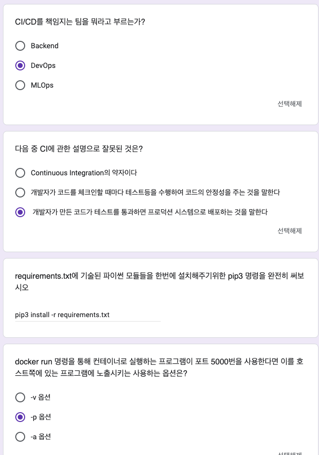
-   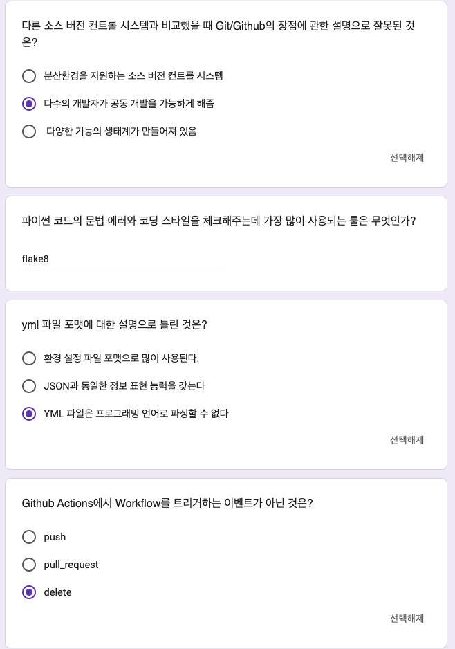

## Ubuntu 22.04에서 Docker로 airflow 실행하는 법

-   강의에서 알려준대로 실행했는데 webserver 연결이 안되는 문제 발생
-   로그를 보고 검색해보니까 권한 문제인 것 같아서 chat gpt에게 물어봄
-   airflow 설정하는데 쓰인 docker-compose.yml를 보니, user id 세팅이 airflow id 세팅값인 50000:0 인걸 확인
-   내 `호스트의 uid / gid`를 확인하니 (id -u, id -g) 1001:1002임을 알 수 있었음
-   그래서 .yml를 수정하고, chown chmod로 host 시스템 파일 경로에 권한도 줬음
    ```bash
    sudo chown -R 1001:1002 /path/to/your/airflow/directory
    sudo chmod -R 775 /path/to/your/airflow/directory
    ```
-   다시 빌드해야하나 고민했는데 웹 서버가 새로고침 하더니 접속이 됨!
-   docker exec으로 서버 접속해서 uid/gid 확인하니까 50000:0 그대로인걸 봐선 권한을 주는게 답이었던듯

# ❗ 느낀 점
