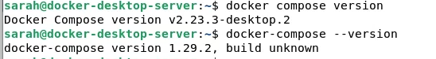
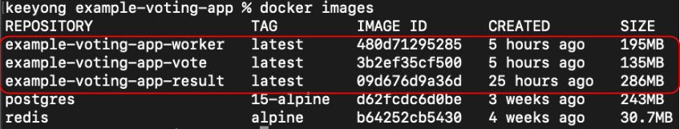
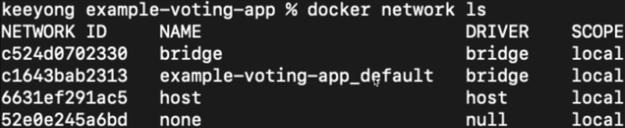
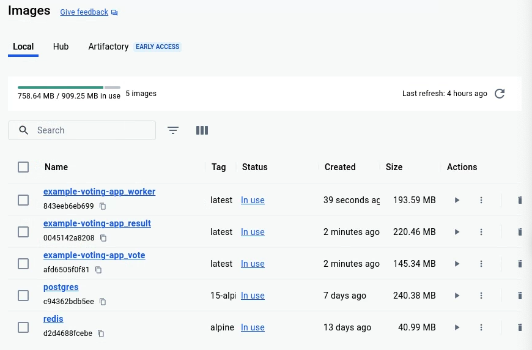
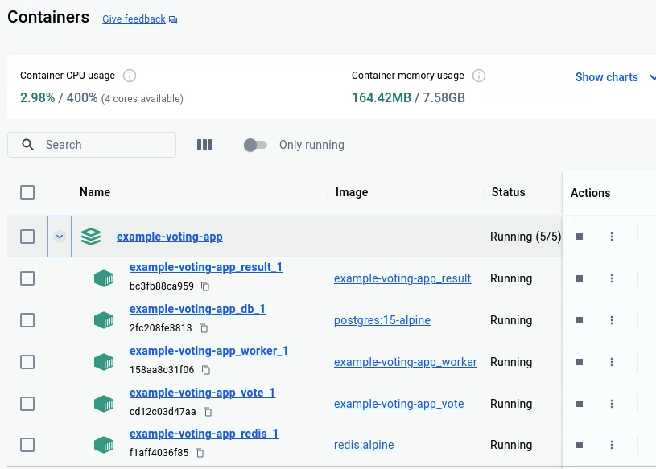
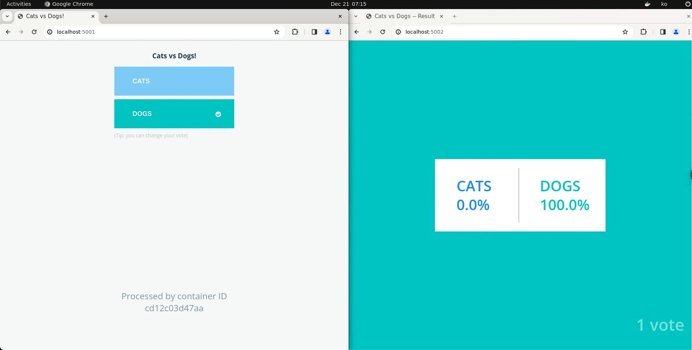

+++
author = "Seorim"
title =  "Day 49 Docker(4)"
slug = "day-49"
date = 2023-12-21T11:27:56+09:00

categories = [
    "DevCourse",
]
tags = [
    "TIL",
]
+++

<style>
g1 { color: #79AC78 }
g2 { color: #B0D9B1 }
g3 { color: #D0E7D2 }
g4 { color: #618264 }
o1 { color: #F9B572 }
w1 { color: #FAF8ED }
</style>

# 📋 공부 내용

## Docker Compose

> 여러 Container로 소프트웨어가 구성되는 경우 사용할 수 있는 툴이자 환경설정파일  
> 개별 Container를 따로 관리하는 것 보다 더 생산성이 높음

`docker-compose.yml` or `docker-compose.yaml`

다양한 테스트를 수행할 수 있으며, 일반적으로 dev, test, prod 등 여러 버전을 만들기도 함

But, 그만큼 배워야 할 것이 많고 복잡해짐

### 사용법

- commands

```bash
docker-compose build
docker-compose up
docker-compose pull
docker-compose ps
docker-compose down
docker-compose start
docker-compose stop
docker-compose rm
```

- version



### docker-compose.y(a)ml

**1. services**

- 프로그램을 구성하는 서비스들
- 각각 Docker Image 지정, Docker Container 실행으로 구성됨 (각각 Dockerfile을 갖고 있거나 docker Hub에서 이미지를 다운로드받아야 함)
- 서비스별로 포트번호, 환경변수, 디스크 볼륨 등을 지정

**2. volumes**

**3. networks**

---

기본 이름이 아닌 다른 이름의 파일을 사용하고 싶다면 `-f` 옵션 사용

```bash
docker-compose -f docker-compose.dev.yml up
```

### 이미지 생성과 관리

**docker-compose build**

- service들 중 build: {path} 로 지정된 것에 대해 빌드가 진행됨

**docker-compose pull**

- docker hub에서 이미지를 읽어오려 하며, image: {image_name}으로 지정됨

**docker images**

- build 된 이미지들은 개별 이미지 앞에 폴더 이름이 prefix로 붙음



**docker-compose images**

- 컨테이너와 그에 의해 실행되고 있는 이미지들만 보여줌

**docker-compose push**

- docker hub 으로 이미지들을 push하려고 함

### 소프트웨어 시작과 중단

**docker-compose up**

- build(&pull) -> create -> start

**docker-compose down**

- stop + remove

**docker-compose stop**

- 컨테이너를 중단

**docker-compose rm**

- 중단상태인 컨테이너들을 삭제

**docker-compose ls**

- docker compose로 실행시킨 컨테이너들을 그룹지어서 보여줌

**docker-compose ps**

- docker compose로 실행시킨 컨테이너들의 상태를 보여줌

### 네트워킹

**docker끼리 네트워크 연결이 필요한 경우**

- sevices에서 지정한 이름으로 host name 생성
- 내부에 DNS 서버가 생성되어 이름을 내부 IP로 변환

**별도 네트워크를 구성하는 경우**

- networks 에 네트워크를 나열하고, 각 네트워크를 적절하게 sevice에 지정해주어야 함

**docker network ls**



## docker compose 실습

### docker-compose.mac.yml (1)

- 읽어올 수 있는 이미지는 dockerhub에서 읽어오며, 이미지가 없는 경우엔 dockerfile의 위치를 제공하여 빌드를 진행
- 네트워크를 지정하지 않고 내부 네트워크 사용

```yaml
services:
  vote:
    build: ./vote # 이미지가 없는 경우이므로 빌드를 진행
    # use python rather than gunicorn for local dev
    # 폴더 내의 dockerfile에 지정된 command를 overwrite하는 것
    command: python app.py
    ports:
      - "5001:80"

  result:
    build: ./result
    # use nodemon rather than node for local dev
    entrypoint: nodemon server.js
    ports:
      - "5002:80"

  worker:
    build: ./worker

  redis:
    image: redis:alpine # 이미지를 docker hub에서 읽어옴

  db:
    image: postgres:15-alpine
    environment:
      POSTGRES_USER: "postgres"
      POSTGRES_PASSWORD: "postgres"
```







- 클린업 후 새로 만든 docker compose 파일을 활용하여 컨테이너들을 실행해보기

```bash
docker-compose -f docker-compose.mac.yml up
```

# 👀 CHECK

_<span style = "font-size:15px">(어렵거나 새롭게 알게 된 것 등 다시 확인할 것들)</span>_

# ❗ 느낀 점
