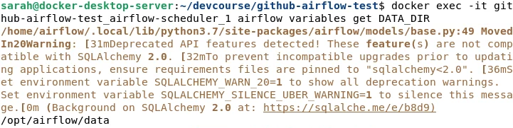
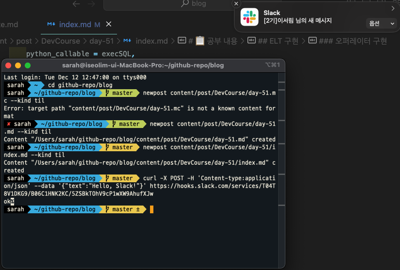
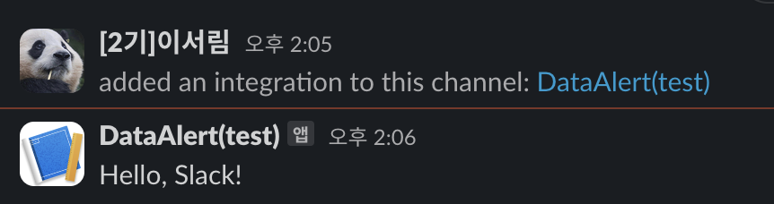

+++
author = "Seorim"
title =  "Day 51 Airflow(6)"
slug = "day-51"
date = 2024-01-01T11:44:47+09:00

categories = [
    "DevCourse",
]
tags = [
    "TIL", "Airflow", "dbt", 
]
+++

<style>
g1 { color: #79AC78 }
g2 { color: #B0D9B1 }
g3 { color: #D0E7D2 }
g4 { color: #618264 }
o1 { color: #F9B572 }
w1 { color: #FAF8ED }
</style>

# 📋 공부 내용

## Airflow Docker 환경설정

### docker-compose.yml

- `:-` : if 처럼 조건문 역할

```yaml
environment:
  AIRFLOW_VAR_DATA_DIR: /opt/airflow/data
  # 환경변수가 존재하지 않는다면(세팅되지 않았다면) :- 뒤의 이름들을 해당 변수에 추가하라는 의미
  _PIP_ADDITIONAL_REQUIREMENTS: ${_PIP_ADDITIONAL_REQUIREMENTS:- yfinance pandas numpy oauth2client gspread}
```

- `DATA_DIR` 변수 확인하는 방법

  - Postgres `Named Volume` 안에 정보가 저장됨
  - Web UI에서 확인 불가하지만 command를 통해 확인 가능

  ```bash
  docker exec -it {airflow-scheduler-container-name} airflow variables get DATA_DIR
  ```

  

- 환경설정값(_Variables, Connections_)을 관리/배포하는 방법

```yaml
x-airflow-common:
  &airflow-common
  ...
  environment:
    &airflow-common-env
    AIRFLOW_VAR_DATA_DIR: /opt/airflow/data
    AIRFLOW_CONN_TEST_ID: test_connection
```

+) 환경 변수가 아닌, credentials 전용으로 `Secrets 백엔드`를 사용하기도 함 - [링크](https://airflow.apache.org/docs/apache-airflow/stable/security/secrets/secrets-backend/index.html)

## ELT 구현

- [Build_Summary.py](https://github.com/learndataeng/learn-airflow/blob/main/dags/Build_Summary.py)

```
def get_Redshift_connection():
    hook = PostgresHook(postgres_conn_id = 'redshift_dev_db')
    return hook.get_conn().cursor()

def execSQL(**context):
    schema = context['params']['schema']
    table = context['params']['table']
    select_sql = context['params']['sql']

    ...

    cur = get_Redshift_connection()

    # drop table if exits, before CTAS
    sql = f"""DROP TABLE IF EXISTS {schema}.temp_{table};CREATE TABLE {schema}.temp_{table} AS """
    sql += select_sql
    cur.execute(sql)

    cur.execute(f"""SELECT COUNT(1) FROM {schema}.temp_{table}""")
    count = cur.fetchone()[0]
    if count == 0:
        raise ValueError(f"{schema}.{table} didn't have any record")

    # 중복 레코드, Primary key 등 여러가지 테스트 진행 가능
    # DBT를 사용하면 이런 여러가지 테스트를 직접 작성할 필요 없어짐

    ...

# @once : 주기적으로 실행되지 않고 한번만 실행됨
dag = DAG(
    dag_id = "Build_Summary",
    start_date = datetime(2021,12,10),
    schedule = '@once',
    catchup = False
)

execsql = PythonOperator(
    task_id = 'mau_summary',
    python_callable = execSQL,
    params = {
        'schema' : 'imsolem1226',
        'table': 'mau_summary',
        'sql' : """SELECT
  TO_CHAR(A.ts, 'YYYY-MM') AS month,
  COUNT(DISTINCT B.userid) AS mau
FROM raw_data.session_timestamp A
JOIN raw_data.user_session_channel B ON A.sessionid = B.sessionid
GROUP BY 1
;"""
    },
    dag = dag
)
```

### CTAS SQL query to `config`

- config/mau_summary.py

```python
# Python dictionary 형태로 사용하기 위해 .py 확장자를 가지게 됨
{
'table': 'mau_summary',
'schema': 'imsolem1226',
'main_sql': """SELECT ...;""",
'input_check': [ ],
'output_check': [ ],
}
```

### 오퍼레이터 구현

- dags/plugins/redshift_summary.py - [링크](https://github.com/learndataeng/learn-airflow/blob/main/dags/plugins/redshift_summary.py#L89)

## 외부 API 연동하여 DAG 작성

### 구글 시트

### Slack

- 앱 생성 및 Webhook으로 메세지 전송

```bash
curl -X POST -H 'Content-type: application/json' --data '{"text":"Hello, Slack!"}' https://hooks.slack.com/services/{slack_webhook_url}
```





## Airflow API & 모니터링

# 👀 CHECK

_<span style = "font-size:15px">(어렵거나 새롭게 알게 된 것 등 다시 확인할 것들)</span>_

# ❗ 느낀 점
