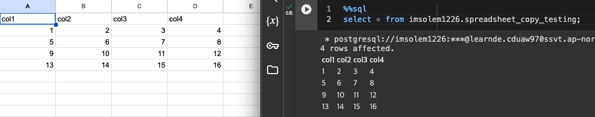
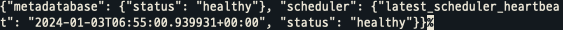

+++
author = "Seorim"
title =  "Day 52 Airflow(7)"
slug = "day-52"
date = 2024-01-02T12:50:38+09:00

categories = [
    "DevCourse"
]
tags = [
    "TIL", "Airflow", "Airflow API"
]
+++

<style>
g1 { color: #79AC78 }
g2 { color: #B0D9B1 }
g3 { color: #D0E7D2 }
g4 { color: #618264 }
o1 { color: #F9B572 }
w1 { color: #FAF8ED }
</style>

# 📋 공부 내용

## Google sheet 연동 실습

- Google Drive API, Google Sheet API 둘 다 사용

- Sheet 내용을 저장할 테이블 생성

```sql
create table imsolem1226.spreadsheet_copy_testing(
  col1 int,
  col2 int,
  col3 int,
  col4 int
);
```

- 테이블에 저장된 데이터 확인
  

## Airflow API

- `airflow.cfg`

```
[api]
auth_backend = airflow.api.aut.backend.basic_auth
```

- `docker-compose.yaml`

```yaml
# AIRFLOW__ : override airflow.cfg
# API__AUTH_BACKENDS : [Api] 섹션 밑의 'AUTH_BACKENDS' 키 값을 설정
AIRFLOW__API__AUTH_BACKENDS: 'airflow.api.auth.backend.basic_auth', 'airflow.api.auth.backend.session'
```

- command로 설정값 확인

```bash
docker exec -it {airflow schedular container name} aiflow config get-value api auth_backend
```

- Web UI로 API 사용을 위한 새로운 유저 추가

- /health API 호출

```bash
curl -X GET --user "{name}:{password}" http://{localhost or address ip}:8081/health
```



- /config

  - 기본 설정 : API로 접근 불가

  - 설정값 : `default:False`, `True`, `non-sensitive-only`

  ```
  #airflow.cfg
  [webserver]
  expose_config = True
  #docker-composer.yaml
  AIRFLOW__WEBSERVER__EXPOSE_CONFIG: 'true'
  ```

- 활성화 된 DAG 찾기

```python
import requests
from requests.auth import HTTPBasicAuth
import json

url = "http://localhost:8080/api/v1/dags"

dags = requests.get(url, auth=HTTPBasicAuth("airflow", "airflow"))

json_dags = json.loads(dags.text) #dags.json()

for dag in json_dags["dags"]:
    if not dag["is_paused"]:
        print(dag)

```

# 👀 CHECK

_<span style = "font-size:15px">(어렵거나 새롭게 알게 된 것 등 다시 확인할 것들)</span>_

# ❗ 느낀 점
