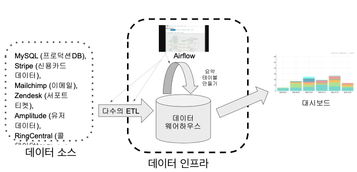

+++
author = "Seorim"
title = 'Day 41 Data pipeline'
slug = 'day 41'
date = 2023-12-11T11:49:09+09:00

categories = [
    "DevCourse",
]
tags = [
    "TIL",
]
+++

<style>
g1 { color: #79AC78 }
g2 { color: #B0D9B1 }
g3 { color: #D0E7D2 }
g4 { color: #618264 }
o1 { color: #F9B572 }
w1 { color: #FAF8ED }
</style>

# 📋 공부 내용

## 데이터 파이프라인

> Data를 소스로부터 목적지로 복사하는 작업

-   (Write code using)Python, Scalar
-   SQL Query(DW or DL -> DW)
-   목적지 : (대부분)`DATA WAREHOUSE`

### 데이터 웨어하우스 구성



```
데이터 소스 --(다수의 ETL)--> 데이터 웨어하우스 --> 대시보드
```

다수의 ETL들 간의 순서를 정하고 주기적으로 실행해주는 프레임워크(=`Airflow`)가 필요해짐

### ETL

> <o1>E</o1>xtract, <o1>T</o1>ransform and <o1>L</o1>oad

-   Date Pipeline, ETL, Data Workflow, DAG(in Airflow)

### ETL vs. ELT

| 용어 | 설명 및 데이터 흐름                                          |                 |
| ---- | ------------------------------------------------------------ | --------------- |
| ETL  | 데이터소스 -> 데이터 웨어하우스                              | 데이터 엔지니어 |
| ELT  | 데이터 웨어하우스(or 데이터 레이크) 내부, 새로운 데이터 생성 | 데이터 분석가   |

#### ELT 프로세스

-   SQL `CTAS`
-   dbt : Data Build Tool (Done by Analytics Engineering)

### Data Lake vs. Data Warehouse

#### 데이터 레이크 (Data Lake)

-   데이터 웨어하우스보다 `몇배 더 큰 크기의 저장소`
-   구조화 데이터 + 비구조화 데이터
-   보존 기한이 없는, 데이터를 `원본`으로 저장하는 저장소

#### 데이터 웨어하우스 (Data Warehouse)

-   보존 기한이 있는, 구조화된 데이터를 `저장하고 처리`하는 저장소
-   시각화를 진행하는 BI툴의 백엔드로 연결

### Data Lake & ELT

|              |     |                            |     |                                        |     |                                  |
| :----------: | :-: | :------------------------: | :-: | :------------------------------------: | :-: | :------------------------------: |
| Data Sources | ->  | Data Lake<br/>(S3, GCS,..) | ->  | Data Transforms<br/>(Spark, Athena,..) | ->  | Data Warehouse<br/>(==Data Mart) |

-   Data Lake의 원본 데이터를 처리하여 Data Warehouse에 적재하는 과정도 `ELT`

### 데이터 파이프라인의 종류

#### Raw Data ETL Jobs (ETL)

-   By Data Engineer

1. 외부와 내부 데이터 소스를 읽어
2. 데이터 포맷 변환 후 (데이터가 커지면 Spark 등 활용)
3. 데이터 웨어하우스에 로드

#### Summary / Report Jobs (ELT)

-   By Data Analyst
-   Analytics Engineer (DBT Tool)

-   DW or DL에서 데이터를 읽고 다시 DW에 쓰는 과정
-   Raw Data를 읽고 일종의 `리포트`나 써머리 형태의 `정제된` 테이블을 다시 만드는 용도
-   특수한 형태 : AB 테스트 결과를 분석하는 데이터 파이프라인

#### Production Data Jobs

-   DW에서 데이터를 읽어 다른 Storage에 쓰는 과정 (데이터 목적지가 외부 Storage)

-   일반적인 타겟 스토리지
    -   Cassandra/HBase/DynamoDB 등과 같은 NoSQL (ML과정에서 필요한 특정 피쳐를 미리 계산)
    -   MySQL과 같은 관계형 데이터베이스(OLTP, `Production DB`)
    -   Redis, Memcache와 같은 캐시
    -   ElasticSearch와 같은 검색엔진

### 데이터 파이프라인을 만들 때 고려할 점

#### 운영 중 발생하는 여러 문제들

-   데이터 파이프라인의 실패
    -   버그 :<
    -   데이터 소스의 문제
        -   ex: 데이터 포맷 변환이 불가능하다면?
    -   데이터 파이프라인들 간 의존도에 대한 이해 부족
        -   특정 테이블의 이름을 바꾸거나, 컬럼을 드랍 하는 등 변경이 생기면 여기에 의존하는 다른 파이프라인에 문제가 생김
-   데이터 파이프라인 증가 -> 유지보수 비용 기하급수적으로 증가
    -   데이터 소스 사이에 의존도가 생기면서 더욱 복잡해짐
        -   ex: 마케팅 채널 정보가 업데이트 되지 않으면 이 관련 다른 모든 정보가 갱신되지 않음
    -   더 많은 테이블을 관리해야함

#### Best Practices

1. Full Refresh

-   가능하다면, 매번 통째로 전부 복사해서 테이블을 만들기
-   Incremental Update만 가능하다면?
    -   Incremental Update : 새로 생성되거나, 업데이트 된 레코드들만 읽어오는 방식
    -   full refresh 할 만큼 충분한 시간이 있는가?
    -   특정 시간을 기준으로 새로 생성되거나 업데이트 된 레코드만 지정해서 읽어올 수 있어야 함

2. 멱등성(Idempotency) 보장

-   동일한 데이터 소스에 대해 파이프라인을 여러번 실행해도 최종 테이블 결과가 달라지지 않아야 함
    -   ex: 중복 데이터 X
-   멱등성이 깨질 경우 데이터 품질에 문제가 발생
-   실패를 하더라도 멱등성이 깨지지 않도록 깔끔하게 실패해야 함
-   중요 포인트 : critical point들이 하나의 atomic action으로 실행이 되어야 함 (다같이 성공, 다같이 실패)
    -   SQL transaction

3. Backfill

-   실패한 데이터 파이프라인을 다시 실행하는 과정이 쉬워야 함
-   full refresh : backfill이 쉬움
-   Airflow: backfill

4. 데이터 파이프라인 입력, 출력을 명확하게 문서화하기

-   비즈니스 오너, 테크니컬 오너 명시하여 기록으로 남기기
    -   비즈니스 오너 : 데이터를 요청한 사람
-   데이터 카탈로그
-   데이터 디스커버리
-   데이터 의존성때문에 발생하는 문제(`데이터 리니지`)를 해결할 때 필요

5. `사용되지 않는` 데이터를 주기적으로 `삭제`

-   테이블의 사용 여부를 주기적으로 확인
-   사용하지 않는 테이블을 찾고, 이 테이블을 생성하는 데이터 파이프라인을 삭제

6. 사고 리포트(post-mortem report) 작성하기

-   동일한, 비슷한 사고가 재발하는 것을 방지
-   사고 원인을 이해하고, 방지하기 위한 `액션 아이템`이 중요
-   기술 부채 정도를 이야기하는 바로미터

7. `중요` 데이터 파이프라인의 `입력과 출력을 체크`

-   입력 레코드 수, 출력 레코드 수를 체크
-   써머리 테이블 작성, primary key uniqueness 보장 여부 체크
-   중복 레코드 체크
-   ...

### ETL 작성 실습

-   #TODO

## Airflow

### 소개

> 가장 많이 사용되는 `데이터 파이프라인 프레임워크`

### 구성 설명

###

# 👀 CHECK

_<span style = "font-size:15px">(어렵거나 새롭게 알게 된 것 등 다시 확인할 것들)</span>_

# ❗ 느낀 점
