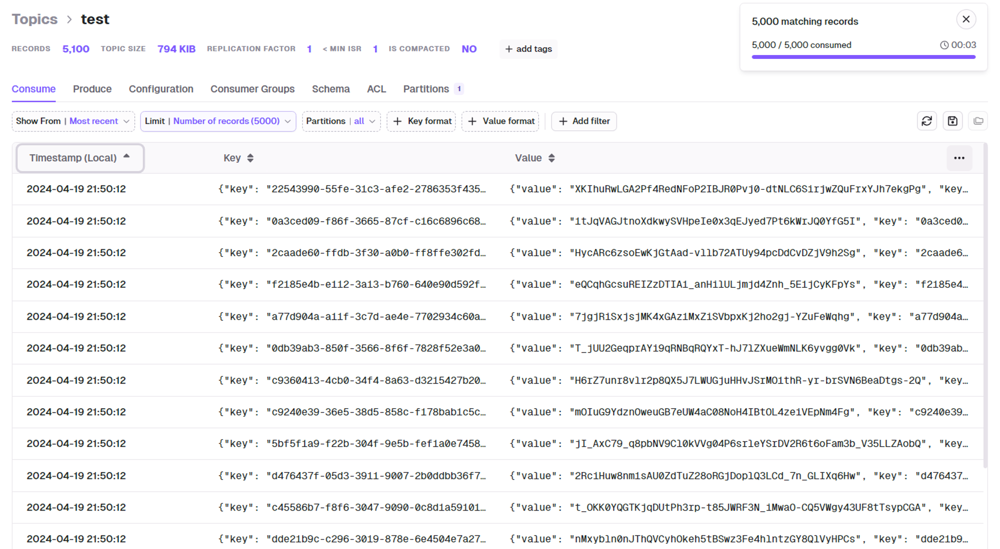
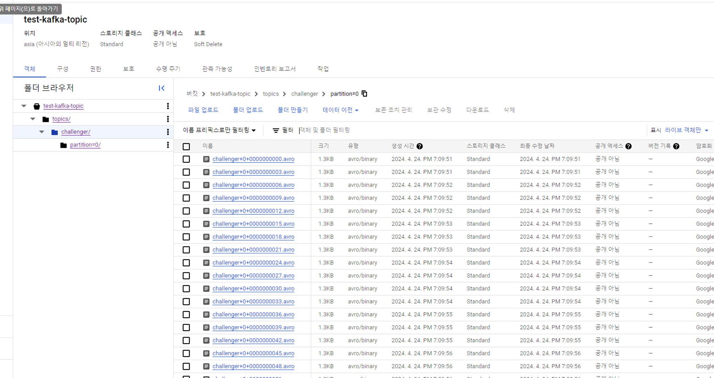
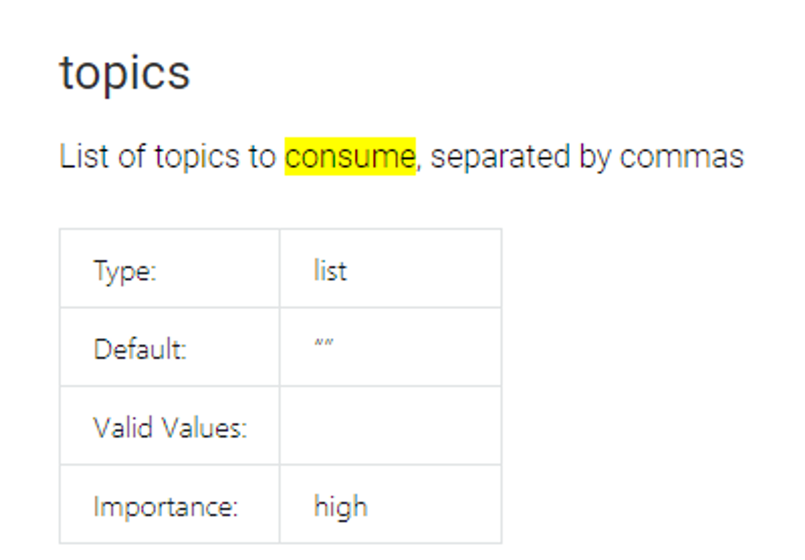
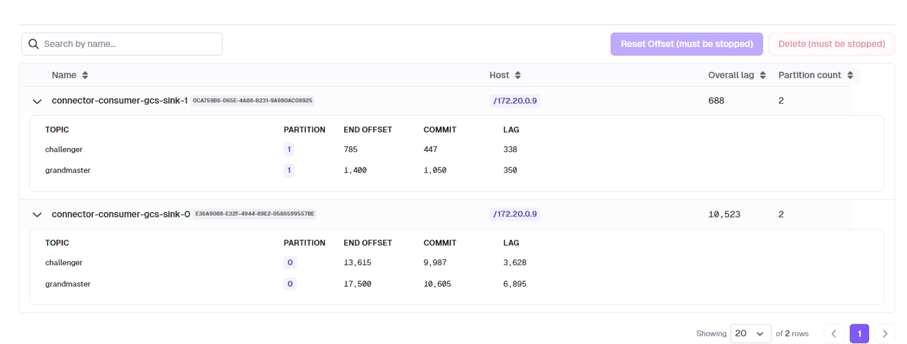
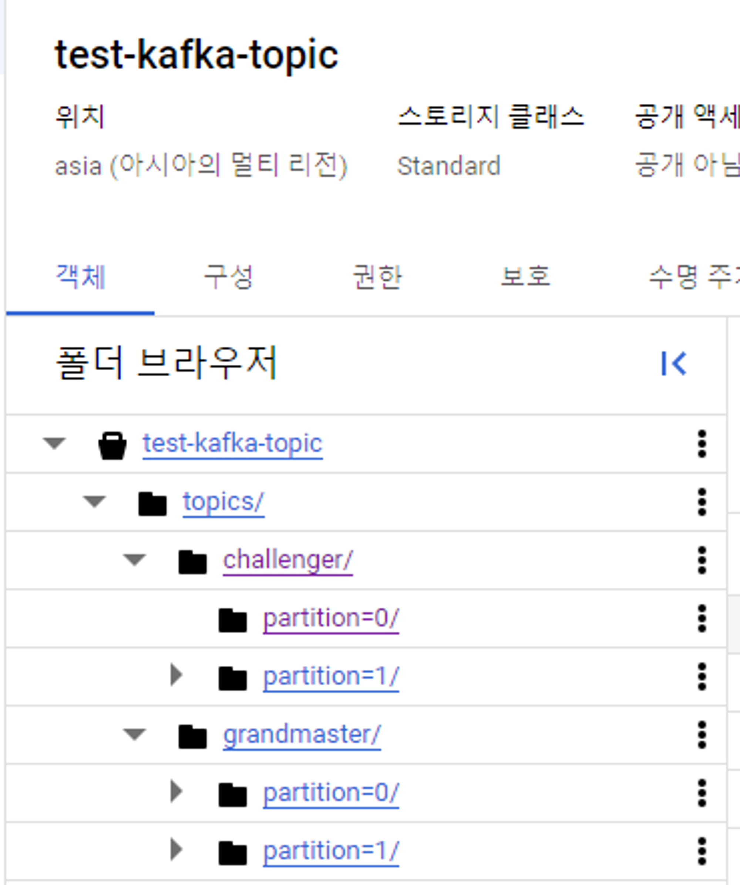
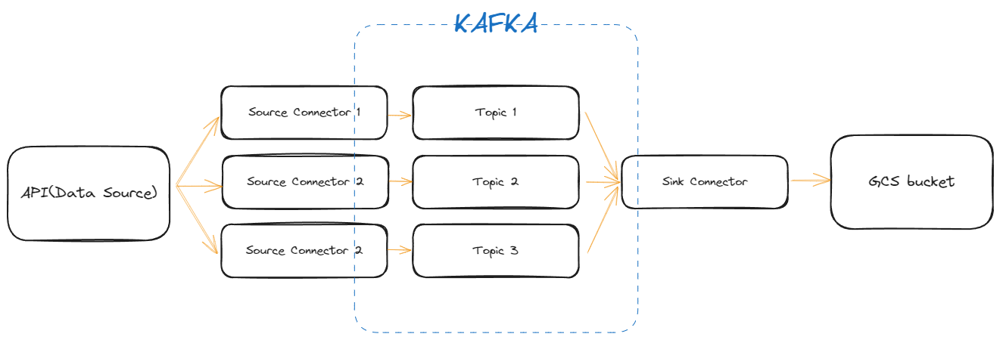

+++
author = "Seorim"
title = 'Kafka 1: Using Kafka Connect'
slug = 'kafka-1-kafka-connect'
date = 2024-04-27T16:43:42+09:00
categories = [
    "kafka"
]
tags = [
    "kafka","kafka-connect", "GCS", "Docker"
]
+++

# Kafka Connect

- Kafka Connect는 Apache Kafka를 활용하는 분산 시스템
- Kafka와 다른 데이터 시스템 사이에서 큰 데이터 스트림을 신뢰성 있게 전송할 수 있도록 설계됨
- 데이터베이스, key-value 저장소, 검색 인덱스, 파일 시스템 등 다양한 소스(Source)와 싱크(Sink)로부터 데이터를 효율적으로 불러오고 전송할 수 있음
- 주로 큰 데이터 파이프라인에서 데이터를 연동하고 관리하는 데 사용
## About Connector
### Source Connector

- 외부 시스템에서 데이터를 추출하여 Kafka 토픽으로 전송하는 역할
- 생산자(Producer)와 비슷한 역할을 하지만, Kafka 외부의 시스템에서 Kafka로 데이터를 `push`하는 데 특화되어 있음

### Sink Connector

- Sink Connector는 Kafka 토픽의 데이터를 읽고 외부의 시스템이나 서비스로 전송
- 소비자(Consumer)와 비슷하지만, Kafka에서 데이터를 `pull`하여 외부 시스템으로 데이터를 push하는 데 특화되어 있습니다.

### Producer,  Consumer와의 차이점

- Producer와 Consumer
	- 각각 데이터를 Kafka 시스템에 보내고 받는 역할 
	- **Producer**: 데이터를 Kafka로 보내는 일반적인 Kafka 클라이언트
	- **Consumer**: Kafka로부터 데이터를 받는 일반적인 Kafka 클라이언트
- Kafka Connect의 Source와 Sink Connector
	- 역할을 확장하여 특정 외부 시스템과의 연동을 담당하는 Kafka Connect 컴포넌트
	- 연동을 자동화하여 크고 복잡한 데이터 파이프라인에서 신뢰성과 확장성을 제공

## Kafka connector 실습

### docker compose로 컨테이너를 올려 kafka 환경 구성하기
    
[GitHub - conduktor/kafka-stack-docker-compose: docker compose files to create a fully working kafka stack](https://github.com/conduktor/kafka-stack-docker-compose)
    
- 데브코스 실습 시 사용했던 docker compose 이용
- 사용하려는 connector를 추가하기 (to service use bash script)
	1. confluent hub
	2. self-managed(from github)
### source, sink connector 각각 instance 생성하기
#### HTTP Source Connector 테스트
        
[GitHub - castorm/kafka-connect-http: Kafka Connect connector that enables Change Data Capture from JSON/HTTP APIs into Kafka.](https://github.com/castorm/kafka-connect-http)
        
- source connector config
	```json
	{
		"kafka.topic": "challenger",
		"tasks.max": "1",
		"http.response.record.offset.pointer": "key=/summonerId",
		"connector.class": "com.github.castorm.kafka.connect.http.HttpSourceConnector",
		"http.response.list.pointer": "/entries",
		"http.request.url": "<https://kr.api.riotgames.com/lol/league/v4/challengerleagues/by-queue/RANKED_SOLO_5x5>",
		"http.timer.interval.millis": "60000",
		"http.request.method": "GET",
		"http.request.headers": "X-Riot-Token:{your token}"
	}			
	```

            
- 주기적으로 데이터 가져오는것을 확인
            
	
            
#### GCS Sink Connector 테스트
        
[Google Cloud Storage Sink Connector for Confluent Platform | Confluent Documentation](https://docs.confluent.io/kafka-connectors/gcs-sink/current/overview.html)
        
- service account for gcs    
	- get json key
                
- sink config
            
	```json
	{
		"value.converter.schema.registry.url": "<http://kafka-schema-registry:8081>",
		// 이 부분 localhost:8081 으로 작성 X
		"topics": "challenger",
		"value.converter": "io.confluent.connect.avro.AvroConverter",
		"schema.compatibility": "NONE",
		"connector.class": "io.confluent.connect.gcs.GcsSinkConnector",
		"gcs.credentials.json":"{your json key to string}"",
		"gcs.part.size": "5242880",
		"confluent.topic.replication.factor": "1",
		"name": "gcs-sink",
		"format.class": "io.confluent.connect.gcs.format.avro.AvroFormat",
		"tasks.max": "1",
		"flush.size": "3",
		"partitioner.class": "io.confluent.connect.storage.partitioner.DefaultPartitioner",
		"confluent.topic.bootstrap.servers": "kafka1:19092",
		// 여기도 마찬가지. localhost:8082로 작성 시 오류
		"storage.class": "io.confluent.connect.gcs.storage.GcsStorage",
		"gcs.bucket.name": "test-kafka-topic"
	}
	```
	
	
            
- 여러개의 토픽을 연결할 수 있음
	
                
	- 이 때, partition의 수와 task의 수와 관련이 있음
		- partition이 하나씩 있을 경우, consumer 하나에 파티션 하나가 할당됨
		- partition이 두개 각각 있을 경우, consumer 2개가 일하게 됨
                
			
                
			
                
### 실제 데이터 흐름
	    

    
### 추가 고려 사항
    
- [ ] connector instance 생성 자동화 (중요도 중간)
	- docker-compose 파일에 service를 추가하고, config 파일을 마운트하고 이를 기반으로 connector instance를 생성하도록 설정
	- docker-connect-config topic 데이터를 volume mount하여 docker container를 재실행해도 config 정보는 남아있게 하는 방법 고려
- [ ] kafka-connect cluster(instance)를 추가하고 source, sink 각각 다른 cluster에서 운영하는 방식으로 성능 향상
	- 지금은 1분마다 데이터를 가져오지만, 실제 진행시에는 1시간 또는 1일 단위로 가져올 예정
- [ ] 중복 체크 (중요도 높음)
- [ ] API key, SSH key 등 credential 적용 방법 (중요도 높음)        
- [ ] 동적으로 url 변경 가능 여부 찾아보기 (중요도 낮음)
        

- 참고 링크 및 자료
    - [https://docs.astronomer.io/learn/airflow-kafka#best-practices](https://docs.astronomer.io/learn/airflow-kafka#best-practices)
	- [Declarative Connectors with Confluent for Kubernetes](https://www.confluent.io/blog/declarative-connectors-with-confluent-for-kubernetes/)
	- [How to run Kafka Connect connectors automatically (e.g. in production)?](https://stackoverflow.com/questions/56474734/how-to-run-kafka-connect-connectors-automatically-e-g-in-production)
    - [Kubernetes를 이용한 효율적인 데이터 엔지니어링(Airflow on Kubernetes VS Airflow Kubernetes Executor) - 2](https://engineering.linecorp.com/ko/blog/data-engineering-with-airflow-k8s-2)
    - [Python FastAPI 시작하기 - FastAPI란? 설치 방법과 기본 예제(FastAPI example) Feat. ASGI, Uvicorn](https://lsjsj92.tistory.com/648)
    - [[Kafka] 메세지큐 서버 도입과 역할의 분리](https://ppaksang.tistory.com/25)
    - [카프카 커넥트를 데이터 파이프라인으로 사용하는 이유? kafka-sink-connector 오픈소스 언빡싱!](https://tech.kakao.com/2023/01/12/introduce-kafka-sink-connector/)
    - [내부 데이터 파이프라인에 Kafka Streams 적용하기](https://engineering.linecorp.com/ko/blog/applying-kafka-streams-for-internal-message-delivery-pipeline)
