+++
author = "Seorim"
title = '서버 세팅 : Ubuntu Server에서 Docker Desktop을 돌려보자'
slug = 'docker-desktop'
date = 2023-12-20T16:53:42+09:00
categories = [
    "Server", 
]
tags = [
    "Server setup", "Docker", "Docker Desktop", "Ubuntu Desktop"
]
+++

<style>
g1 { color: #79AC78 }
g2 { color: #B0D9B1 }
g3 { color: #D0E7D2 }
g4 { color: #618264 }
o1 { color: #F9B572 }
w1 { color: #FAF8ED }
</style>

# 서버 세팅

## 계기

부트캠프 과정에서 도커를 사용하는데, 나는 아주 작고 소중한 8GM 메모리를 가진 맥북을 사용하기 때문에 도커 데스크탑을 설치해서 작동시키기가 쉽지 않았다.

Superset을 쓸 때는 Preset.io 서비스를, Airflow를 쓸 때는 Airflow 서버를 만들었다. 하지만 이번엔 도커 그 자체를 사용하는 과정이어서 다른 서비스로 회피할 수 없었다.(ㅠㅠ)
처음에는 우분투 서버에 도커만 설치할까 하다가, 우분투 데스크탑을 설치해 GUI환경을 세팅하고 그 위에 도커 데스크탑을 설치하여 GUI환경 전체를 세팅해보기로 결심했다.

첫날 온갖 시행착오를 겪으며 서버를 세팅한 데는 5시간 정도 걸렸지만, 그 이후 다른 사람에게 알려주면서 같이 세팅했을 땐 한시간~한시간 반 정도 걸렸다. 서버 세팅법을 알려주고 다시 만들어보면서 나름 정리가 되어서, 블로그에 적어보기로 했다.

## 과정

> 서버 설정과 연결은 로컬 터미널에서 진행하며, `google cloud sdk`가 설치되어 있어야 한다.  
> VM 인스턴스에 연결됐을때는 root 계정이 아니라 일반 계정으로 설치 및 설정을 진행한다.

### GCE(Google Compute Engine) VM 설정

> `중첩된 가상화`를 설정해야하기 때문에, 이를 지원하는 머신인 `n1, n2, c3` 중에 골라 사용해야 한다.  
> 도커 데스크탑의 요구 사양이 높은 편이기 때문에, `vCPU 최소 2개 이상, 메모리 최소 8GB 이상`으로 구성해야 한다.

**<o1>1. 머신 및 디스크 사양</o1>**

-   머신 : n1-standard-4 (`4 vCPUs`, 2 cores, `15GB memory`)

-   부팅 디스크 : `Ubuntu 22.04 LTS`, 64GB `SSD`

-   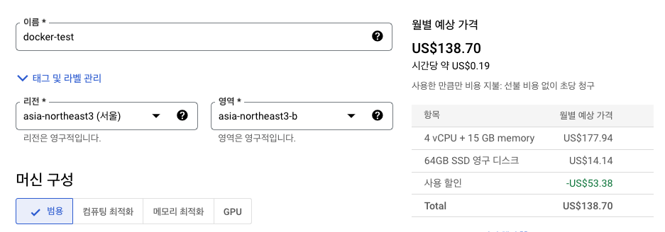
-   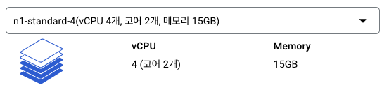
-   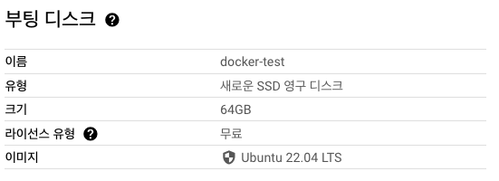
-   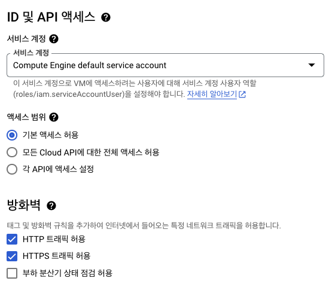

**<o1>2. 중첩된 가상화 (nested virtualization) 설정</o1>**

[참고 링크 1](https://cloud.google.com/compute/docs/instances/nested-virtualization/enabling?hl=ko#gcloud_1)

`VM_NAME` : 본인의 VM instance 이름

`ZONE` : 해당 instance가 위치한 지역

-   다음 명령어로 VM 속성을 config.yaml 파일으로 내보낸다. GCE를 처음 써본다면 이 과정에서 권한 설정 관련 구글 로그인이 진행될 수 있다.

    ```bash
    gcloud compute instances export VM_NAME --destination=config.yaml --zone=ZONE
    # -------
    gcloud compute instances export "docker-test" --destination=config.yaml --zone=asia-northeast3-b
    ```

-   config.yaml 파일을 열고 다음을 파일에 추가한다.

    ```yaml
    advancedMachineFeatures:
        enableNestedVirtualization: true
    ```

    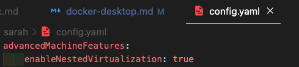

-   다음 명령어로 수정된 config.yaml 파일으로부터 VM 속성을 업데이트 한다. 이 과정은 시간이 좀 걸릴 수 있음.

    ```bash
    gcloud compute instances update-from-file VM_NAME --source=config.yaml --most-disruptive-allowed-action=RESTART --zone=ZONE
    # -------
    gcloud compute instances update-from-file "docker-test" --source=config.yaml --most-disruptive-allowed-action=RESTART --zone=asia-northeast3-b
    ```

-   업데이트 이후 VM에 연결한다. VM을 업데이트 하면 재부팅을 진행하므로, 바로 연결이 안될수도 있다.

    ```bash
    gcloud compute ssh --zone "asia-northeast3-b" "docker-test"
    ```

    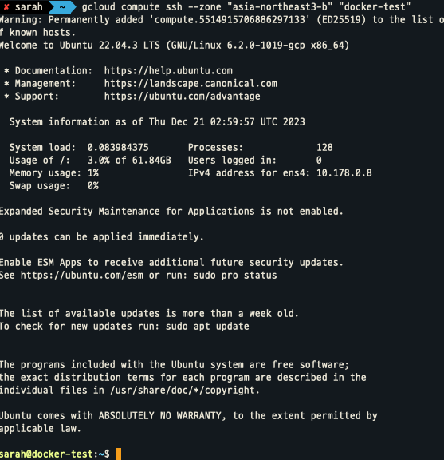

-   (연결된 인스턴스에서) 다음 커맨드로 중첩된 가상화가 설정되었는지 확인한다. 0 이외의 응답이 나와야 사용 설정이 제대로 된 것이다.

    ```bash
    grep -cw vmx /proc/cpuinfo
    ```

    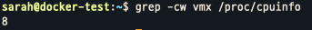

**<o1>3. kvm 지원 여부를 확인</o1>**

[참고 링크 2](https://docs.docker.com/desktop/install/linux-install/#kvm-virtualization-support)

-   (연결된 VM 인스턴스에서) 다음 커맨드를 입력해 kvm를 지원하는지 확인한다.

    ```bash
    modprobe kvm
    modprobe kvm-intel

    # 위 커맨드가 실패한 경우, 다음 커맨드를 입력해본다.
    sudo apt install cpu-checker
    kvm-ok

    # 다음 커맨드로 지원되는 kvm module을 확인할 수 있다.
    lsmod | grep kvm
    ```

    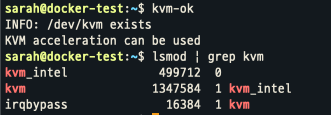

### Chrome, Chrome remote desktop, Ubuntu Desktop 설치

<https://ubuntu.com/blog/launch-ubuntu-desktop-on-google-cloud>

<https://snowdeer.github.io/linux/2017/08/04/install-gui-desktop-on-ubuntu/>

```bash
sudo apt update
```

**<o1>크롬 설치</o1>**

```bash
wget https://dl.google.com/linux/direct/google-chrome-stable_current_amd64.deb
```

```bash
sudo apt install ./google-chrome-stable_current_amd64.deb
```

**<o1>크롬 원격 데스크탑 설치</o1>**

```bash
wget https://dl.google.com/linux/direct/chrome-remote-desktop_current_amd64.deb
```

```bash
sudo apt install ./chrome-remote-desktop_current_amd64.deb
```

**<o1>우분투 데스크탑 설치</o1>**

-   이 과정은 설치 시간이 오래 걸리는 편이니 참고할 것

```bash
sudo apt update
sudo apt upgrade
sudo apt install ubuntu-desktop
```

**<o1></o1>**

### Chrome remote desktop으로 Ubuntu 서버에 접속

**<o1>파일 및 계정 설정</o1>**

[참고 링크](https://carrie2120.tistory.com/2)

-   크롬 원격 데스크탑 실행 시, 우분투 데스크탑이 실행되도록 파일 설정

```bash
# 다른 desktop을 사용할경우 .desktop 파일의 이름을 확인할 것
vi /usr/share/xsessions/ubuntu.desktop

# Exec= 뒤의 모든 부분을 복사
# Exec=env GNOME_SHELL_SESSION_MODE=ubuntu /usr/bin/gnome-session --session=ubuntu
# 홈 디렉토리로 이동
cd ~

# 원격 데스크탑 세션 파일 생성 및 설정
vi .chrome-remote-desktop-session

# 파일에 exec /etc/X11/Xsession '<EXEC_COMMAND>'를 적은 뒤 저장
# exec /etc/X11/Xsession 'env GNOME_SHELL_SESSION_MODE=ubuntu /usr/bin/gnome-session --session=ubuntu'

# ubuntu VM instance를 reboot
sudo reboot
```

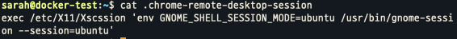

-   이후 VM에 재 접속해서 진행

-   `ubuntu` user password 변경 (본인이 자주 사용하는걸로 설정)

```bash
sudo passwd ubuntu
```

**<o1>크롬 원격 데스크탑 연결</o1>**

-   크롬 원격 데스크탑 SSH 연결을 누르고 해당 커맨드 복사하여 인스턴스와 연결된 터미널에 입력

    -   <https://remotedesktop.google.com/headless>

    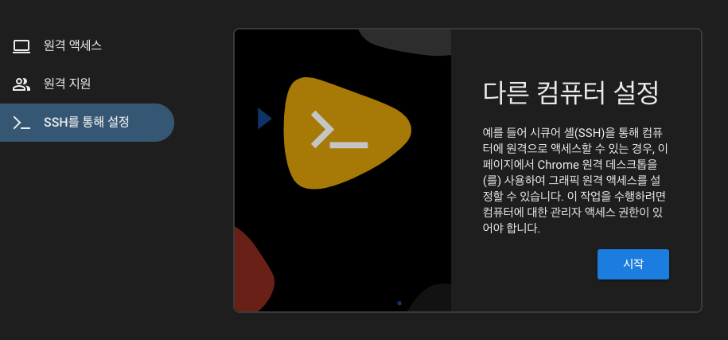
    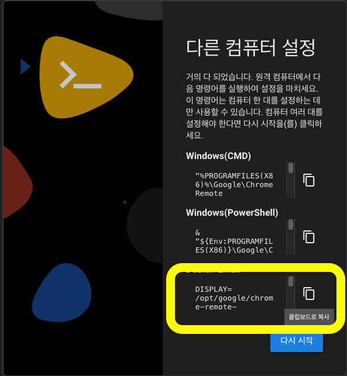

    -   PIN 6자리를 설정하는데, 본인이 자주 사용하는걸로 설정해야 나중에 잊지 않음
    -   이 커맨드는 서버의 원격 데스크탑 호스트를 데몬서비스로 백그라운드에서 실행해주기 때문에, 호스트 서비스를 실행하기 위해 따로 명령어를 실행할 필요가 없음

    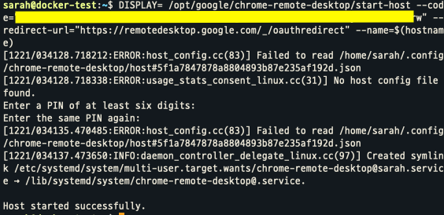

-   서버 접속 : <https://remotedesktop.google.com/access>

    -   앞에서 설정한 PIN 입력

    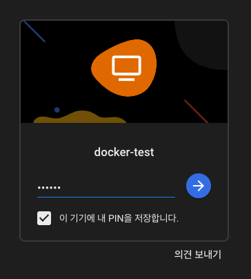

    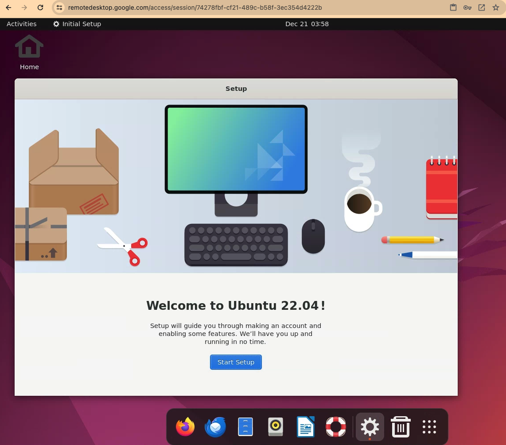

**<o1>기타 접속을 위한 설정</o1>**
[설정 관련 참고 링크1](https://askubuntu.com/questions/1370068/ubuntu-now-always-starts-in-overview-mode-when-logging-in-how-to-avoid)

[참고 링크 2](https://askubuntu.com/questions/1418937/your-native-host-connector-do-not-support-following-apis-v6)

-   ubuntu desktop 실행 시 가끔 발생하는 Activities 활성화 오류를 막기 위해 extension 설치

    -   우분투 데스크탑에 접속해서 진행해야 함!
    -   [gnome shell integration 크롬 확장 설치](https://chromewebstore.google.com/detail/gnome-shell-integration/gphhapmejobijbbhgpjhcjognlahblep) (우분투 데스크탑에서 크롬을 열고 설치)

    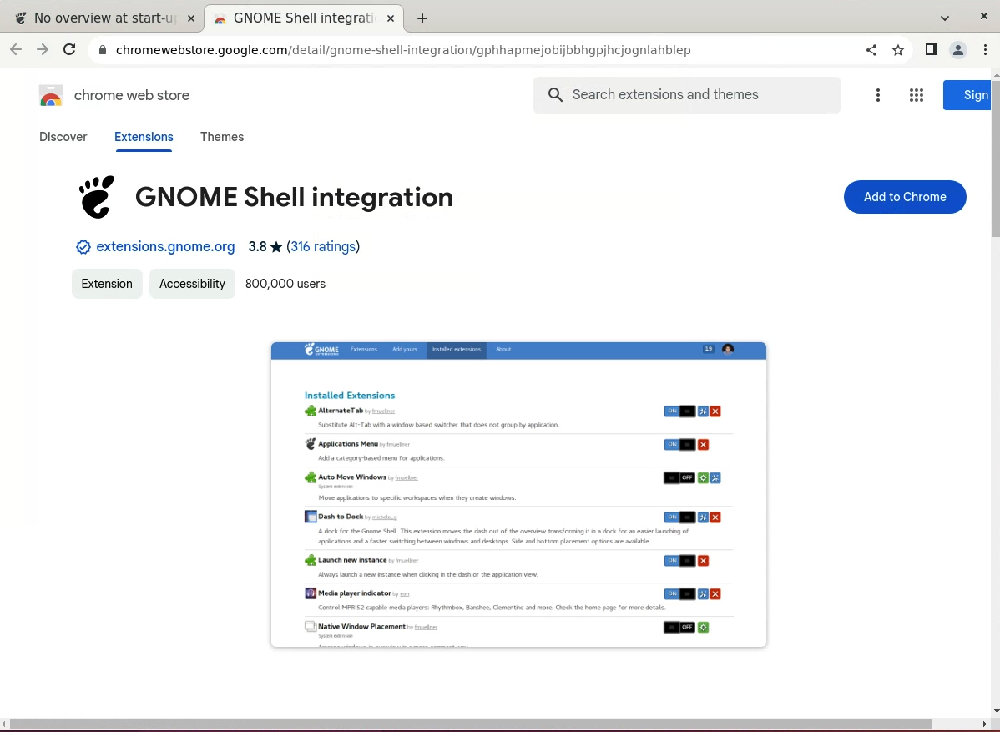

    -   [gnome shell brower integration 설치](https://wiki.gnome.org/action/show/Projects/GnomeShellIntegration/Installation?action=show&redirect=Projects%2FGnomeShellIntegrationForChrome%2FInstallation#Ubuntu_Linux) (vm 연결 터미널에서 진행)

    ```bash
    sudo apt install chrome-gnome-shell
    ```

    -   extension 설치 : <https://extensions.gnome.org/extension/4099/no-overview/>

    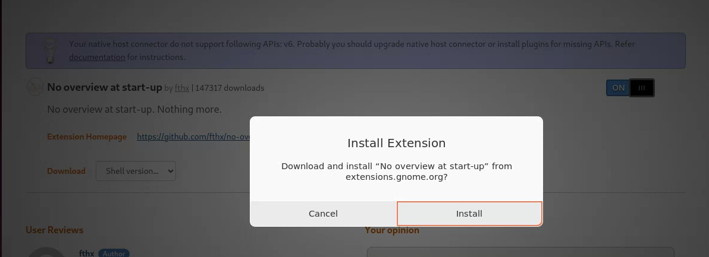

    -   extension manager 설치

    ```bash
    sudo apt install gnome-shell-extension-manager
    ```

    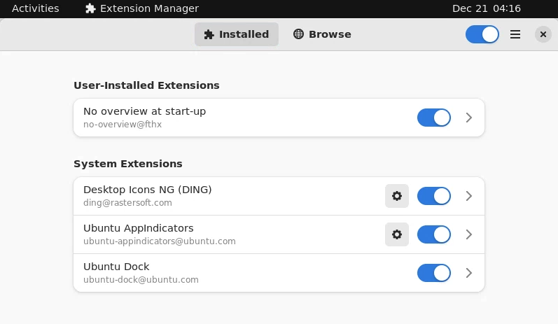

-   keyring 설정 (Ubuntu 계정과 마찬가지로 자주 사용하는 비밀번호로 세팅해야 잊지 않음 ㅠ)

    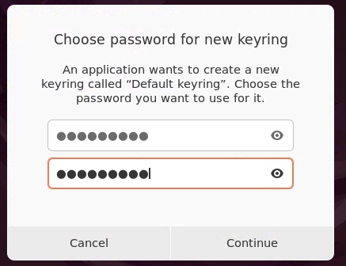

### Docker Desktop 설치 및 실행

**<o1>Docker 설치</o1>**

<https://docs.docker.com/engine/install/ubuntu/#install-using-the-repository>

```bash
sudo apt-get update
sudo apt-get install ca-certificates curl gnupg
sudo install -m 0755 -d /etc/apt/keyrings
```

```bash
curl -fsSL https://download.docker.com/linux/ubuntu/gpg | sudo gpg --dearmor -o /etc/apt/keyrings/docker.gpg
```

```bash
sudo chmod a+r /etc/apt/keyrings/docker.gpg
```

```bash
echo \
  "deb [arch=$(dpkg --print-architecture) signed-by=/etc/apt/keyrings/docker.gpg] https://download.docker.com/linux/ubuntu \
  $(. /etc/os-release && echo "$VERSION_CODENAME") stable" | \
  sudo tee /etc/apt/sources.list.d/docker.list > /dev/null
```

```bash
sudo apt-get update
```

**<o1>Docker desktop 설치</o1>**

<https://docs.docker.com/desktop/install/ubuntu/#install-docker-desktop>

-   xfce 같은 non-Gnome Desktop 환경인 경우에 다음 패키지를 다운받아야 함

```bash
sudo apt install gnome-terminal
```

-   docker-desktop 패키지의 버전은 시간에 따라 달라질 수 있으니 페이지에서 다운받으라는 파일으로 알아서 변경할 것

```bash
wget https://desktop.docker.com/linux/main/amd64/docker-desktop-4.26.1-amd64.deb
```

```bash
sudo apt-get install ./docker-desktop-4.26.1-amd64.deb
```

-   설치 후 Application에서 실행하거나, `systemctl --user start docker-desktop`으로 실행

-   시작 시 docker-desktop이 실행되도록 하려면 `systemctl --user enable docker-desktop`으로 설정

**<o1>kvm 권한 부여</o1>**

```bash
# /dev/kvm 권한 확인
ls -al /dev/kvm
# 유저가 kvm에 접근할 수 있도록 kvm 그룹에 추가
sudo usermod -aG kvm $USER
# 이후 sudo reboot 또는 GUI에서 restart 클릭하여 재접속
```

-   권한 부여 후 Application > 도커 데스크탑 실행 화면

    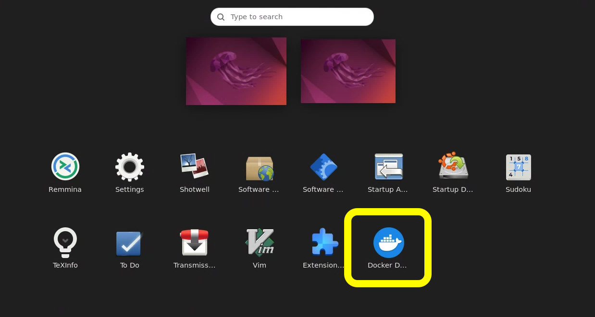

    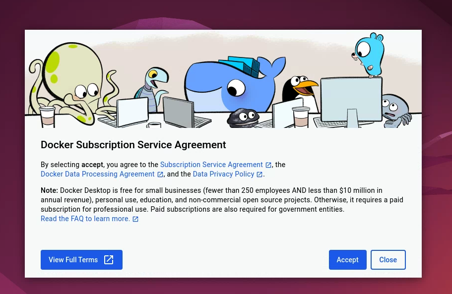

    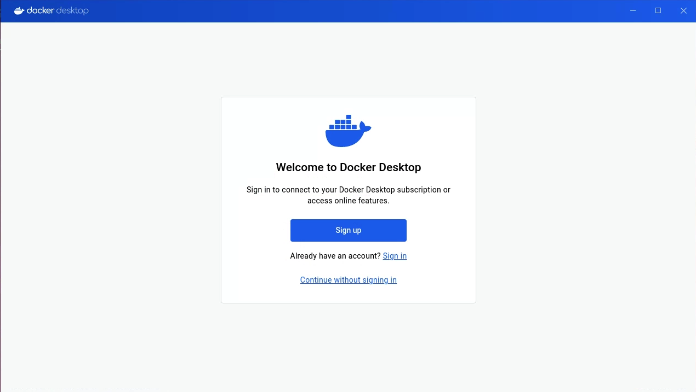

### 참고 링크들
