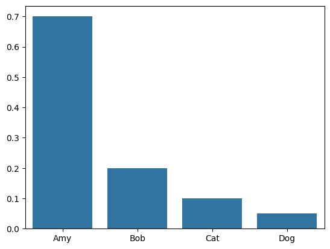

+++
author = "Seorim"
title =  "Day 10"
date = 2023-10-27T16:54:37+09:00

categories = [
    "DevCourse",
]
tags = [
    "TIL",
]
+++


# TIL - 스크래핑 데이터의 시각화

## 📋 공부 내용
### Seaborn 데이터의 시각화
#### Seaborn
> `matplolib` 라이브러리를 기반으로 하여, 다양한 고수준(high-level) 그래프를 그릴 수 있는 라이브러리
#### matplolib
> 파이썬 시각화 라이브러리
#### WordCloud
> 텍스트 클라우드 라이브러리로, 텍스트 구름을 그릴 수 있음
#### KoNLPy 
> 한국어 형태로 분석기 라이브러리. 주어진 문장에서 명사를 뽑아낼 수 있음

#### 설치 및 불러오는 방법
- 설치 
```
pip install seaborn
pip install wordcloud
pip install konlpy
```
- 불러오기 (import)
```python
import seaborn as sns
import matplotlib.pyplot as plt
from wordcloud import WordCloud
from konlpy.tag import Hannanum
```


#### 데이터 시각화1 - 라이브러리 기본 활용
- 꺾은선 그래프 lineplot
```python
sns.lineplot(x=[1, 3, 2, 4], y=[0.7, 0.2, 0.1, 0.05])
```


- 바 그래프 barplot

```python
sns.barplot(x=["Amy", "Bob", "Cat", "Dog"], y=[0.7, 0.2, 0.1, 0.05])
```


- plot 속성
    - 제목 title
    ```python
    sns.barplot(x=["Amy", "Bob", "Cat", "Dog"], y=[0.7, 0.2, 0.1, 0.05])
    plt.title("Bar Plot")

    # jupyter lab에서 실습할 경우 노트북 환경이라 plt.show()를 쓰지 않아도 보였지만, 실제로는 필수적으로 이 코드를 적어야 볼 수 있음
    plt.show()
    ```
    

    - xlabel, ylabel
    ```python
    sns.barplot(x=["Amy", "Bob", "Cat", "Dog"], y=[0.7, 0.2, 0.1, 0.05])

    plt.xlabel("This is x-label")
    plt.ylabel("This is y-label")

    plt.show()
    ```
    
    - x limit, y limit
    ```python
    sns.lineplot(x=[1, 3, 2, 4], y=[4, 3, 2, 1])

    # plt.xlim()
    plt.ylim(0, 10)

    plt.show()
    ```
    
    - size
    ```python
    # plot으로 그래프 그리기 전에 먼저 figure size를 지정해야 함
    plt.figure(figsize=(20, 10))
    sns.lineplot(x=[1, 3, 2, 4], y=[4, 3, 2, 1])

    plt.show()
    ```
    

#### 데이터 시각화2 - 기상청 날씨 정보 표현하기

```python
# 라이브러리 불러오기
# 스크래핑을 위한 selenium & webdriver
from selenium import webdriver
from selenium.webdriver import ActionChains, Keys
from selenium.webdriver.chrome.service import Service
from selenium.webdriver.common.actions.action_builder import ActionBuilder
from selenium.webdriver.common.by import By
from webdriver_manager.chrome import ChromeDriverManager
# 데이터 시각화를 위한 seaborn
import seaborn as sns
import matplotlib.pyplot as plt


# 기상청 페이지에서 날씨 중 온도 데이터를 가져와서 저장
driver = webdriver.Chrome(service=Service(ChromeDriverManager().install()))
url = "https://www.weather.go.kr/w/weather/forecast/short-term.do"
driver.get(url)
driver.implicitly_wait(5)
temperatures = driver.find_element(By.ID, "my-tchart").text
temperatures = [int(i) for i in temperatures.replace("℃", "").split("\n")]

plt.ylim(min(temperatures)-2, max(temperatures)+2)
sns.lineplot(
    x = [i for i in range(len(temperatures))], 
    y = temperatures
)
plt.ylabel("temperature")
plt.show()
```


#### 데이터 시각화3 - 제목에 사용되는 단어의 빈도
```python
import requests
from bs4 import BeautifulSoup
import time
from collections import Counter
import matplotlib.pyplot as plt
import seaborn as sns

url = "https://qna.programmers.co.kr/?page={}"
user_agent = {
    "User-Agent": {user-agent}
}

# 사전 형태로 데이터의 빈도를 체크
tagsD = {}
for i in range(1, 11):
    res = requests.get(url.format(i), user_agent)
    soup = BeautifulSoup(res.text, "html.parser")

    tags = soup.find_all("li", "label-tag")
    for i, t in enumerate(tags):
        tags[i] = t.text.strip()
    for t in tags:
        tagsD[t] = tagsD.get(t, 0) + 1
    time.sleep(0.5)

# Counter의 .most_common으로 제일 많이 등장하는 10개만 추출
tagsC = Counter(tagsD).most_common(10)

# seaborn /plt를 통해 적절하게 시각화 
x_elem = [a[0] for a in tagsC]
y_elem = [a[1] for a in tagsC]
plt.figure(figsize=(20, 10))

sns.barplot(x=x_elem, y=y_elem)

plt.xlabel("Tag")
plt.ylabel("Frequency")
plt.title("Frequency of questions in Programmers")

plt.show()
```


#### 데이터 시각화 4 - 스크래핑한 내용으로 단어구름 만들기
- 데이터 시각화 3와 같은 조건에서 스크래핑한 내용으로 단어구름을 만든다.
```python
# 스크래핑에 사용되는 라이브러리
import requests
from bs4 import BeautifulSoup
# 시각화에 사용되는 라이브러리
import matplotlib.pyplot as plt
from wordcloud import WordCloud

import time
from collections import Counter
from konlpy.tag import Hannanum

url = "https://qna.programmers.co.kr/?page={}"
questions = []
for i in range(1, 6):
    res = requests.get(url.format(i), {"User-Agent":user_agent})
    soup = BeautifulSoup(res.text, "html.parser")

    parsed_datas = soup.find_all("li", "question-list-item")
    for data in parsed_datas:
        questions.append(data.h4.text.strip())

# 제목에서 명사만 추출
hannanum = Hannanum()
words = []
for q in questions:
    nouns = hannanum.nouns(q)
    words += nouns
# 한 글자 단어를 제외하려면 밑의 코드를 작성하면 된다.
# words = [w for w in words if len(w) > 1]

counter = Counter(words)

# 한국어는 기본지원이 되지 않아 font_path로 한국어폰트를 제공해주어야 함
# width, height, background_color로 결과 이미지의 크기와 색을 바꿀 수 있음
wordcloud = WordCloud(
    font_path="/Users/sarah/github-repo/dev_project/TAEBAEK-font.ttf",
    width = 1000, 
    height = 1000,
    background_color='white'
)
img = wordcloud.generate_from_frequencies(counter)
plt.imshow(img)
```

## 👀 CHECK
*<span style = "font-size:15px">(어렵거나 새롭게 알게 된 것 등 다시 확인할 것들)</span>*

- WordCloud
    - font_path에 온라인 폰트 링크를 넣을 수는 없을까?
    - 단어 구름 모양을 하트, 스페이드 등 네모가 아닌 모양으로 만들 수 있을까?
    - 결과 이미지를 표로 내보내지 않고 이미지만 가져올 수 있을까?

## ❗ 느낀 점
강의를 통해 시각화를 배우고 실습하면서, 다양하게 활용해보고싶은 욕심이 들었다. CHECK에 적은것처럼 여러가지 활용방식에 대해 궁금증이 떠올랐다. 오늘은 TIL 적는것에 집중이 잘 되지 않고 다른 일에 정신이 팔려서 추가적인 실습을 하지 못했는데, 주말에 전부 진행해보려고 한다.

오늘은 이번주 마지막 강의였다. 저번주는 주말에 딱히 추가적인 공부를 하지 않았는데, 이번주는 하나라도 하고 글로 정리할 것이다. 분석이나 시각화는 강의자료를 참조하지 않고 외워서 적을 수 있을 정도로 연습을 하려고 한다. 

