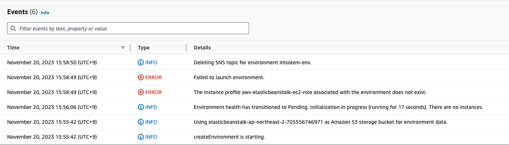
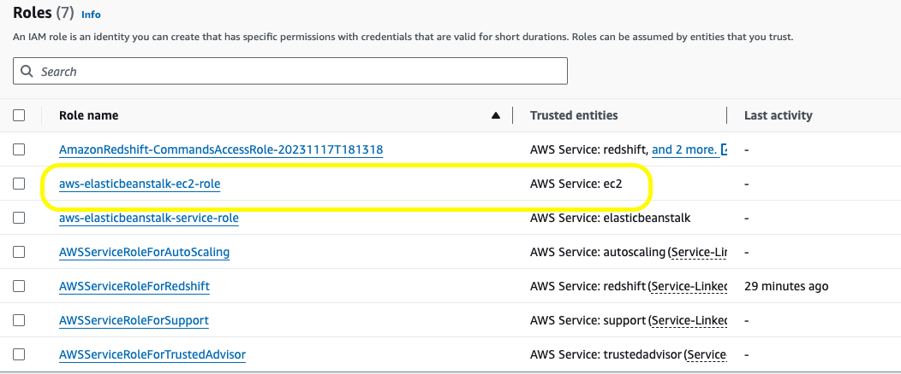
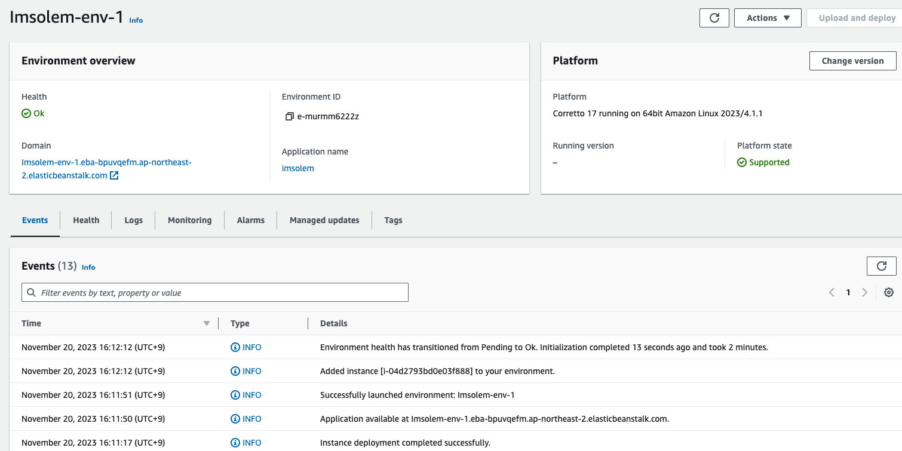

+++
author = "Seorim"
title =  "Day 26"
date = 2023-11-20T10:50:47+09:00

categories = [
    "DevCourse",
]
tags = [
    "TIL", "EC2", "Elastic Beanstalk"
]
+++

# TIL - AWS EC2

## 📋 공부 내용

### 클라우드 컴퓨팅

#### 클라우드 컴퓨팅의 이점

-   `민첩성` : 빠르게 배포 및 운영이 가능하다.
-   `탄력성` : CPU 등 리소스의 추가 및 제거가 쉽다.
-   `비용절감` : 잉여리소스에 대한 비용이 감소한다.
-   `On demand` : 리소스가 필요할 경우 바로 구매하여 사용할 수 있다.
-   `관리 용이성` : 서버실 등 일일이 관리할 필요가 없으며, 서비스 업체를 통해 GUI등으로 쉽게 관리할 수 있다.

#### 클라우드 유형

(리소스 관점에서 분류)

-   `On Premises` : 직접 서버를 구성하고 관리
-   `IAAS` : 하드웨어 부분까지 클라우드 서비스 업체가 관리해주며, 그 외에는 직접 관리
-   `PAAS` : 하드웨어 + OS, 미들웨어 부분까지 클라우드 서비스가 관리
-   `SAAS` : 모든 리소스를 클라우드 서비스에서 관리

### AWS

> Amazon에서 제공하는 클라우드 서비스

#### AWS 기본 용어

-   `가상화` : 물리적 컴퓨터 하드웨어를 효율적으로 활용하게 해주는 프로세스
-   가상머신(`Virtual Machine`) : 물리적 컴퓨팅을 소프트웨어 형태로 시뮬레이션 할 수 있는 가상 환경
-   `스냅샷` : 특정 시점에 스토리지의 파일 시스템을 포착해 보관하는 기술
-   데이터 센터 : 여러 서버들이 한데 모여 네트워크로 연결된 시설
-   Region : Data Center 위치, 국가마다 자원 사용 비용이 다름
-   AZ(Availability Zone): 가용 영역, 하나의 Region은 둘 이상의 AZ로 구성됨

### EC2

#### EC2 특성 및 정보

-   `인스턴스` : 가상 컴퓨팅 환경
-   `AMI`(Amazon Machine Image) : 서버에 필요한 OS, Software 등이 구성되어있는 템플릿
-   `Key pair` : 인스턴스 로그인 정보를 보호하기 위해 제공
-   Amazon EBS(Elastic Block Store)
-   Security Group : 인스턴스에 연결할 수 있는 protocol, port, IP 등을 지정
-   `EIP` (Elastic IP) : 실행될 때 마다 동적으로 변경되는 IP 대신 사용하기 위해 발급받는 고정 IPv4 주소
-   Tag : EC2 리소스 등에 할당하는 메타데이터, 검색가능
-   VPC(Virtual Private Cloud) : 가상 네트워크

#### Elastic Beanstalk

> `애플리케이션`을 신속하게 `배포하고 관리`해주는 서비스

**특징**

-   용량 provisioning, load balancing 등을 자동으로 처리해줌
-   Go, Java, .NET, Node.js, PHP, Python, Ruby 언어 지원
-   `EC2` 등 AWS `리소스를 provisioning` 하여 애플리케이션을 실행

## 👀 CHECK

_(어렵거나 새롭게 알게 된 것 등 다시 확인할 것들)_

-   elsticbeanstalk 오류 관련 해결법

    [stackoverflow 링크](https://stackoverflow.com/questions/30790666/error-with-not-existing-instance-profile-while-trying-to-get-a-django-project-ru)

    -   envirionment 생성 시 오류 발생
        
    -   IAM Role 생성해서 오류 해결
        
    -   environment 생성 성공
        

## ❗ 느낀 점

개념 및 설정 위주라 크게 어렵거나 이해가 안되는 부분은 없었다. 다만 이전 강의를 다 완료하지 못하고 시작해서 혹시 aws 쪽 설정에 충돌이 생길까봐 걱정이 됐다.

그 외에는 오늘 강의 외에 해야 할 다른 일들이 많아서 정신이 없다 보니까 TIL도 기본적인 내용만 적게 됐다. 많이 아쉽다 ㅠㅠ

이전에 적지 못했던 TIL들을 천천히 적고 있는데 아무래도 글쓰기를 잘 못하다보니 오랜 시간이 걸린다. 그렇지만 글은 쓰면서 늘 테니까...! 힘들어도 많이 써보고 나중에 다시 보면서 고쳐봐야겠다. 😊 :+1:
