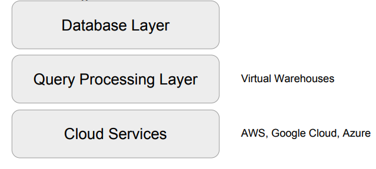
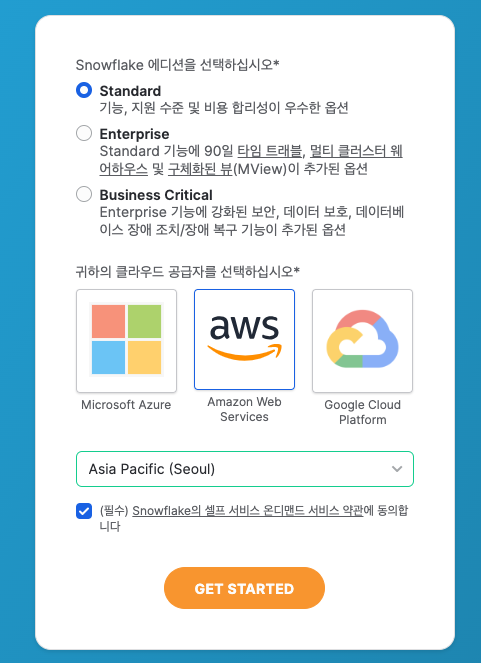
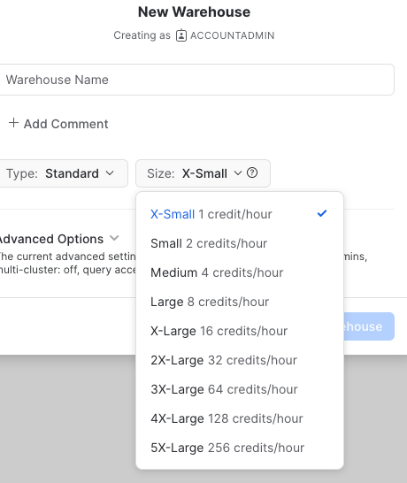

+++
author = "Seorim"
title =  "Day 33 Snowflake"
url = '/day-33'
date = 2023-11-30T12:06:30+09:00

categories = [
    "DevCourse",
]
tags = [
    "TIL", "Snowflake"
]
+++

# 📋 공부 내용

## Snowflake란

### 소개

클라우드 기반 데이터웨어하우스?
["데이터 클라우드"](https://slownews.kr/81312)
AWS, GCP, Azure 과 같은 글로벌 클라우드 위에서 모두 동작(멀티클라우드)

### 특징

-   가변비용모델

    -   storage, computing infra 별도 설정 가능
    -   노드 수 조정, distkey(데이터 skew 문제) 등 조절 불필요

-   SQL 기반 - 빅데이터
    -   비구조화 데이터 처리, ML 기능 제공
-   다양한 포맷, 다양한 플랫폼의 클라우드 스토리지(S3, GC Cloud Storage 등) 지원
    

-   Time travel
    -   #TODO
-   Python API
-   멀티클라우드 지원
-   다른 지역 데이터 공유 (Cross-Region Replication) 기능 지원
-   Snowflake 계정 구성
    -   Organizations
        -   하나 혹은 그 이상의 Account로 구성됨
    -   Accounts
        -   하나 혹은 그 이상의 DB로 구성됨
    -   Databases
        -   Account에 소속된 데이터를 다루는 컨테이너
        -   `Warehouse`(컴퓨팅리소스)와 일대일 관계가 아님 (1 Warehouse - 4 Databases)
-   Data Marketplace
-   Data Sharing
    > "Share, Don't Move"  
    >  Dataset을 `Storage level`에서 공유하는 방식

## Snowflake 활용 실습

### 계정 생성


(무료 시험판 계정 생성)

-   무료계정은 별도의 로그인 링크를 통해 접속해야 함
    

### Snowflake 비용

#### 컴퓨팅 비용 : Credit

-   Credit : 쿼리 실행, 데이터 로드 등 작업 수행에 소비되는 리소스 단위
-   1 Credit = $2~$4
-   Snowflake Warehouse : 사용시간 당 크레딧 청구
    

#### 스토리지 비용

-   TB 당 비용 청구

#### 네트워크 비용

-   지역간, 또는 (다른)클라우드간 데이터 전송 시 TB 당 비용 청구

### Snowflake Schema

```
SNOWFLAKE DB & Schema
dev
├─ raw_data
├─ analytics
└─ adhoc
```

# 👀 CHECK

_<span style = "font-size:15px">(어렵거나 새롭게 알게 된 것 등 다시 확인할 것들)</span>_

-   Snowflake SQL - <https://docs.snowflake.com/en/guides-overview-queries>
    > "Snowflake supports standard SQL", including a subset of ANSI SQL:1999 and the SQL:2003 analytic extensions. Snowflake also supports common variations for a number of commands where those variations do not conflict with each other.

# ❗ 느낀 점
